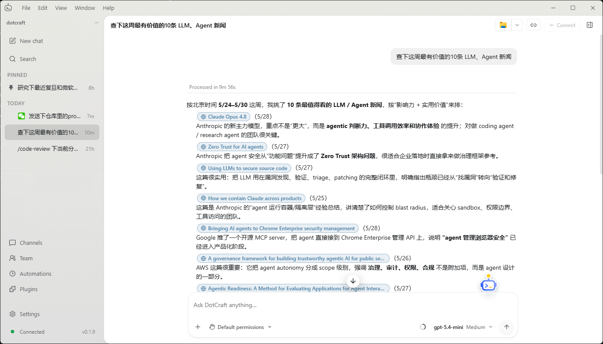
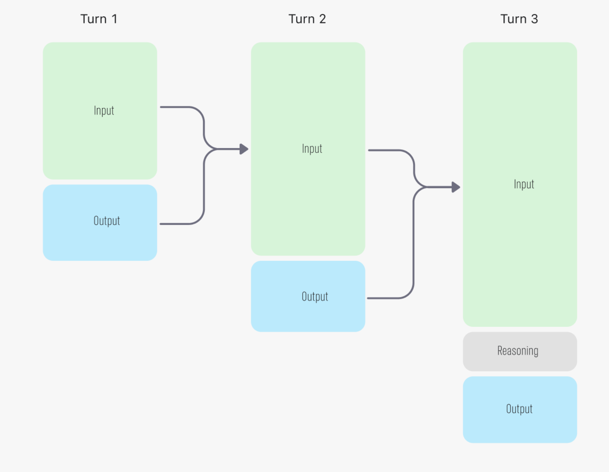
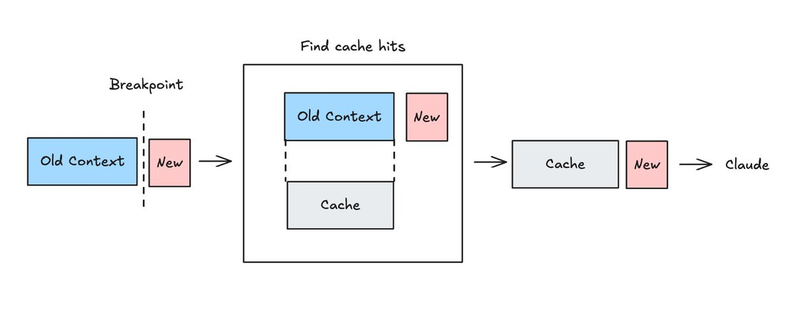
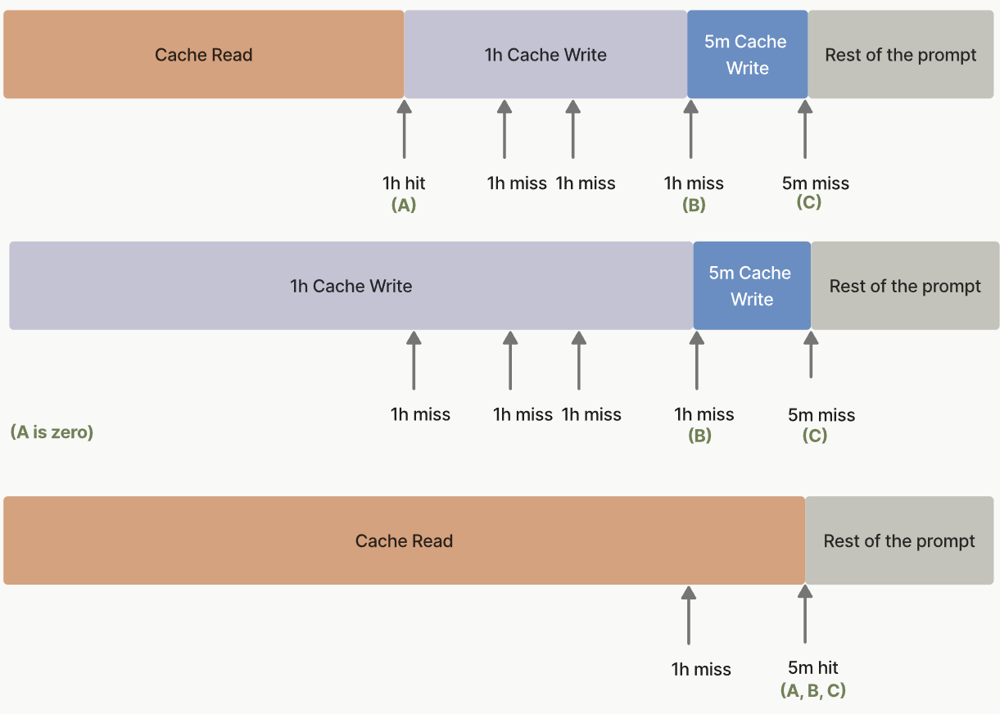
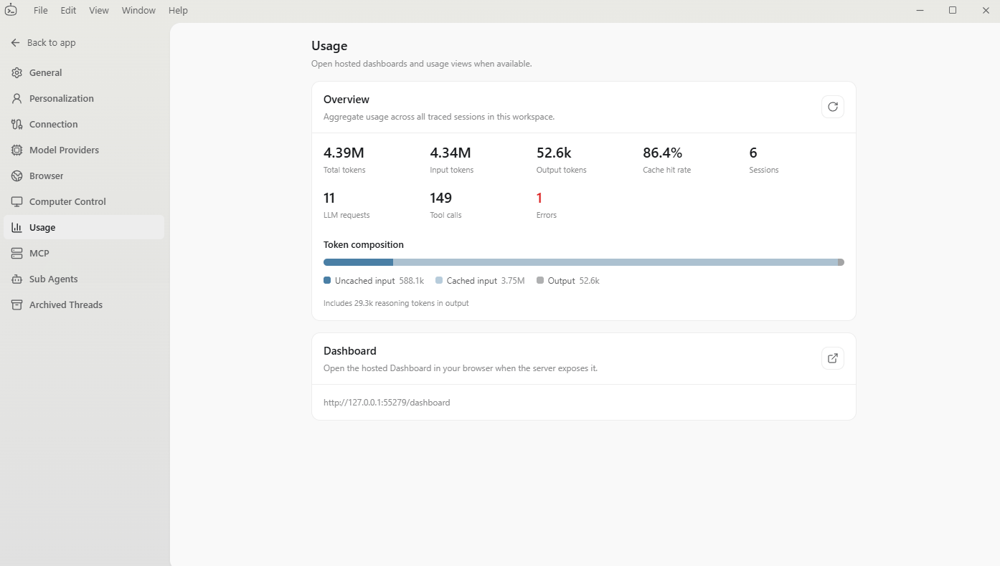
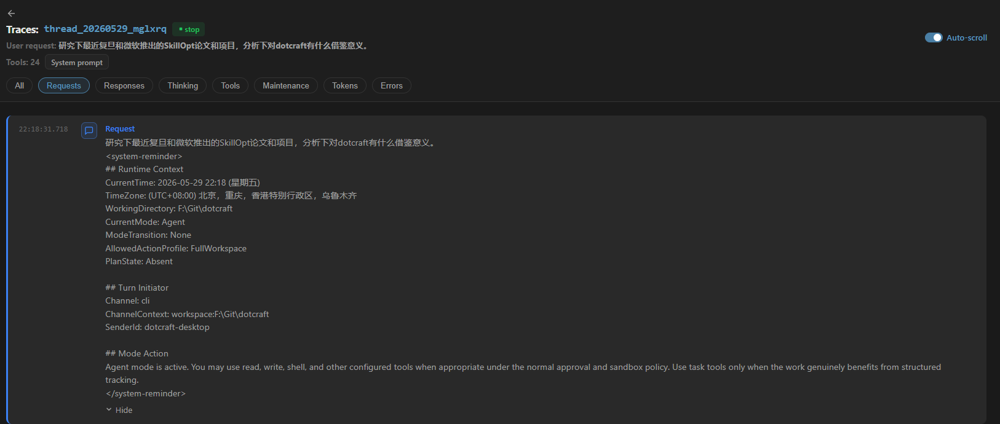
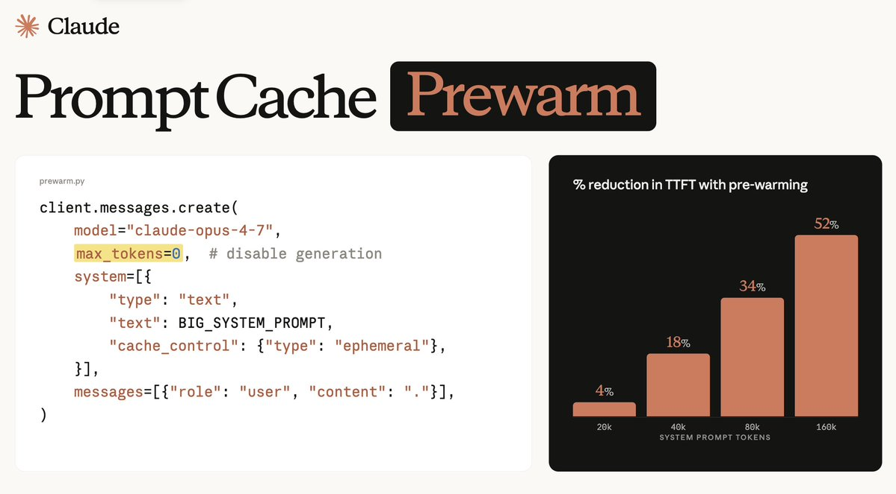
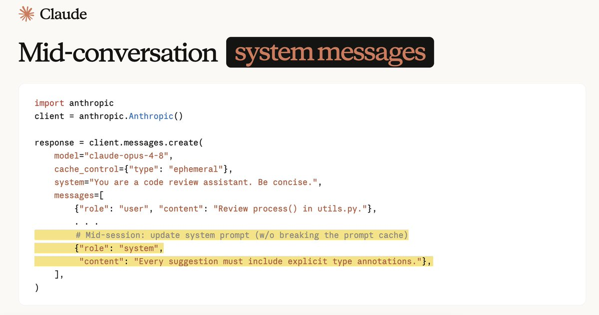

# AI Agent 如何省钱：Prompt Cache 优化实践

<!-- more -->

随着大模型的推理能力愈发强大，阻碍 Agent 落地的不再是模型能力，而是高昂的 Token 成本。

本篇主要分享开发 Agent 过程中遇到的 Prompt Cache（提示缓存）优化问题。和游戏开发非常注重性能优化一样，Prompt Cache 也是 Agent 开发中最重要的硬指标之一。

## 起因

笔者从二月份 Claw 类 Agent 助手兴起后，开始设计开发 [DotCraft](https://github.com/DotHarness/dotcraft)——一个以 .NET 技术栈、C# 为主要语言的 AI Agent。它最初只是我自己的 Claw 助手和群机器人，之后随着不断迭代，吸收了大量主流 Coding Agent 的功能，逐渐成为我游戏开发工作中的主力。凭借极高的拓展性，工作中的 Agentic 业务也开始基于这套 Agent Harness 来建设和开发。

而最初把 DotCraft 用于工作开发时，接入的是公司的 Claude Opus 4.7 API，遇到了一个非常直观的痛点：一个任务明明只跑了几分钟，账单却接近 50 美刀。

虽然没有之前流传的"某游戏公司一夜烧掉几百万 Token"那么离谱，但也足以让我停下来重新审视 Agent 的设计。我去 LLM 提供商的后台查了一下缓存命中情况，结果发现 cache hit rate 竟然是 0。

大部分大模型厂商（中转站除外）都会把输入 Token 按"缓存命中"和"未命中"分开计费，命中部分通常能便宜一大截——Anthropic 低至未命中的 1/10，OpenAI 大约是 1/4 ~ 1/2。

这一点对 Agent 尤其敏感。如今的 Agent 早已不是 ChatGPT 3.5 时代那种一问一答的聊天机器人，而是动辄几十、几百次的多轮工具调用——每一轮，用户和 Agent 的历史会话都会作为前缀重复发送给大模型。一旦缓存完全打不中，大模型调用就会变成一件极其昂贵的事情。

于是我开始在 DotCraft 里一点点补全 trace，定位所有导致缓存失效的原因，试着把这个系统性问题逐一拆开。

## 输入构成

首先要说明的是，Agent 本质上就是 LLM + Function Call 组成的循环：用户发消息，LLM 输出消息；如果 LLM 调用了工具，客户端就处理工具，再把历史消息和最新的工具结果发回 LLM，如此往复。

用户每一轮的输入 Input 和当轮 LLM 的输出 Output，会在下一轮作为 Input 再次发送。注意这里的"轮"并不是指 Agent 和用户的每一次对话，而是 Agent 内部的每一次消息发送。

如果从协议层面来看，以 OpenAI Chat-Completion 协议为例，Input 里除了上一轮的输出和历史消息外，还包含：

1. System Prompt：既包含应用内硬编码的提示词（例如"你是 ClaudeCode..."），也包含用户可编辑的部分（例如 CLAUDE.md、AGENTS.md 等）
2. 工具的 JSON Schema：涵盖所有内置工具和 MCP 工具

因此这里有一个前置结论：系统提示词和工具，只要其中任意一个发生变化，整个输入的前缀就会跟着变。

## 缓存构成

那是不是只要保证每轮输入前缀一致，就一定能命中缓存？

当然不是。真正的缓存命中逻辑都在大模型后端实现，每家作用到推理端 KV-Cache 的方式也不尽相同。但对开发者而言，我们只需关注不同协议提供的约定标准。

依然以最简单的 OpenAI Chat-Completion 协议为例：开发者无需显式控制缓存，后端会对每次输入的消息数组做前缀哈希计算，只要后续请求不修改数组前面的内容，前缀在大部分情况下都能完全命中。

但以上只是理想情况，实际还有几个常见的干扰因素：

1. 路由问题：推理端的路由可能把第 N 轮的缓存写到了 A 集群，而 N+1 轮却被路由到了 B 集群，自然就读不到缓存。
2. 时效问题：缓存以张量形式存储在 GPU 上，而显存非常昂贵，因此各家厂商都会给缓存设置生存时间（TTL），超时之后缓存自然也就失效了。

针对这些问题，厂商各自有对应的优化方案和协议标准，下游应用开发者只需关注协议层面的约定即可。

举几个真实的例子：

1. Codex 使用 OpenAI Responses 协议，虽然走的也是隐式缓存，但会在 Request 上额外带 `session_id` 等关联头，并用请求体参数 `prompt_cache_key` 维持路由黏性（移除后就会出现路由问题）。
2. Anthropic 协议支持把 TTL 设为 1 小时来延长热启动窗口，但代价是更贵的**缓存写入**价格。

## Agent 应用缓存控制策略

有了对 Prompt Cache 的基础理解后，就可以回到 Agent 应用层面的缓存命中问题上了。

在遇到 DotCraft 的缓存命中问题后，笔者先从基础设施入手，在应用侧建立了一套完善的缓存跟踪逻辑，具体如下：

1. 客户端对每次发给 LLM 的 Request，把系统提示词和工具 Schema 分别计算前缀哈希，一旦有变动就能立刻定位到是哪一部分变了。
2. 根据不同协议的返回包统计缓存的写入和读取情况（Anthropic 协议有相关字段，OpenAI 没有），用来判断未命中的原因。比如处于冷启动窗口时，命中率本来就偏低。

策略 2 这里引申出一个小提示：缓存命中不代表命中率就一定是 100%，它和当轮缓存输入的占比有关。

举个例子，如果上一轮只写入了 100 Token 的缓存，而上一轮的输出有 900 Token，那么当前轮理论上的最大命中率也只有 10%。

再比如用户每次都开新会话、只问一个问题，永远处于冷启动，那理论最大命中率就是 0%。

所以如果 GitHub 上有项目声称自己的缓存命中率能稳定到 98%、99%，基本可以认为是不严谨甚至唬人的说法。

相比之下，DotCraft "不躲、不藏、不绕、不逃，稳稳地"提供了应用侧的真实数据统计。

## 面向缓存命中的 Agent 设计

有了分析工具后，笔者很快就发现了 DotCraft 老版本里的各种设计问题（其中不少问题在 OpenClaw 的早期版本里也同样存在，这也是当时很多使用者对它的核心"评价"——贵）。

下面汇总几个典型的错误设计：

1. Plan 模式切换时同时改了系统提示词和可用工具，后者直接导致 Tools Schema 变化。
2. 把用户的实时信息（例如时间戳）放进了系统提示词，导致每轮的系统提示词都在变。
3. AGENTS.md、MEMORY.md、Skill 索引实时刷新，导致系统提示词变化。
4. MCP 工具启用后实时刷新，导致 Tools Schema 变化。

针对这些问题，DotCraft 采用了和主流 Coding Agent 一致的优化策略：

1. 在系统提示词中固定写好各个模式的行为准则，再在用户的 User Message 后追加当前模式信息，告诉 Agent 现在处于哪个模式。工具层面则用 Policy 兜底：如果 Plan 模式下 Agent 误用了文件写入工具，会直接返回错误和引导信息。
2. 用户的实时信息同样追加在 User Message 之后，而不放进系统提示词。
3. 对系统提示词做分页管理，像 MEMORY.md 这种低频变更的内容保留快照，只在上下文压缩后或 TTL 失效后才更新。
4. 为 MCP 工具增加 Deferred Loading（目前仅支持 OpenAI Responses 协议），让增量的工具以延迟加载的方式进入上下文，从而不破坏前缀缓存。

下面是 DotCraft 的 Dashboard Trace 记录，可以看到用户发送 User Message 后，模式信息和时间戳被追加在了它后面。

## 高级缓存命中策略

上面这些缓存控制，对一个现代 Agent Harness 来说只能算是基础。像 Claude Code、Codex 这类更强大的 Harness，在缓存命中上还有更丰富的控制策略。

### 显式缓存控制

Anthropic 协议支持显式缓存控制，提供了 4 个 Cache Point 断点，方便应用侧更灵活地分段缓存。

它带来的最直接好处是"缓存回退"：即使历史会话发生了变更（例如上下文压缩之后），依然可以复用上一个断点标记的"系统提示词 + 工具 Schema"前缀缓存。

### 上下文压缩复用前缀

Codex 的上下文压缩走的是一个特殊的 Compact API，属于黑盒。不过笔者推测它应该用了和上面显式缓存类似的手段，复用了"系统提示词 + 工具 Schema"的前缀缓存。

另一种策略是像 Claude Code 那样，从原会话 Fork 出一个分支会话：完整复制主会话的系统提示词、工具 Schema 和历史消息，再追加一条 User Message 让 LLM 生成一段 Summary，这样分支会话就能复用主会话的前缀缓存。

DotCraft 采用的是 Claude Code 的方案，并且把同样的策略用在了记忆整理功能上：在主会话进行的同时，后台 Fork 一个分支会话来完成 MEMORY.md 和 HISTORY.md 的总结与写入。

而对于无法复用前缀的冷启动场景（例如重启之后），则会退回 Legacy 方案：直接修改系统提示词、移除工具 Schema、过滤工具输出，以此生成上下文 Summary，尽量压低 Token 开销。

## 厂商专属控制策略

这一块主要是 Anthropic 独有的控制策略。它和大模型的后训练方式息息相关，因此其他厂商即便照搬 Anthropic 协议也无法快速适配——不过笔者估计 OpenAI 在不久的将来也会跟进。

### 缓存预热

前面提到，用户发 Request 时会有一个冷启动窗口，这段时间里缓存还没写好，无法立刻读取。为此可以采用预热手段：应用先行发送"系统提示词 + 工具 Schema"来预热这部分前缀缓存，等用户的 Request 真正到来时就能直接命中，省下开销。甚至对于大规模并行的 Agent（例如最近 Claude Code 推出的 Dynamic Workflow），多个会话还能复用同一份前缀缓存。

### 中途插入系统提示词

写这篇文章时恰逢 Claude Opus 4.8 发布。抛开 Anthropic 那些颇为唬人的跑分（Benchmark 的数据向来真假参半）不谈，这次更让我意外的是：Opus 4.8 支持把系统提示词随时追加到历史会话之后了。这会极大增强现有 Agent Harness 的灵活性——还是拿 Plan 模式切换来说，后续 Harness 可以在切换模式后直接追加一段系统提示词来约束行为，而不必把大量提示词都 hardcode 在最初的系统提示词里，从而省下更多 Token。

## 结语

Agent Harness 里的很多东西本质上都是工程上的优化手段，当然也少不了一些有趣的奇技淫巧哈哈。

笔者认为这些手段最终都会沉淀为 Agent Harness 的通用规范，所以如今造一个 Agent 理论上是件很容易"照葫芦画瓢"的事。Agent 的价值更多并不在它本身，而在于它能在业务中创造多少价值。

笔者在设计 DotCraft 时也更看重拓展性和架构设计，在业务中持续打磨改进，而不是一味跟风堆料。

最后欢迎小伙伴们 Star、Fork 和 Contribute ~

仓库链接 [DotHarness - DotCraft](https://github.com/DotHarness/DotCraft)

## 参考资料

- [OpenAI — Prompt caching guide](https://developers.openai.com/api/docs/guides/prompt-caching)
- [Anthropic — Prompt caching](https://platform.claude.com/docs/en/build-with-claude/prompt-caching)
- [Anthropic — Pricing](https://platform.claude.com/docs/en/about-claude/pricing)
- [Anthropic — Mid-conversation system messages](https://platform.claude.com/docs/en/build-with-claude/mid-conversation-system-messages)
- [Anthropic — What's new in Claude Opus 4.8](https://platform.claude.com/docs/en/about-claude/models/whats-new-claude-4-8)
- [OpenAI Codex — CLI features](https://developers.openai.com/codex/cli/features)
