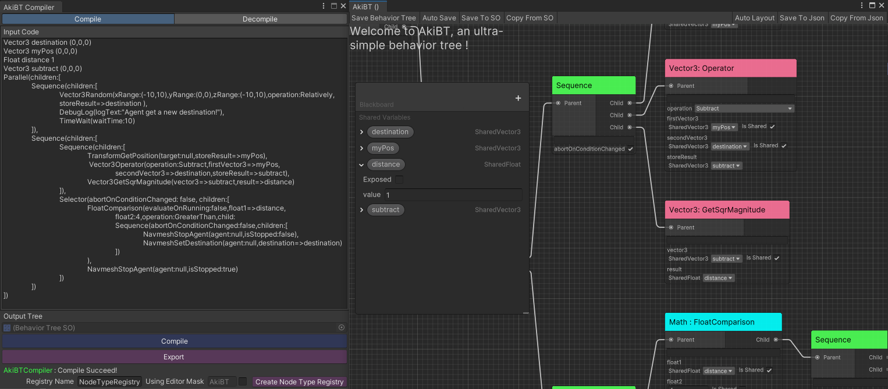

# 为行为树创建脚本语言

<!-- more -->
AkiBTDSL是我在大三针对行为树编写的Domain Specific Language，包含了一个编译器，将DSL编译为Unity SerializeReference支持的Json格式。因此可以认为Json是行为树的IL。但设计上有很多问题，本篇文章旨在对其进行重写。

## 目前的编译流程

1. 进行词法分析
2. 递归下降法语法分析
3. 将文本填充到数据容器中
4. 序列化容器为Json
5. 由Unity的JsonUtility反序列化为行为树

初步思考的问题如下：
>1. 中间多了一次序列化和反序列化Json。
>
>2. 递归下降的处理缺少工程化设计，例如语法树构建。

## 重新设计编译器

我需要重新学习怎么设计编译器，上述的DSL就是在学习编译原理课时搓出来的，所以可以看到一些基础知识的运用，但综上所述有很多问题。

要设计编译器，如今不能不提LLVM。

!!! tips
    LLVM是一套现代的编译器工具链用于开发编译器。

当然我们的目标指令并不是机器码也不是.Net IL而是行为树实例，因此用LLVM肯定是大材小用，但LLVM提供了一个非常优质的教程（Kaleidoscope）手把手教我们怎么构建一个编译器，我们只需要看调用IR之外的代码即可（因为我们需要自己绑定语法树到运行时指令）。

教程 [My First Language Frontend](https://llvm.org/docs/tutorial/MyFirstLanguageFrontend/index.html)

### 1. 词法分析

先扫描成Token(词元),但里采取的是标准的逐字分析。

```Cpp
/// gettok - Return the next token from standard input.
static int gettok() {
  static int LastChar = ' ';

  // Skip any whitespace.
  while (isspace(LastChar))
    LastChar = getchar();

  if (isalpha(LastChar)) { // identifier: [a-zA-Z][a-zA-Z0-9]*
    IdentifierStr = LastChar;
    while (isalnum((LastChar = getchar())))
      IdentifierStr += LastChar;

    if (IdentifierStr == "def")
      return tok_def;
    if (IdentifierStr == "extern")
      return tok_extern;
    return tok_identifier;
  }

  if (isdigit(LastChar) || LastChar == '.') { // Number: [0-9.]+
    std::string NumStr;
    do {
      NumStr += LastChar;
      LastChar = getchar();
    } while (isdigit(LastChar) || LastChar == '.');

    NumVal = strtod(NumStr.c_str(), nullptr);
    return tok_number;
  }

  if (LastChar == '#') {
    // Comment until end of line.
    do
      LastChar = getchar();
    while (LastChar != EOF && LastChar != '\n' && LastChar != '\r');

    if (LastChar != EOF)
      return gettok();
  }
}
```
但由于DSL的语法没有那么复杂，我选择先用正则和预处理分词再逐词分析，减少一些代码量。

```C#
private static string[] Tokenize(string code)
{
    const string Pattern = @"(\(|\)|\[|\,|\:|\]| |\n|\r|=>|\t)";
    int start = 0;
    int flag = 0;
    var tokens = new List<string>();
    for (int i = 0; i < code.Length; ++i)
    {
        if (code[i] == '\"')
        {
            if (flag == 0)
            {
                tokens.AddRange(Regex.Split(code[start..i], Pattern));
                start = i + 1;
                flag = 1;
            }
            else
            {
                tokens.Add(code[start..i]);
                start = i + 1;
                flag = 0;
            }
        }
    }
    if (start < code.Length)
        tokens.AddRange(Regex.Split(code[(start - flag)..], Pattern));
    return tokens.Where(x => !new[] { "\n", "\r", "\t", " ", "" }.Contains(x)).ToArray();
}
```
但这导致Token不再是一个int变量，在教程中Token<0即为特殊标识符例如`def`,而为正时则为相应符号的Ascii码。但如果要适应中文或逐词分析，我们就得调整Token的数据结构。

我选择使用结构体来代替，通过重载运算符，我们依然可以比对Token是否为标识符或普通字符串。

```C#
public enum TokenType
    {
        // Dynamic token, need be interpreted by parser
        DYNAMIC,
        EOF,
        // Code comment
        COMMENT,
        // Define sharedVariable
        DEF_VARIABLE,
        // Define node
        DEF_NODE,
        // Value type
        VALUE
    }
    /// <summary>
    /// Each token returned by the lexer includes a token type and potentially a string value
    /// </summary>
    public readonly struct Token
    {
        public TokenType Type { get; }
        public string Value { get; }
        public Token(TokenType tokenType)
        {
            Type = tokenType;
            Value = default;
        }
        public Token(string value)
        {
            Type = TokenType.DYNAMIC;
            Value = value;
        }
        public Token(TokenType tokenType, string value)
        {
            Type = tokenType;
            Value = value;
        }
        public static bool operator ==(Token first, Token second)
        {
            return first.Type == second.Type && first.Value == second.Value;
        }

        public static bool operator !=(Token first, Token second)
        {
            return first.Type != second.Type || first.Value != second.Value;
        }
        public static bool operator ==(Token first, TokenType second)
        {
            return first.Type == second;
        }

        public static bool operator !=(Token first, TokenType second)
        {
            return first.Type != second;
        }
        public static bool operator ==(Token first, string second)
        {
            return first.Value == second;
        }

        public static bool operator !=(Token first, string second)
        {
            return first.Value != second;
        }
        public bool Equals(Token other)
        {
            return other.Type == Type && other.Value == Value;
        }

        public override bool Equals(object obj)
        {
            return obj is Token token && Equals(token);
        }

        public override int GetHashCode()
        {
            return HashCode.Combine(Type, Value);
        }

        public override string ToString()
        {
            return $"[{Type}]{Value}";
        }
    }
```

### 2. AST 抽象语法树

如果自己构建语法树，就不需要Json的序列化步骤了。

```Cpp
// Kaleidoscope的AST节点
// 引用自 https://llvm-tutorial-cn.readthedocs.io/en/latest/chapter-2.html
/// VariableExprAST - Expression class for referencing a variable, like "a".
class VariableExprAST : public ExprAST {
  std::string Name;
public:
  VariableExprAST(const std::string &name) : Name(name) {}
};

/// BinaryExprAST - Expression class for a binary operator.
class BinaryExprAST : public ExprAST {
  char Op;
  ExprAST *LHS, *RHS;
public:
  BinaryExprAST(char op, ExprAST *lhs, ExprAST *rhs)
    : Op(op), LHS(lhs), RHS(rhs) {}
};

/// CallExprAST - Expression class for function calls.
class CallExprAST : public ExprAST {
  std::string Callee;
  std::vector<ExprAST*> Args;
public:
  CallExprAST(const std::string &callee, std::vector<ExprAST*> &args)
    : Callee(callee), Args(args) {}
};
```
语法树的构建还是比较简单，只需要对每种合法的语法用面向对象的方式表达即可。

有趣的是我们可以创建一些`语法糖`。

#### 构建语法树前的语法糖

例如我在DSL中规定了申明变量的格式如下：
```
Vector3 myVector (0,0,0)
```

转为语法树就是
```
VariableDefineExprAST
 - FieldType: FieldType.Vector3
 - IsGlobal: false
 - Name: "myVector"
 - Value: ValueExprAST
          - FieldType: FieldType.Vector3
          - Value: (0,0,0)
```
其中`VariableDefineExprAST`嵌套了一个`ValueExprAST`表达式。

那我们可以增加一个新的语法糖例如使用`default`来替代默认值`(0,0,0)`。
```
Vector3 myVector default
```
那么`Parser`在读取到`default`后，可以根据`typeof(Vector3)`补上默认值`(0,0,0)`,这样AST依然和上面是一样的，不需要改动后续步骤中的代码。
!!! Extend
      这与C#中初始化属性值很类似，属于构建语法树之前的语法糖。

#### 构建语法树后的语法糖

DSL规定了在节点中引用`SharedVariable`可以使用`=>`标识符，例如：
```
NavmeshSetDestination(destination=>myDestination)
```
但它需要我们申明此变量，我们可以增加`??`来在变量未申明时自动申明变量。
```
NavmeshSetDestination(destination=>??myDestination)
```

这个情况需要修改编译的流程，即在编译器为此表达式生成代码之前，需要额外判断变量栈中是否有该值。

!!! Extend
      这与C#中将匿名函数在编译阶段会被转为委托实例一样，属于构建语法树之后的语法糖。

### 3. 生成行为树

这里因为丢弃了Json，所有我们需要自己实现DSL到BT的生成步骤，相当于实现一下反序列化。

这里我预先生成一个Json用来存储反射数据，减少一些运行时反射的开销。

```C#
public class NodeTypeRegistry
{
    public Dictionary<string, NodeInfo> nodeInfos = new();
}
public class NodeInfo
{
    public string className;
    public string ns;
    public string asm;
    public bool isVariable;
    public List<PropertyInfo> properties;
}
public class PropertyInfo
{
    public string label;
    public string name;
    public FieldType fieldType;
}
```

然后就是由Visitor访问者进入每个表达式中读取数据了。

例如对于值类型表达式`ValueExprAST`, 访问者进入后直接将值推入栈中。

```C#
 protected override ExprAST VisitValueExprAST(ValueExprAST node)
{
    // Push value to task
    valueStack.Push(node.Value);
    return node;
}
```
在Node的属性表达式`PropertyExprAST`中，先从栈中读取Node的反射数据，然后由访问者进入子表达式，最后取出值并写入节点。

```C#
 protected override ExprAST VisitPropertyAST(PropertyExprAST node)
  {
      NodeBehavior parent = nodeStack.Peek();
      Visit(node.Value);
      FieldInfo fieldInfo = node.MetaData.FieldInfo;
      fieldInfo.SetValue(parent, valueStack.Pop());
      return node;
  }
```

## 完成

这样就大功告成了，写完DSL到行为树的编译器后，我再写了一个反编译器，这样例如下图中左边的DSL就可以和右边的行为树相互转换了。

这样顺便实现了新的序列化方案。



## 代码

https://github.com/AkiKurisu/AkiBTDSL