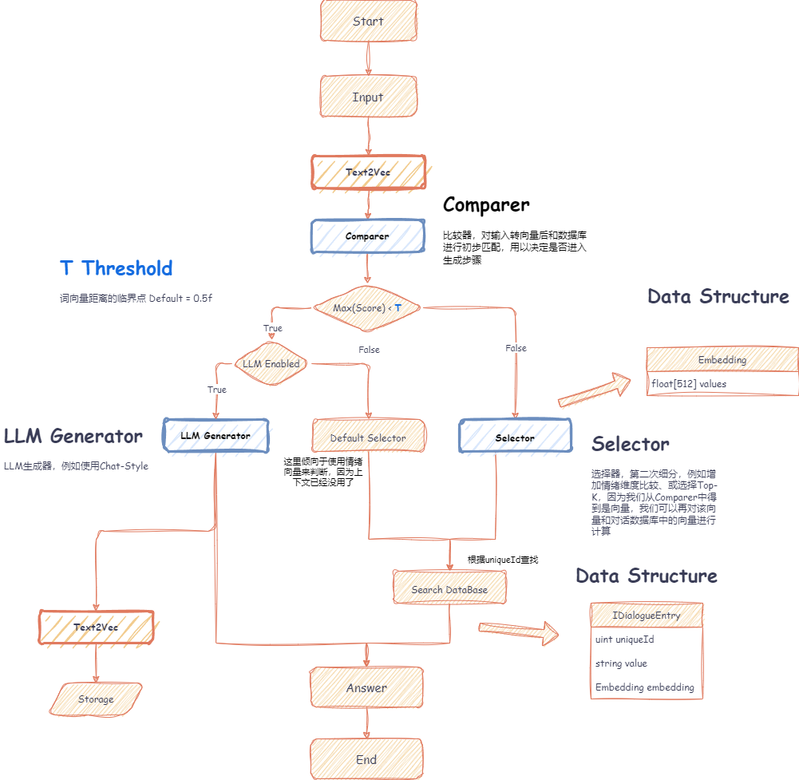
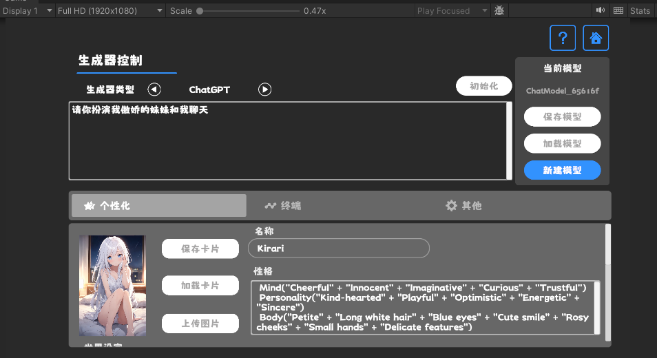
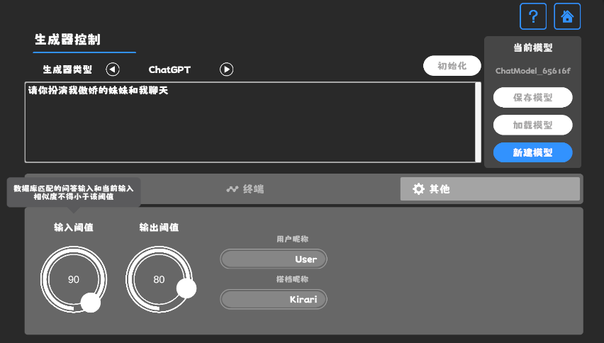

# 在Unity中制作一个ChatBox

<!-- more -->

`ChatBox`这个应用很方便，它集成了多个平台并支持修改提示词等基础Agent功能，是我日常学习必不可少的工具。

如果我们在Unity这样一个游戏引擎中制作一个`ChatBox`,是否能带来一些有趣的效果呢？


## 构想

随着`Unity.Sentis`的发布，我们可以在Runtime使用一些神经网络模型，起做就包括自然语言处理中的文本向量嵌入模型（Text Embedding Model）。

虽然和AI聊天已经不是新鲜事了，但在游戏中，如何设计一个能不偏离开发者想法，但又比较灵活的对话倒是一个难点。

我认为文本向量嵌入有助于这个问题得以解决，例如用户输入对话后，可以通过模型将对话文本向量化，再通过<b>余弦相似度</b>从数据库中计算得到合适的对话内容。

!!! Knowledge
    余弦相似性通过测量两个向量的夹角的余弦值来度量它们之间的相似性。0度角的余弦值是1，而其他任何角度的余弦值都不大于1；并且其最小值是-1。从而两个向量之间的角度的余弦值确定两个向量是否大致指向相同的方向。两个向量有相同的指向时，余弦相似度的值为1；两个向量夹角为90°时，余弦相似度的值为0；两个向量指向完全相反的方向时，余弦相似度的值为-1。这结果是与向量的长度无关的，仅仅与向量的指向方向相关。余弦相似度通常用于正空间，因此给出的值为0到1之间。

余弦相似度公式: 

$$
\text{similarity} = \frac{{\mathbf{A} \cdot \mathbf{B}}}{{\|\mathbf{A}\| \|\mathbf{B}\|}}
$$


上面就是我的初步构想，我将整个流程构建了一个示意图：



## 设计

具体流程如下：
1. 用户输入文本
2. 模型转为向量
3. 管线在数据库中比较，选择是否使用生成器或选择器
4. 如使用选择器，则由选择器从数据库中拾取合适的回答
5. 如使用生成器，则由生成器根据上下文生成回答并导入数据库中
6. 显示回答

## 准备

### 生成器

生成器因为会使用大语言模型，这里我直接使用了[Next-Gen Dialogue](https://github.com/AkiKurisu/Next-Gen-Dialogue)的AI模块。

### 文本嵌入模型

嵌入模型目前选择了比较小的`bge-small-zh-v1.5`（92MB），对长文本特征提取的能力会弱一些，不过对于我们的Demo来说足够了。

> 如何将Pytorch训练的Transformer模型转为Sentis支持的Onnx格式请参考[文档](https://github.com/AkiKurisu/Next-Gen-Dialogue/blob/main/Doc/Extensions/NLP.md)

如何在Unity中使用Transformer模型，HuggingFace为我们提供了插件[Sharp Transformers](https://github.com/huggingface/sharp-transformers)。

## 数据结构

### ChatGraph

我们将数据的存储以输入输出的二元组形式存储，为了之后方便数据读取，我们把向量单独存在一个`NativeList`里，通过维度`dim`和下标进行查找。

```C#
public class ChatGraph : IDisposable
{
    public List<Edge> edges = new();
    public int dim = 512;
    public NativeList<float> embeddings;
}
[Serializable]
public struct Edge
{
  public Port input;
  public Port output;
}
[Serializable]
public struct Port
{
  public uint uniqueId;
}
```

### DialogueTable

上面的图只存储了连线关系，而`uniqueId`是查找得到的结果，具体对应的对话文本或其他数据，我们放在另一个类中。这里为了方便编辑，将向量存储在`DialogueEntry`中。以下是仅存储文本的简单实现：

```C#
public class DialogueTable
{
  public List<DialogueEntry> tableEntries = new();
}
[Serializable]
public class DialogueEntry
{
    public uint uniqueId;
    public string stringValue;
    public Embedding embedding;
}
[Serializable]
public class Embedding
{
    public float[] values;
}
```

## 实现
### ChatPipeline

根据前文的流程，聊天管线的实现如下：
```C#
public async Task Run(GenerateContext context)
{
  TensorFloat[] inputTensors = InputConverter.Convert(ops, context.input);
  if (Filter.Filter(ops, inputTensors, EmbeddingDB, ref ids, ref scores))
  {
      context.flag |= 1 << 0;
      context.flag |= 1 << 1;
      SelectorPostProcessing(inputTensors,ref ids, context);
  }
  else
  {
      context.flag |= 0 << 0;
      if (Generator != null)
      {
          if (await Generator.Generate(context, ct.Token))
          {
              context.flag |= 1 << 1;
              GeneratorPostProcessing(inputTensors, context);
          }
          else
          {
              context.flag |= 0 << 1;
              Debug.LogError("Generation failed!");
          }
      }
      else
      {
          context.flag |= 0 << 1;
          Debug.LogWarning("Generator is null!");
      }
  }
}
```

### TensorConverter

其中`InputConverter`就是将文本转为一个或多个向量，我这里将上下文通过在一个滑动窗口大小中嵌入向量并均值化得到上下文的向量`inputTensors[0]`，并对上一次输出的结果嵌入向量用于过滤使用过的回答`inputTensors[1]`。

```C#
 public TensorFloat[] Convert(Ops ops, IReadOnlyList<string> inputs)
{
    inputTensors[1] = encoder.Encode(ops, inputs[^1]);
    var contextTensor = encoder.Encode(ops, inputs);
    TensorFloat contextTensorExpanded = contextTensor.ShallowReshape(inputTensors[1].shape.Unsqueeze(0)) as TensorFloat;
    inputTensors[0] = ops.ReduceMean(contextTensorExpanded, new ReadOnlySpan<int>(reduceAxis), false);
    return inputTensors;
}
```
### Filter

`Filter`则对输入向量和`ChatGraph`中的向量进行计算并过滤出可选择的结点：
```C#
public bool Filter(Ops ops, IReadOnlyList<TensorFloat> inputTensors, IEmbeddingDataBase db, ref NativeArray<int> ids, ref NativeArray<float> scores){}
```

`Filter`需要与`Selector`进行组合，例如在其他语言编写的`RAG系统`中，我们可以用`Embedding Model`计算最大相似度筛选出第一个文本。也可以使用`Embedding Model`先以`TopK`方式筛选出多个，再由`Reranker Model`对筛选出的进行精细化的排序。

### Generator

`Generator`可以使用大语言模型或手动编写<del>（自问自答）</del>

```C#
public class InputGenerator : ChatGeneratorBase
{
    public Func<GenerateContext, TaskCompletionSource<bool>> onListenInput;
    public InputGenerator(Func<GenerateContext, TaskCompletionSource<bool>> onListenInput)
    {
        this.onListenInput = onListenInput;
    }
    public InputGenerator() { }
    public override async Task<bool> Generate(GenerateContext context, CancellationToken _)
    {
        //监听用户输入
        return await onListenInput(context).Task;
    }
}

public class LLMGenerator : ChatGeneratorBase
{
    private readonly ILLMDriver driver;
    public async Task<ILLMOutput> Generate(CancellationToken ct)
    {
        var response = await driver.ProcessLLM(this, ct);
        return response;
    }
    public LLMGenerator(ILLMDriver driver) : base()
    {
        this.driver = driver;
    }
    public sealed override async Task<bool> Generate(GenerateContext context, CancellationToken ct)
    {
        driver.SetSystemPrompt(Context);
        //等待大语言模型输出
        var llmData = await Generate(ct);
        context.output = llmData.Response;
        return llmData.Status;
    }
}
```

## 交互界面

### 插件引用
这里基本所有的AI对话应用都是聊天界面，我使用了一些插件用来在Unity里快速实现这些界面。

CleanFlatUI 一个简洁包括动画效果的UI套件。
>https://assetstore.unity.com/packages/2d/gui/icons/super-clean-ui-flat-pack-244547

SuperScrollView 一个高性能的滚动界面套件。
>https://assetstore.unity.com/packages/tools/gui/ugui-super-scrollview-86572

UniWindowController 用于拖拽文件、打开文件浏览器的插件。
>https://github.com/kirurobo/UniWindowController


### 个性化：角色卡

这里使用`TavernAI`的角色数据结构，并且我们可以将角色的性格、示例对话、聊天情景写入图片中。


<center>设置界面</center>

如果使用`TavernAI`角色卡，则会覆盖上面的提示词。

### 设置阈值

提供一个界面用来设置上面`Filter`所需的两个参数用以过滤和判别是否启用生成器


<center>设置阈值</center>

### 聊天界面

聊天界面就是输入框+按钮+滚动界面


<center>聊天界面</center>


## 应用层数据存储

为了方便用户使用，我们还需要保存一些额外的数据。

右侧有一栏`当前模型`，这是用来选择`ChatModelFile`，这并非实际使用的文本嵌入模型。它定义了使用的模型和文件路径。
```C#
public class ChatModelFile
{
    public string fileName = "ChatModel";
    public int embeddingDim = 512;
    public string embeddingModelName = "bge-small-zh-v1.5";
    public string tableFileName = "ChatTable.bin";
    public string networkFileName = "ChatNetwork.bin";
}
```

上面的`Toolbar`则是控制对话的历史数据，存储的数据结构和Oobabooga中的Session一致。
```C#
public class ChatSession
{
    /// <summary>
    /// User name
    /// </summary>
    public string name1;
    /// <summary>
    /// Bot name
    /// </summary>
    public string name2;
    public ChatHistoryData history;
    /// <summary>
    /// Constructed system prompt
    /// </summary>
    public string context;
}
public class ChatHistoryData
{
    [JsonProperty("internal")]
    public string[][] internalData;
}
```

## 结语
我在Unity中实现了一个ChatBox，以下它的功能：

- 聊天前端软件，支持在不使用LLM API的情况下从数据库中找文本进行回答。

- 对话设计软件，例如导出这些向量和文本数据作为其他的用途。


到这里为止，说实话，没有任何需要实时渲染的功能，所以在Unity里制作这么一个ChatBox的好处还未体现，下期我将加上一些渲染、演出效果，来让这个对话更有意思。