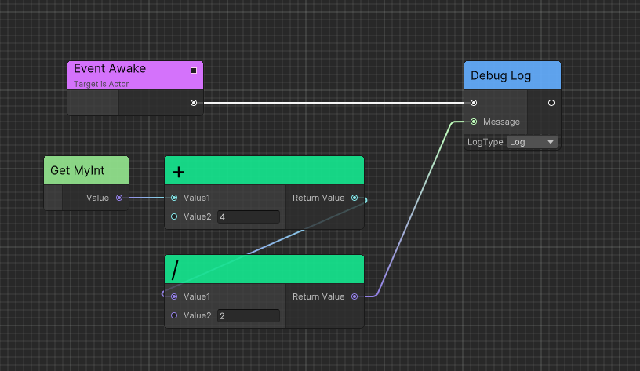
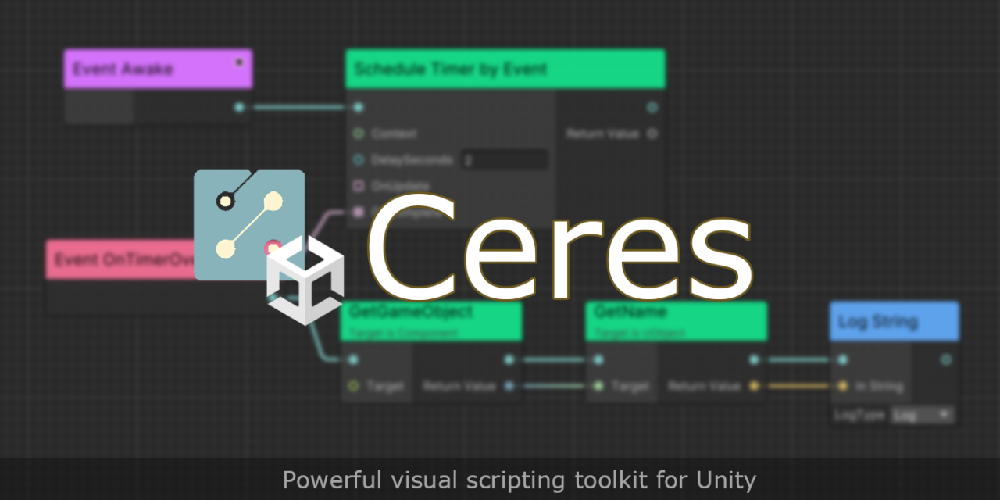

# 如何设计一个Unity可视化脚本框架（二）

<!-- more -->

Ceres是我基于自身两年半的Unity独立游戏制作经验和半年的Unreal工作经验，开发出的可视化脚本框架。
其中，`Ceres.Flow`的功能类似于Unreal蓝图（Blueprint/Kismet）中EventGraph，方便开发者基于事件和节点连线来实现游戏逻辑。
由于UE的蓝图已经成为了游戏业内的可视化脚本方案标杆，为了易于理解，下文简称可视化脚本为蓝图。


本期文章系列旨在分享我开发中的一些设计点和解决问题的过程。

上篇文章详见：[如何设计一个Unity可视化脚本框架（一）](./design-a-visual-scripting-framework-1.md)

## 底层设计

在上一篇笔者谈到新轮子需要在设计环节考虑运行时性能问题。对此，我们可以先观察现有框架的运行时设计。而运行时设计不得不提Unreal和Unity在可视化编辑器底层设计上的差异。

### Unreal蓝图
在UE的蓝图（Kismet/Blueprint）中，不存在虚拟机实例，即XNode和NodeGraphProcessor中的`Graph`。而是由`Kismet Compiler`编译为字节码，运行时由Unreal的超级基类`UObject`来执行。这使得蓝图的性能相较于原生C++并没有特别差。但该设计极大依赖Unreal的UHT生成代码，例如蓝图对C++的调用需要UHT对相应方法生成Thunk函数。简而言之，这需要框架能直接面向编译器设计。

### Unity可视化编辑器

XNode和NodeGraphProcessor都是基于C#上层的设计，C#给予了方便的反射系统，这使得我们可以直接使用高级语言抽象化"节点"作为运行时容器，而不必基于指令和栈。这大大简化了开发的难度并减少了成本，但也带来相应内存和性能的开销，例如反序列化节点的开销。

### Ceres

Ceres也采用了基于运行时节点的设计，通过运行时实例化蓝图“虚拟机”执行逻辑。

## 应用层设计
在应用层，Unreal的蓝图对于Unity中的实现上参考意义不大，接下来我们仅分析XNode和NodeGraphProcessor中的实现。

无论是面向Unity还是Unreal，可视化编辑器都是为了抽象化逻辑流和数据流，其中逻辑流是指节点和连线，数据流是指节点的输入和输出。

### 数据流设计

在Unity的两个实现中，这可以理解为`Port`之间的数据交换。

而这两个框架的实现上，运行时都不存在`Port`实例，XNode输入输出依赖Node手动操作出，NodeGraphProcessor简化为使用反射在节点运行前后注入。

但由于颗粒度不够，两者不可避免使用了拆装箱来进行类型擦除。

```C#
// XNode的输出值装箱
object GetValue(NodePort port)

// NodeGraphProcessor的输入值拆箱
fieldInfo.SetValue(fieldOwner, passThroughObject);
```

Ceres于是将Port抽象，简单版的实现如下：

```C#
public abstract class CeresPort
{
  public abstract void Link(CeresPort targetPort);
}

public class CeresPort<TValue>: CeresPort
{
    public TValue defaultValue;

    private CeresPort<TValue> _getter;

    public TValue Value
    {
        get
        {
            if (_getter != null) return _getter.Value;
            return defaultValue;
        }
        set => defaultValue = value;
    }

    public override void Link(CeresPort targetPort)
    {
        if (targetPort is not CeresPort<TValue> genericPort)
        {
            return;
        }
        genericPort._getter = this;
    }
}
```

这样对于值类型的输入输出就不需要再拆装箱了。

进一步，我们还需要考虑值类型之间的隐式转换，例如int和float之间的转换，如果转换需要开发者手动添加一个节点想必是非常麻烦的。

因此在Ceres中，我们可通过注册委托来实现`Port`间的隐式转换，使用如下：
```C#
CeresPort<float>.MakeCompatibleTo<int>(f => (int)f);
CeresPort<int>.MakeCompatibleTo<float>(i => i);
CeresPort<Vector3>.MakeCompatibleTo<Vector2>(vector3 => vector3);
```


具体实现可见[CeresPort](https://github.com/AkiKurisu/Ceres/blob/main/Runtime/Core/Models/Graph/Ports/CeresPort.cs#L206)。

### 逻辑流设计

XNode和NodeGraphProcessor的逻辑流设计上，都是依次执行节点。但我们还需要考虑节点的依赖关系，即节点的输入和输出。

例如节点A的输出依赖节点B的输出，那么节点A的执行顺序应该在节点B之后。如果只有从前往后执行一种顺序的话，只能依赖用户连线顺序正确。




因此Ceres在设计上将逻辑流分为了Forward和Dependency两种，这使得我们可以让部分节点不再需要显式的输入输出`Port`。如上图所示，我们可以在调用`Debug.Log`前再执行前置的节点。

## 总结

本篇笔者分享了一下Ceres在数据流和逻辑流上的设计点，
下一期我将会分享Flow设计上的一些细节，例如C#和蓝图之间调用的设计。

当然项目一直在持续开发中，欢迎提issues。

## 项目


https://github.com/AkiKurisu/Ceres