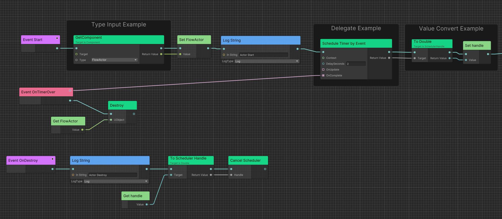

# 如何设计一个Unity可视化脚本框架（三）

<!-- more -->

Ceres是我基于自身两年半的Unity独立游戏制作经验和半年的Unreal工作经验，开发出的可视化脚本框架。
其中，`Ceres.Flow`的功能类似于Unreal蓝图中的EventGraph，方便开发者基于事件和节点连线来实现游戏逻辑。



本期文章系列旨在分享我开发中的一些设计点和解决问题的过程。

上篇文章详见：[如何设计一个Unity可视化脚本框架（二）](./design-a-visual-scripting-framework-2.md)

>由于UE的蓝图已经成为了游戏业内的可视化脚本方案标杆，为了易于理解，下文简称可视化脚本为蓝图。

## C#和蓝图怎么通信

可以分为两部分，蓝图调用C#，C#调用蓝图。我们先说较为简单的前者。

### 蓝图调用C# 

从用户层面，例如Unreal，开发者可以通过一个metadata标记方法来让蓝图能够调用C++方法。

```cpp
UFUNCTION(BlueprintCallable)
void ExampleFunction();
```

当然如上篇提到，这依赖框架面向编译器设计，从原理上是Unreal会生成额外的C++代码来包装原方法。使得包装后的Thunk方法的输入输出能够和蓝图的输入输出保持一致。例如输入统一为void**即指针数组，输出也为指针。

那么在C#中设计类似的功能从直觉上就是使用反射，但我们都知道使用反射的性能很差。并且在Unity的保守式GC下，使用反射还会带来显著的GC开销，例如我们调用`MethdInfo.Invoke`时参数为`object[]`，需要创建新的数组对象并且还有潜在的拆装箱。

但这并不妨碍反射的使用，因为它确实能够快速帮助我们实现类似于Unreal蓝图调用C++的功能。

于是在Ceres.Flow中可以这样标记函数显示在蓝图中。

```C#
[ExecutableFunction]
public void TestFunctionVoid()
{
    Debug.Log($"Execute {nameof(TestFunctionVoid)}");
}
```


设计上基本没有什么新奇的，反倒是性能优化的地方比较花时间，这里简单介绍几个细节。

#### 反射优化

推荐[Why is Reflection slow](https://mattwarren.org/2016/12/14/Why-is-Reflection-slow)这篇文章，里面有详细介绍反射的性能问题的来源，
同时也给了我们几个常见的优化方案，例如使用委托。

Ceres.Flow中的反射优化感兴趣的读者可以看这个PR [Delegate Optimization](https://github.com/AkiKurisu/Ceres/pull/2)。

#### 拆装箱优化

用委托替代反射的好处之一是不需要每次额外allocate一个数组。但如果不能预先知道委托类型，就仍需要运行时拆装箱来传递参数。
对此，Flow利用运行时构造泛型实例来支持无拆装箱的方法调用（当然此方法存在反序列化的额外开销）。

实现方面，由于C#不存在C++中的Variadic Templates(可变模板参数)，我们只能像微软提供的`System.Action`和`System.Func`一样，
手写不同数量的泛型方法，目前我只手写到6个入参。超过6个参数就使用默认的反射方式调用。


### 库函数

Unreal中还有一种蓝图调用C++的方式，即库函数。我们可以通过创建库类，在其中定义静态方法，并在蓝图中进行调用。
这在Unity显得太有用了，因为大部分开发者无法修改引擎侧的C#源码。而上述方式让蓝图调用C#依赖于用户可以修改相应的代码。

库函数可以实现C#扩展方法一样的效果，我们对Unity原生组件的API调用都可以改成静态函数的方式。以下是一个扩展方法的实现例子：
```C#
public static class GameObjectExtensions
{
    public static void SetAction(this GameObject gameObject, bool isActive)
    {
        gameObject.SetActive(isActive);
    }
}
```

那么在Ceres.Flow中，我们可以像这样创建库函数，这里Attribute中的属性作用就和上面扩展方法中this的作用类似，不过是喂给编辑器的语法糖。

```C#
public partial class UnityExecutableLibrary: ExecutableFunctionLibrary
{
    [ExecutableFunction(IsScriptMethod = true, IsSelfTarget = true), CeresLabel("SetActive")]
    public static void Flow_GameObjectSetActive(GameObject gameObject, bool value)
    {
        gameObject.SetActive(value);
    }
}
```


优化方面，Ceres.Flow利用SourceGenerator注册了函数指针来优化性能。感兴趣的读者可以看这个PR [Use FunctionPtr for static executable function](https://github.com/AkiKurisu/Ceres/pull/13).

### C#调用蓝图

Unreal中的做法仍然是用户在头文件定义方法，UHT来生成代码进行实现。下面是一个Unreal中的ImplementableEvent定义示例。

```C++
UFUNCTION(BlueprintImplementableEvent)
void BP_ExampleEvent(); /* 实现则在.gen中 */
```

这在设计层面让我一开始陷入了思考，因为C#没有头文件之说，并且Unity目前的C#版本不支持patial method，我们怎么让C#调用蓝图呢？

于是我想到了Unity.Netcode是怎么实现的RPC，如果你不了解Netcode也没关系。RPC简而言之就是远程调用方法，远端一般是server或者client。
那么我们这里远端就是蓝图对象。翻阅源码后了解到Unity的编译管线中有一个后处理环节用来操作生成出的dll，也即对IL进行操作，因此叫ILPostProcess。
我们可以利用这个特性来在用户的方法实现中注入对蓝图的调用，从而实现C#调用蓝图！

那么实现后，我们就可以这样调用蓝图方法了.

```C#
public class FlowTest : FlowGraphObject /* Inherit from MonoBehaviour */
{
    [ImplementableEvent]
    public void Awake()
    {

    }

    [ImplementableEvent]
    public void PrintFloat(float data)
    {

    }

    [ImplementableEvent]
    public void ExecuteTest(string data)
    {

    }
}
```


如果你对实现比较好奇，可以参考文档[Flow/ILPP](https://github.com/AkiKurisu/Ceres/blob/main/Docs/flow_startup.md#ilpp)。


## 总结

本篇笔者分享了一下Flow方法调用上的设计细节，希望对大家有所帮助。

下一期主题还没想好，有想法的可以评论区留言。

当然项目一直在持续开发中，欢迎提issues捏。

## 项目


https://github.com/AkiKurisu/Ceres