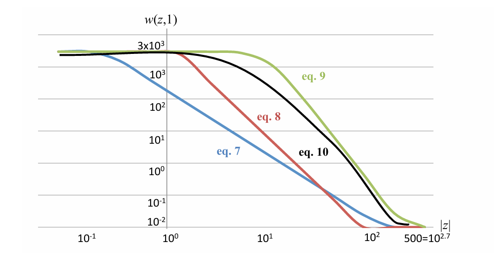
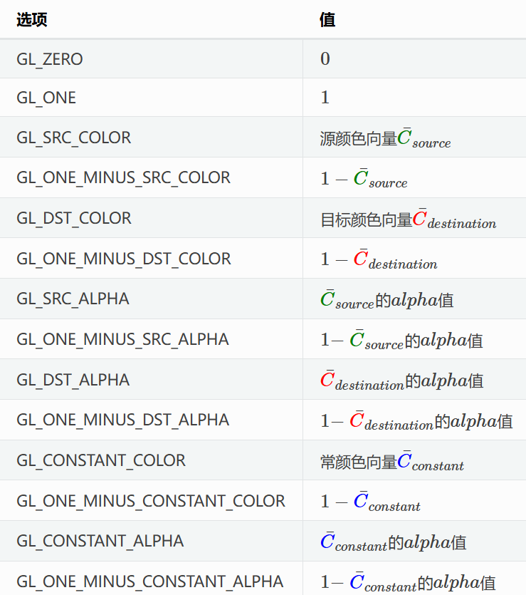
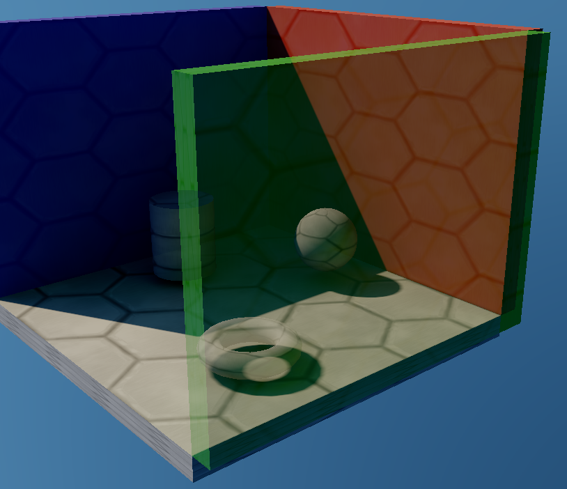

# 头发半透明渲染OIT技巧

<!-- more -->

目前游戏中应用广泛的Alpha Dithering + TAA渲染头发的方式，对于像暖暖这种需要静距离观察的应用场景来说，效果还是不够精细。

一方面渲染上还是有噪点，另一方面如果不使用单独的TAA Buffer，依赖全屏TAA，就限制了玩家可自定义AA方案，而这个在广泛的3A游戏中都是有多种方案可供选择。

而如果采取Alpha Blend方式，不可避免遇到半透明渲染排序问题。因此要使用Order Independent Transparency (OIT)技术解决这一问题。

## WOIT

OIT的流派有很多种，例如Depth Peeling, Pixel Linked List, Movement-Based等，这里我们使用Weighted Blended。Weighed Blended需要通过合适的权重函数来近似计算Over算子, 其由英伟达在13年提出，详见 [NVIDIA/Weighted Blended Order-Independent Transparency](https://jcgt.org/published/0002/02/09/)。




以下是Paper作者Morgan McGuire在其博客[Weighted, Blended Order-Independent Transparency](https://casual-effects.blogspot.com/2014/03/weighted-blended-order-independent.html)中给出一个的OpenGL实现的示例。

Accumulate部分：

```c++
// Output linear (not gamma encoded!), unmultiplied color from
// the rest of the shader.
vec4 color = ... // regular shading code

// Insert your favorite weighting function here. The color-based factor
// avoids color pollution from the edges of wispy clouds. The z-based
// factor gives precedence to nearer surfaces.
float weight =  max(min(1.0, max(max(color.r, color.g), color.b) * color.a), color.a) * clamp(0.03 / (1e-5 + pow(z / 200, 4.0)), 1e-2, 3e3);

// Blend Func: GL_ONE, GL_ONE
// Switch to premultiplied alpha and weight
gl_FragData[0] = vec4(color.rgb * color.a, color.a) * weight;

// Blend Func: GL_ZERO, GL_ONE_MINUS_SRC_ALPHA
gl_FragData[1].a = color.a;
```

Blend 部分

```c++
vec4 accum = texelFetch(RT0, int2(gl_FragCoord.xy), 0);
float reveal = texelFetch(RT1, int2(gl_FragCoord.xy), 0).r;

// Blend Func: GL_ONE_MINUS_SRC_ALPHA, GL_SRC_ALPHA
gl_FragColor = vec4(accum.rgb / max(accum.a, 1e-5), reveal);

```

OpenGL BlendFunc参考如下：



如果在Unity中实现的话，BIRP可以参考冯乐乐女神的实现 [candycat1992/OIT_Lab](https://github.com/candycat1992/OIT_Lab/blob/master/Assets/OIT/WeightedBlended/Scripts/WeightedBlendedManager.cs)，URP的话简述如下：

1. 正常渲染不透明物体。
2. 正常渲染天空盒。
3. 一个Draw Object Pass 用MRT渲染OIT半透明物体（Accumulate + Reveal）。
4. 一个全屏Blit Pass将颜色Blend到`CameraColorTarget`上。

## 半透问题

Matt大佬在其博客[Weighted Blended Order-Independent Transparency](https://therealmjp.github.io/posts/weighted-blended-oit/)中提到了WOIT近似计算的问题，对于标记为半透明，但Alpha实际很大的物体，如果权重函数的曲线不够陡峭即Power系数不够大时，WOIT的Blend会出现问题，即本应不透明的物体看起来变得透明了。




而头发本质是不透明的，因此完全使用WOIT是不可行的（不然就看到脑袋了）。

## 头发半透方案

我们先看下目前各类游戏的头发半透是怎么做的。

### 伪半透明渲染

二渲中的头发半透大概是一种艺术表达，通常是针对眼睛和眉毛部分的颜色混合，表达出头发的通透感。

实现上，可以用Stencil Mask标记需要混合的不透明片元后单独渲染一个Transparent Hair Pass来实现，非标记区域头发还是普通的Opaque渲染。

### 双Pass渲染

写实项目中，，半透部分Alpha Blend的目的是为了处理边缘锯齿。

那么在Dithering方案之前，通常用双Pass来解决，即一个Pass用来渲染Alpha高区的部分，一个Pass用来渲染Alpha低区的部分。

这个方案的主要问题是边缘部分的半透明叠加时仍会存在排序问题。

## OIT半透方案

上述双Pass渲染的问题刚好可以由WOIT来解决。

因此我们以URP为例，调整一下方案:

1. 正常渲染不透明物体，其中包括Alpha高区的不透明头发，写入深度
2. 正常渲染天空盒
3. 渲染Alpha低区的OIT半透明头发，不写入深度
4. 一个全屏Blit将颜色Blend到CameraColorTargetRT上。
5. 正常渲染半透明物体

这里分离了头发和其他半透明物体的渲染，让头发使用OIT，而其他半透物体仍使用Render Queue。

这个方式在纯Opaque的场景中都能用，但如果头发在半透明物体前，例如窗户前，就会存在渲染错误。原因在于这里OIT Blend Color渲染在其他半透明之前，因此半透明物体的渲染会覆盖头发的渲染。

而把Blend Pass放到Draw Transparent Objects之后，就会导致头发始终可见（和上面半透问题一致）。

## 补丁方案

为了解决普通半透明物体覆盖头发的问题，笔者总结了以下几个方案。

### Pre-Z

这种是只保留边缘部分的半透效果，URP中即开启`Depth Priming`，在Depth Prepass中先写入Alpha高区+低区的深度，之后Opaque Pass和OIT Pass只输出颜色，不写入深度。但这个的缺点是边缘部分半透效果会变差，个人觉得效果不够好。

### Depth Postpass

这种方式是在绘制半透头发的时候写入深度。

但半透明物体渲染正常来说是不能写入深度的，原因在于影响了半透明的ZTest。因此需要和HDRP一样增加一个Depth Postpass，在渲染完OIT半透后再单独渲染一遍半透部分的Depth，该方案额外的收益是顺便解决了Dof等依赖深度的后处理效果。

但存在的问题是头发Alpha低区写入深度后， 被覆盖的像素在Transparent Pass中就不被渲染了，头发在半透物体前会产生边缘的混合错误。

### After Transaprent

这种方式是把OIT半透明放最后渲染，在例如单角色展示大厅的场景中效果较好，但因为没有正确的渲染排序，头发会覆盖在所有半透物体上。

## 最终混合方案

上面的补丁方案都在现有渲染管线上存在限制和缺陷，`After Transaprent` 的方式效果最好，但如果前面有半透遮挡就会有问题。

GPU Gem3中为了优化半透粒子，将其渲染到一张单独的降分辨率的RT上，即半透分离渲染，最后和Color Buffer进行混合，但由于深度精度缺失，混合后，半透边缘会被背景颜色渗透。

[Blocky Artifacts](../../../assets/images/2025-04-27/blocky_artifacts.png)

其解决方案是结合Sobel Edge Detect对边缘进行Stencil标记，然后在全分辨率下对标记区域再绘制一遍半透物体。

受到启发，我在`After Transaprent`方案和`Depth Postpass`基础上，在OIT Pass中写入了Stencil，在Draw Transparent Objects之后，对标记区域再重新Overdraw一次。

该方案解决了普通半透物体被头发穿透的问题，同时因为写入了深度，Overdraw不会在OIT物体背后重复绘制。

Nice!

## 引用

[GPU Gems 3 - Chapter 23. High-Speed, Off-Screen Particles](https://developer.nvidia.com/gpugems/gpugems3/part-iv-image-effects/chapter-23-high-speed-screen-particles)

[NVIDIA - Weighted Blended Order-Independent Transparency](https://jcgt.org/published/0002/02/09/)

[Morgan McGuire - Weighted, Blended Order-Independent Transparency](https://casual-effects.blogspot.com/2014/03/weighted-blended-order-independent.html)

[Matt - Weighted Blended Order-Independent Transparency](https://therealmjp.github.io/posts/weighted-blended-oit/)