# Unity URP高质量渲染开发实践

<!-- more -->


总所周知，URP是Unity开发移动端的首选项，但它的Feature在如今看来实在匮乏。另一方面，如今移动端的性能越来越强劲，对于高通骁龙Elite这样的高端芯片甚至可以支持在移动端使用光线追踪技术。

结合这样的背景，笔者为了想要在移动端获得高质量的角色渲染，前后大概花了一年的时间开发了IllusionRP这一开源渲染插件，插件也不再只包括角色渲染质量的提高，还吸收并集成了非常多来自HDRP和开源插件的渲染功能。

IllusionRP完全基于URP的RendererFeature开发，无缝衔接现有URP项目，目前适用于Unity 2022.3.62 和 URP14.0.12，理论上也支持基于22版本的团结引擎（没测试过），仓库链接放在了文章末尾，欢迎在GitHub收藏关注。

本篇文章就开发IlluionRP的设计思路以及工程实现方面进行经验分享。

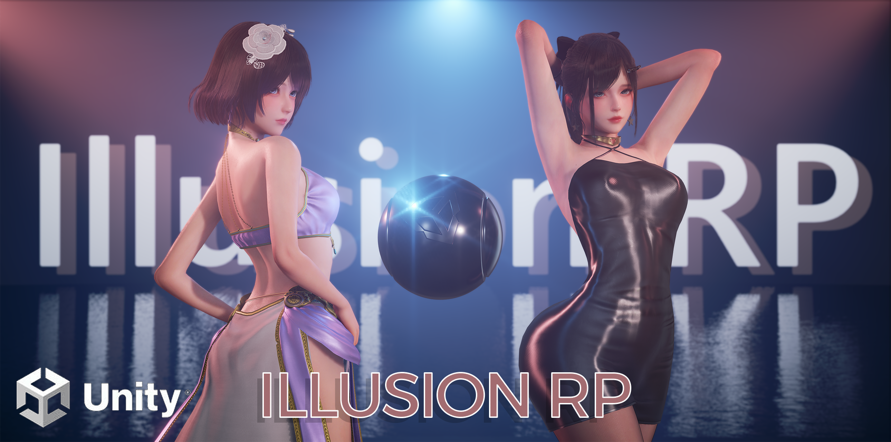

## 方案选择

如果你是一名Unity游戏开发者，想让游戏画面变得更好看应当怎么办呢？ 

1. 直接用HDRP。Feature很多，但由于大部分使用ComputeShader，只适用于主机和高端PC。在国内因为没法做手游，市面上几乎没多少使用HDRP的商业项目。但现在移动端性能逐渐变强的情况下，也存在有优化能力的团队将HDRP适配到移动端，例如搜狐畅游引擎部的[图形引擎实战：HDRP移动版高清渲染管线改造](https://zhuanlan.zhihu.com/p/567981404)。
2. URP加插件。URP可以直接通过RendererFeature注入ScriptableRenderPass方便拓展功能，AssetStore和Github都能找到非常多的插件。
3. 自己写SRP，例如蛋白胨大佬的[DanbaidongRP](https://github.com/danbaidong1111/DanbaidongRP)，前提是有比较强的图形学知识和工程能力。

第一种我觉得对于普通开发者来说不太可能，等搞完都出Unity7了（Unity之前说会在Unity7整合URP和HDRP）。

第二种我认为有好有坏，将渲染功能拆分成RenderFeature让社区开发者可以协作是一件好事，但也会导致冗余浪费和隐藏成本的提高。

譬如A插件实现了一个SSR，在Forward渲染路径下增加一个ThinGBufferPass，而B插件实现了一个SSGI，也在Forward渲染路径下增加了类似的Pass，那么很自然会看到这里要渲染两次实则功能一样的ThinGBuffer。

再譬如对于需要修改Shader的效果，插件一般都会单独提供一个Shader，而要使用多个插件的效果就需要开发者手动整合。

因此在接入各类插件后，整体优化和整合的问题还是落在了开发者头上，改完了还不方便更新。

第三种对我这样的民科菜鸟来说属实太难了... 客观来讲，自定义的SRP难以随引擎升级以适配新功能（例如Unity6的GPU Driven），维护成本比较高。

但由于笔者认为自己的工程能力尚可，不想直接摆烂，结合自己对SRP的理解攒出了第四个方案——在URP基础上再搭一层管线，将HDRP迁移过来的渲染功能合并在一个RendererFeature中以便管线调度RendererPass。

因为没有重写渲染管线，基本都是加法，这让笔者能在一边迁移功能的同时学习相关概念和算法~

然后渲染路径的选择上，使用Deferred的话需要修改LightLoop源码比较麻烦，最后选择只兼容Forward和Forward+渲染路径，添加Shader和Pass比较灵活。

## 主要拓展

大概可以分为<b>Shading-着色器</b>、<b>Rendering-渲染管线</b>以及<b>Workflow-工作流</b>三大部分。

### Shading

着色器的拓展主要依赖于添加新的Shading Model，URP只有一个Lit，对于复杂的材质是完全不够的。

IllusionRP添加了以下Shading Model：

1. Skin 皮肤
2. Hair 头发
3. Fabric 布料

### Rendering

光添加ShadingModel对于提高渲染质量是不够的，例如URP的SSAO对于角色渲染就是非常糟糕，至少也得调整为HBAO才能看。

IllusionRP集成了以下渲染功能：
1. Per Object Shadow 逐物体阴影
2. Percentage Closer Soft Shadows (PCSS) 高质量的软阴影
3. Contact Shadow 接触阴影
4. Ground Truth Ambient Occlusion (GTAO)高质量的屏幕空间环境光遮蔽
5. Screen Space Reflection (SSR)屏幕空间反射
6. Screen Space Subsurface Scattering (5S)屏幕空间次表面散射
7. Screen Space Global Illumination (SSGI)屏幕空间全局光照
8. Precomputed Radiance Transfer Global Illumination (PRTGI)预计算辐照度全局光照
9. Reflection Normalization 反射标准化
10. Order Independent transparency (OIT)顺序无关半透明
11. Volumetric Fog 体积雾
12. Convolution Bloom 卷积泛光（替换原生Bloom）
13. Auto Exposure 自适应曝光
14. 仿原神的Gran-Turismo Tonemapping（替换原生Tonemapping-Neural）
15. Unreal的Filmic ACES Tonemapping（替换原生Tonemapping-ACES）

其中PerObjectShadow、GTAO和5S对于提升角色渲染质量影响最大，如果读者也想要提高角色渲染质量，可以尝试只添加这3个功能。

给这些功能细分一下的话：

1~3是阴影渲染提升

4~7是屏幕空间光照提升

7~9是全局光照提升

10是半透明渲染提升

11~15是后处理提升

我会在后面的实现部分会再介绍其中的实现细节。

### Workflow

工作流这部分可以分为着色器开发流程、效果管理流程、渲染调试流程与构建流程。

#### 着色器开发流程

IllusionRP将Shader开发分为了设计层和模型层，插件为每个新增的Shading Model都提供了Amplify Shader Editor的Template，设计师可以像在HDRP或UE中一样直接选择Shading Model练练看创建Shader， 并且使用了HDRP的Surface Input提供了几个示例（HD Skin、HD Hair、HD Fabric等）。

IllusionRP使用ASE作为设计层工具的一大原因是ASE的模板开发比较方便，可以通过注释来创建静态编译选项，例如Hair Template就可以直接在ASE编辑器中切换KajiyaKay和Marschner模型。

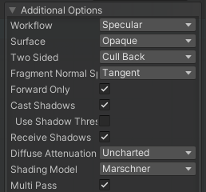


#### 效果管理流程

IllusionRP将为每个效果在RendererFeature上提供了全局开关，方便在不同平台下切换可使用的效果，以及之后方便剔除Shader变体。其次提供了VolumeComponent方便配置效果参数以及Gameplay侧的效果开关。

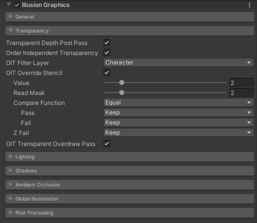

#### 渲染调试流程

RendererDebugger是Unity原生的运行时调试工具，但可惜不支持非侵入式的拓展，所以我基于之前写的开发框架[AkiKurisu - Chris](https://github.com/AkiKurisu/Chris)走了自己的一套调试方式。

Chris提供了类似Unreal的CVar功能，我们可以在控制台中输入变量来调整运行时启用的渲染效果以及一些Debug效果。

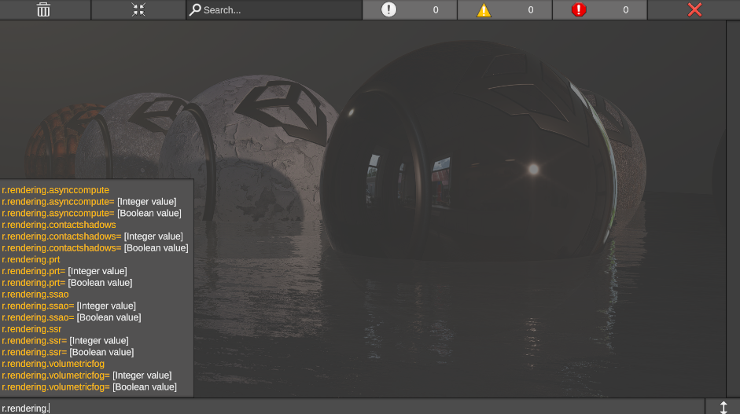

#### 构建流程

对于渲染管线，构建部分要考虑的实际就是Shader变体控制，IllusionRP完全参考URP的Shader变体管理，使用Shader Prefiltering和Variant Stripper两个工具来分别进行剔除。

Shader Prefiltering是Unity提供的粗筛漏斗，但这里存在设计问题导致有一些坑点。

例如`[RemoveIf]`和`[SelectIf]`这几个Attribute只能作用在Const或序列化字段中，<b>静态字段</b>是不生效的。其次因为URP会在自己的Prefiltering中剔除掉例如ScreenSpaceShadow和ScreenSpaceOcclusion，我们需要标记`overridePriority`为`true`来覆盖URP的设置。

```C#
public partial class IllusionRendererFeature
  {
      // Notice that prefilter attribute only works for serialized fields and constants
      internal enum PrefilterMode
      {
          Remove,                     // Removes the keyword
          Select,                     // Keeps the keyword
          SelectOnly                  // Selects the keyword and removes others
      }

      // Override priority in UniversalRenderPipelinePrefitering
      // Prefer Depth Normal, see GroundTruthAmbientOcclusion.cs
      [SelectIf(true, overridePriority: true, keywordNames: ScreenSpaceAmbientOcclusion.k_SourceDepthNormalsKeyword)]
      private const bool RequiresScreenSpaceOcclusionDepthNormals = true;

      
      [RemoveIf(PrefilterMode.Remove,     keywordNames: IllusionShaderKeywords._SCREEN_SPACE_SSS)]
      [SelectIf(PrefilterMode.Select,     keywordNames: new [] {"", IllusionShaderKeywords._SCREEN_SPACE_SSS})]
      [SelectIf(PrefilterMode.SelectOnly, keywordNames: IllusionShaderKeywords._SCREEN_SPACE_SSS)]
      [SerializeField]
      internal PrefilterMode ScreenSpaceSubsurfaceScatteringPrefilterMode = PrefilterMode.Select;
  }
```

Variant Stripper是更加精细化针对特定变体的剔除工具。IllusionRP直接参考URP，对于每一个Shader变体判断关键词组合是否有效，例如开启SURFACE_TYPE_TRANSPARENT后，因为没有写入深度，就不应该使用屏幕空间的效果例如SSAO、SSR、SSAO，我们就可以在Variant Stripper中剔除掉这些变体。

```C#
private bool StripUnusedFeatures_ScreenSpaceOcclusion(ref ShaderStrippingData strippingData, ref ShaderStripTool<ShaderFeatures> stripTool)
{
    if (strippingData.IsShaderFeatureEnabled(ShaderFeatures.ScreenSpaceOcclusion))
    {
        // Transparent strip ssao
        if (strippingData.IsKeywordEnabled(_surfaceTypeTransparent) && strippingData.IsKeywordEnabled(_screenSpaceOcclusion))
            return true;
        
        if (stripTool.StripMultiCompileKeepOffVariant(_screenSpaceOcclusion, ShaderFeatures.ScreenSpaceOcclusion))
            return true;
    }
    else
    {
        if (stripTool.StripMultiCompile(_screenSpaceOcclusion, ShaderFeatures.ScreenSpaceOcclusion))
            return true;
    }
    
    return false;
}
```

## 着色器实现

IllusionRP在着色器实现上的过程与细节。

### 皮肤材质

皮肤核心是次表面散射，笔者起初尝试了Matt大神提供的球面高斯次表面散射（SGSSS），用公式拟合替代了过去移动端经常使用的预计算次表面散射技术中的LUT，在Forward渲染路径下为着色器节省了宝贵的一个Sampler。但因为没有屏幕空间的模糊，效果我感觉还是不够好，一种方式是再使用一个模糊过的法线，但这样就又把省下的Sampler还了回去。

之后还是完全使用（照抄）了屏幕空间次表面散射（5S），并且还原了HDRP的多Profile方式以支持多种次表面散射材质。

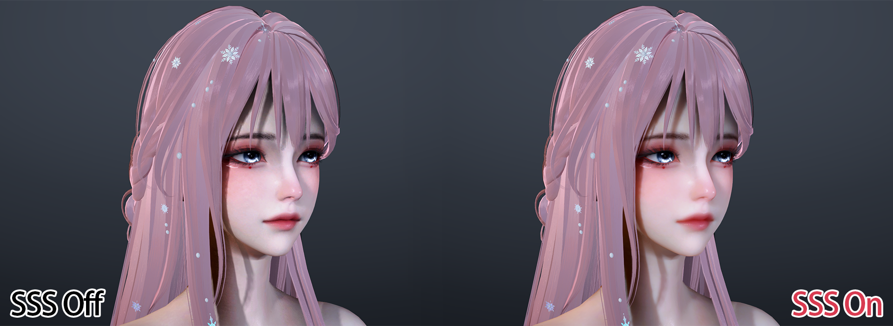

剩下的就是皮肤比较特殊的双镜叶高光来模拟皮肤的油脂层。

```cpp
// Primary Lobe
half3 SpecularLobe1 = SkinGGXSpecularLobe(brdfData, normalWS, lightDirectionWS, viewDirectionWS);

// Secondary Lobe
BRDFData brdfData2 = brdfData;
brdfData2.roughness = max(PerceptualRoughnessToRoughness(SkinData.PerceptualRoughness), HALF_MIN_SQRT);
half3 SpecularLobe2 = SkinGGXSpecularLobe(brdfData2, normalWS, lightDirectionWS, viewDirectionWS);

// Dual Lobe Mix
half3 SpecularLobeTerm = lerp(SpecularLobe1, SpecularLobe2, SkinData.LobeWeight);
```

### 头发材质

Kajiyakay模型目前都是使用双层高光的变体版本，可以参考HDRP接入。

Marschner模型则直接使用了UE5中的版本。

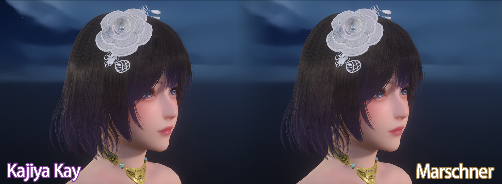

额外参考神秘海域4中分享的`Volumetric-based`方式，增加了一个背面体积散射，搭配体积光有不错的视觉效果。

```cpp
// Reference: [The Process of Creating Volumetric-based Materials in Uncharted 4]
half3 HairVolumetricBacklitScatter(half3 albedo, half3 L, half3 V, half3 N, HairData hairData)
{
    const half ScatterPower = 9;
    const half lightScale = 1;

    half3 NoisedL = normalize(L + hairData.Noise * 0.25);
    half NdotL = dot(N, NoisedL);
    half NdotV = dot(N, V);
    half VdotL = dot(V, NoisedL);
    half CosThetaL = saturate(abs(NdotL));
    half CosThetaV = saturate(abs(NdotV));
    
    half3 scatterFresnel = pow(1.0 - CosThetaV, ScatterPower);
    half3 scatterLight = pow(saturate(-VdotL), ScatterPower) * 
                        (1.0 - CosThetaV) *
                        saturate(1.0 - CosThetaL);
    
    half3 transAmount = scatterFresnel + lightScale * scatterLight;
    return lerp(1, albedo, 0.8) * hairData.Tint * transAmount * hairData.Backlit;
}
```

剩下就是为了让头发边缘没有锯齿or噪点，使用顺序无关的透明渲染方式，详细可见[如何在Unity URP中让头发渲染更丝滑](https://zhuanlan.zhihu.com/p/1907549925065070387)。

### 布料材质

布料主要就两部分：

Anisotropy Specular各项异性高光

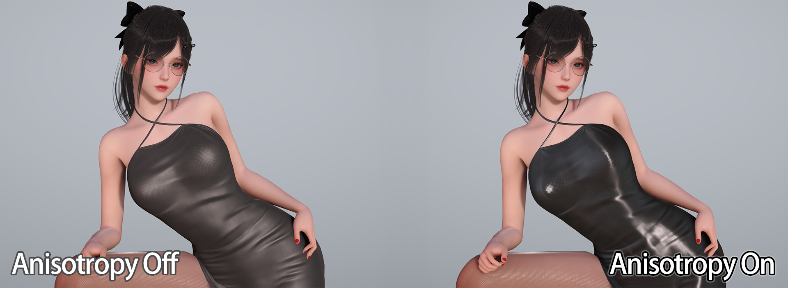

Ashikhmin和Charlie两种Sheen Scattering模型。

需要注意在URP下因为设计原因，Lambert漫反射都没有除PI，为了保证能量守恒，对于自定义的Shading Model，需要使用NoPI版本即未除PI的版本。

```cpp
void SheenScattering(BRDFData brdfData, half NoH, half NoV, half NoL, out half SheenTerm)
{
    // @IllusionRP:
    // Since URP does not multiply INV_PI in Lambert Diffuse for artistic design considerations.
    // Specular term need multiply PI to maintain energy conservation.
#ifdef _SHEEN_VELET
    half D_Sheen = D_AshikhminNoPI(NoH, brdfData.roughness2);
#else
    half D_Sheen = D_CharlieNoPI(NoH, brdfData.roughness);
#endif
        
    half V_Sheen = V_Neubelt(NoL, NoV);
    SheenTerm = D_Sheen * V_Sheen;
#if REAL_IS_HALF
    SheenTerm  = SheenTerm  - HALF_MIN;
    SheenTerm  = clamp(SheenTerm , 0.0, 100.0); // Prevent FP16 overflow on mobiles
#endif
}
```

然后因为前面适配了多Profile的次表面散射，理论上可以根据需要可以加入布料的次表面散射。

## 阴影质量提升

由于CSM的阴影精度并不高，对于需要高精度阴影的角色，除了增加CSM等级的方式，更普遍的做法是使用逐物体阴影PerObjectShadow。

这里使用了Stalo大佬星穹铁道复刻项目[stalomeow/StarRailNPRShader](https://github.com/stalomeow/StarRailNPRShader)中的PerObjectShadow实现。

其次参考HDRP和recaeee大佬的渲染项目[recaeee/RecaNoMaho_P](https://github.com/recaeee/RecaNoMaho_P)，为主光源阴影和逐物体阴影适配了PCSS软阴影，越远越模糊的表现能提高阴影的质感，从实践上看在开启了PenumbraMask标记半影区域以及使用ScreenSpaceShadow后，PCSS的开销比较可控，移动端可以选择开启。

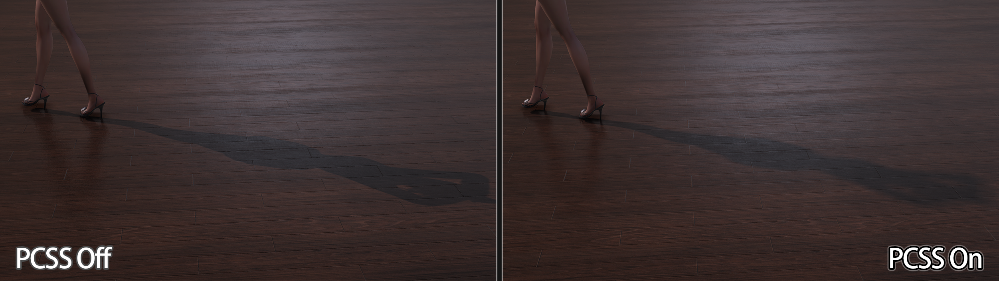

另一方面，URP由于使用Shadow Caster Vertex Based Bias会在特定角度有很多瑕疵（具体可参考[zilch - 自适应Shadow Bias算法](https://zhuanlan.zhihu.com/p/370951892)的分享，因此IllusionRP使用了Shadow Receiver Fragment Based Bias。

但这也有一定弊端，即IllusionRP的Shader无法和其他URP Shader一起使用，例如要添加AssetStore的Shader，就需要逐个手动适配。

```cpp
// Ref: ApplyShadowBias
// Should be used in fragment shader instead of vertex shader
float3 IllusionApplyShadowBias(float3 positionWS, float3 normalWS, float3 lightDirection)
{
#ifdef _MAIN_LIGHT_SHADOWS_CASCADE
    half cascadeIndex = ComputeCascadeIndex(positionWS);
#else
    half cascadeIndex = half(0.0);
#endif

    float4 shadowBias = _MainLightShadowCascadeBiases[cascadeIndex];
    
    float invNdotL = 1.0 - saturate(dot(lightDirection, normalWS));
    float scale = -invNdotL * shadowBias.y;

    // In fragment shadow bias, bias direction is reversed
    positionWS = -lightDirection * shadowBias.xxx + positionWS;
    positionWS = normalWS * scale.xxx + positionWS;
    return positionWS;
}

float3 biasPositionWS = positionWS;
#if APPLY_SHADOW_BIAS_FRAGMENT
    // Recalculate shadowCoord when using shadow bias in fragment shader
    biasPositionWS = IllusionApplyShadowBias(positionWS, normalWS, lightDir);
    #if !(defined(_MAIN_LIGHT_SHADOWS_SCREEN) && (SURFACE_TYPE_RECEIVE_SCREEN_SPACE_SHADOWS))
        shadowCoord = TransformWorldToShadowCoord(biasPositionWS);
    #endif
#endif

half realtimeShadow = IllusionMainLightRealtimeShadow(shadowCoord);
```

## 屏幕空间光照实现

屏幕空间光照接入了SSAO（使用了GTAO算法）、SSGI、SSR。

SSR在我之前的文章[UPR Screen Space Reflection实践](https://zhuanlan.zhihu.com/p/1912828657585590857)中提过，和HDRP不同的是IllusionRP额外包含了几个更轻量的不使用Hiz的方法。

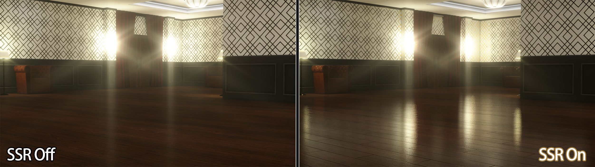

对于前向渲染管线中实现屏幕空间光照的工程实践中，我认为有以下几个重点：

### GBuffer获取

因为IllusionRP没有侵入式修改URP，所以是单独增加了一个ForwardGBufferPass来收集GBuffer数据，更好的方式是放在DepthNormalPass中MRT一起收集。

### 历史帧管理

SSR和SSGI都有时域混合降噪的需求，因此管线需要支持历史帧管理。

SRP提供了`BufferedRTHandleSystem`专门用于管理历史帧RT资源的Swarp。

需要注意的是`BufferedRTHandleSystem`只会在RT尺寸超过缓冲区大小时重新创建RenderTexture，而如果是RT尺寸变小，则直接通过修改全局的HistoryRTHandleSize来调整采样和写入时的UV，减少运行时DynamicResolution伸缩RTSize带来的Allocation。

URP下因为不开启DynamicResolution可以关掉这个功能，防止手机屏幕转动导致RTSize不匹配。

```c#
var descriptor = renderingData.cameraData.cameraTargetDescriptor;
var viewportSize = new Vector2Int(descriptor.width, descriptor.height);
_historyRTSystem.SwapAndSetReferenceSize(descriptor.width, descriptor.height);

// Since we do not use RTHandleScale, ensure render texture size correct
if (_historyRTSystem.rtHandleProperties.currentRenderTargetSize.x > descriptor.width
    || _historyRTSystem.rtHandleProperties.currentRenderTargetSize.y > descriptor.height)
{
    _historyRTSystem.ResetReferenceSize(descriptor.width, descriptor.height);
}
```

### AsyncCompute优化

屏幕空间光照的计算量比较大，因此可以使用AsyncCompute来提高效率。

根据英伟达[Advanced API Performance: Async Compute and Overlap](https://developer.nvidia.com/blog/advanced-api-performance-async-compute-and-overlap/)的建议，我们可以在Compute Queue中计算SSR、GTAO，在Graphics Queue中做一些计算较轻的任务，例如阴影图的渲染。

所以我们可以在启用AsyncCompute时修改一下URP中`MainLightShadowCasterPass`和`AdditionalLightsShadowCasterPass`的`renderPassEvent`。注意这里在实践中发现URP14.0.12因为会在场景中没有相应光源阴影时Clear了错误的RenderTarget，会导致Pre-Z深度被清掉，所以要视情况调整顺序。

```c#
// Re-order light shadow caster pass renderPassEvent better for async compute.
// Ref: https://developer.nvidia.com/blog/advanced-api-performance-async-compute-and-overlap/
bool enableAsyncCompute = _rendererData.PreferComputeShader 
                            && IllusionRuntimeRenderingConfig.Get().EnableAsyncCompute;

// Shadow Caster has bug in URP14.0.12 when there is no main/additional light in scene which will clear pre-z.
// So skip re-order when shadow is not rendered.
bool reorderMainLightShadowPass = enableAsyncCompute && CanRenderMainLightShadow(renderingData);
var mainLightShadowCasterPass = UniversalRenderingUtility.GetMainLightShadowCasterPass(renderer);
if (mainLightShadowCasterPass != null)
{
    mainLightShadowCasterPass.renderPassEvent = reorderMainLightShadowPass ? IllusionRenderPassEvent.LightsShadowCasterPass : RenderPassEvent.BeforeRenderingShadows;
}
bool reorderAdditionalLightShadowPass = enableAsyncCompute && CanRenderAdditionalLightShadow(renderingData);
var additionalLightsShadowCasterPass = UniversalRenderingUtility.GetAdditionalLightsShadowCasterPass(renderer);
if (additionalLightsShadowCasterPass != null)
{
    additionalLightsShadowCasterPass.renderPassEvent = reorderAdditionalLightShadowPass ? IllusionRenderPassEvent.LightsShadowCasterPass : RenderPassEvent.BeforeRenderingShadows;
}
```

### 半分辨率优化

屏幕空间光照如果启用全分辨率，可以在Shader中直接LoadTexture减少一个Sampler，但带宽会吃的比较紧。如果使用半分辨率，就需要在ForwardPass中额外使用一个Sampler，这对于前向渲染来说比较够呛（启用SSR+SSGI+SSAO三个效果的话则可能需要3个Sampler）。

因此HDRP对ScreenSpaceLighting功能普遍使用Compute In Half Resolution + Upsampling to RTSize的做法，Lighting就可以直接LoadTexture，这比URP原生SSAO只做半分辨率更为合理。

## 全局光照方案

在Unity2022中，URP还未支持APV，只有LightMap+LightProbes一套原始人方案。前者纯静态、需要UV2，后者面向动态物体，但由于URP没有LightProbeProxy构建3d纹理，只能逐物体对附近的LightProbe做插值，这使得角色模型等复杂模型的间接光光照效果很差（与环境不一致）。

所以IllusionRP亟需接入一套更方便的全局光照方案。

接入SSGI是比较轻松的，但SSGI由于无法获取屏幕外的信息，我们还需要有一套Fallback的方案，因此IllusionRP采取了PRTGI+SSGI的全局光照组合。

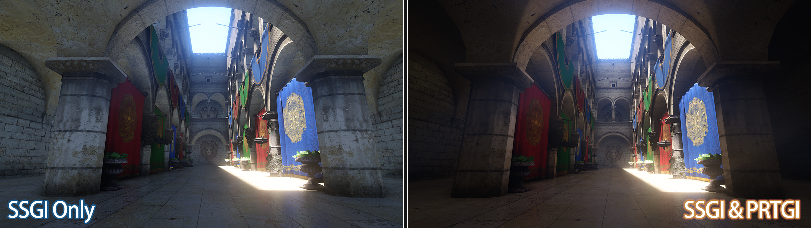

### 预计算辐照度全局光照

预计算辐照度全局光照（PRTGI）的实践在我之前的文章[Unity预计算辐照度全局光照PRTGI实践与拓展（上）](https://zhuanlan.zhihu.com/p/1957857268528834096)和[Unity预计算辐照度全局光照PRTGI实践与拓展（下）](https://zhuanlan.zhihu.com/p/1957865115991908586)已介绍过，其缺点就是很容易丢失高频的漫反射信息，所以对于室内细节表现不佳。

编辑器工具上，我提供了和APV一样的Adjustment Volume来调整Probe位置。

### 屏幕空间全局光照

迁移HDRP中的SSGI方案后，将fallback到APV的部分改成采样PRT的IrradianceVolume即可。

参考了HDRP和[jiaozi158/UnitySSGIURP](https://github.com/jiaozi158/UnitySSGIURP)中的做法，对未命中的像素fallback到AmbientProbe和ReflectionProbes上。

HDRP中的AmbientProbe来自物理天空盒，URP中我们暂未实现类似功能，因此直接使用RenderSettings中的ambientProbe（即LightSettings中设置的环境颜色）。

```c#
private void BindAmbientProbe(CommandBuffer cmd)
{
    SphericalHarmonicsL2 ambientProbe = RenderSettings.ambientProbe;
    _ambientProbeBuffer ??= new ComputeBuffer(7, 16);
    var array = new NativeArray<Vector4>(7, Allocator.Temp);
    array[0] = new Vector4(ambientProbe[0, 3], ambientProbe[0, 1], ambientProbe[0, 2], ambientProbe[0, 0] - ambientProbe[0, 6]);
    array[1] = new Vector4(ambientProbe[1, 3], ambientProbe[1, 1], ambientProbe[1, 2], ambientProbe[1, 0] - ambientProbe[1, 6]);
    array[2] = new Vector4(ambientProbe[2, 3], ambientProbe[2, 1], ambientProbe[2, 2], ambientProbe[2, 0] - ambientProbe[2, 6]);
    array[3] = new Vector4(ambientProbe[0, 4], ambientProbe[0, 5], ambientProbe[0, 6] * 3, ambientProbe[0, 7]);
    array[4] = new Vector4(ambientProbe[1, 4], ambientProbe[1, 5], ambientProbe[1, 6] * 3, ambientProbe[1, 7]);
    array[5] = new Vector4(ambientProbe[2, 4], ambientProbe[2, 5], ambientProbe[2, 6] * 3, ambientProbe[2, 7]);
    array[6] = new Vector4(ambientProbe[0, 8], ambientProbe[1, 8], ambientProbe[2, 8], 1);
    _ambientProbeBuffer.SetData(array);
    array.Dispose();
    cmd.SetGlobalBuffer(IllusionShaderProperties._AmbientProbeData, _ambientProbeBuffer);
}
```

## 半透明渲染提升

使用Weighted Blend OIT来修复头发半透明部分的穿插。但提升的不多，单独使用OIT还是会有瑕疵。

后续可以参考UE5使用Pixel Linked List或Moment Based OIT来进一步优化。

## 后处理提升

这块因为笔者用的模型不是那么写实（日式写实），使用ACES时感觉效果不好，就找了两个方案：

Filmic ACES Tonemapping：参照UE将ACES参数暴露出来, 根据场景调整。

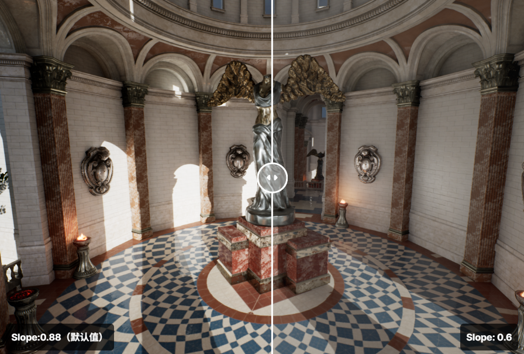

Gran-Turismo Tonemapping：使用更简单的曲线在不降低饱和度的情况下拉低过曝区域。

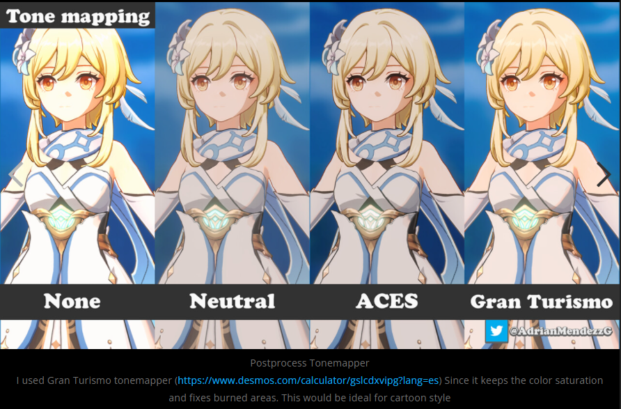

到应用方面，URP实际也给我们开了口子, 我们可以创建一个新的PostProcessData，在里面替换后处理Shader，然后在原有Shader基础上增加关键词控制Tonemapping算法即可。

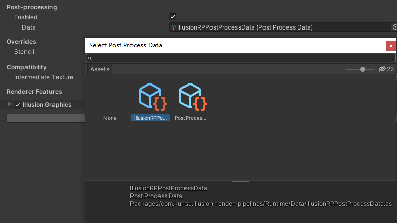

从接入结果上看，对于我这里的角色，个人认为GT效果要更好些。

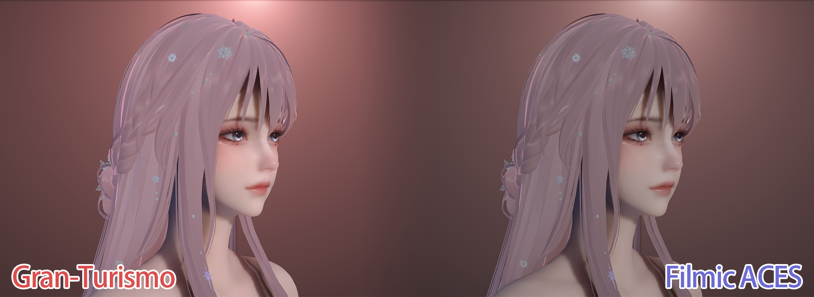

## 参考资料

[Matt - Approximating Subsurface Scattering With Spherical Gaussians](https://therealmjp.github.io/posts/sss-sg/)

[傻头傻脑亚古兽 - Unity实现SSS皮肤次表面散射 - 知乎](https://zhuanlan.zhihu.com/p/583108480)

[jplee - Extra technique for Skin shader by URP](https://leegoonz.blog/2020/08/24/dual-lobe-for-skin-shader-by-urp/)

[jplee - UE4 ACES Tone mapping port URP](https://leegoonz.blog/2021/09/03/ue4-aces-tone-mapping-port-urp/)

[Naughty Dog - The Process of Creating Volumetric-based Materials in Uncharted 4](https://advances.realtimerendering.com/s2016/The%20Process%20of%20Creating%20Volumetric-based%20Materials%20in%20Uncharted%204.pptx)

[NVIDIA - Weighted Blended Order-Independent Transparency](https://jcgt.org/published/0002/02/09/)

[Casual Effects - Weighted, Blended Order-Independent Transparency](http://casual-effects.blogspot.com/2014/03/weighted-blended-order-independent.html)

[ZZNEWCLEAR13 - 在URP的片元着色器中应用阴影偏移](https://zznewclear13.github.io/posts/unity-urp-apply-shadow-bias-in-fragment-shader/)

其他参考项目可以在项目文档中查看。

## 仓库链接

欢迎Star、Fork和Contribute~

（不知道什么时候有空升级到Unity6的RenderGraph捏）

[AkiKurisu - IllusionRP](https://github.com/AkiKurisu/IllusionRP)