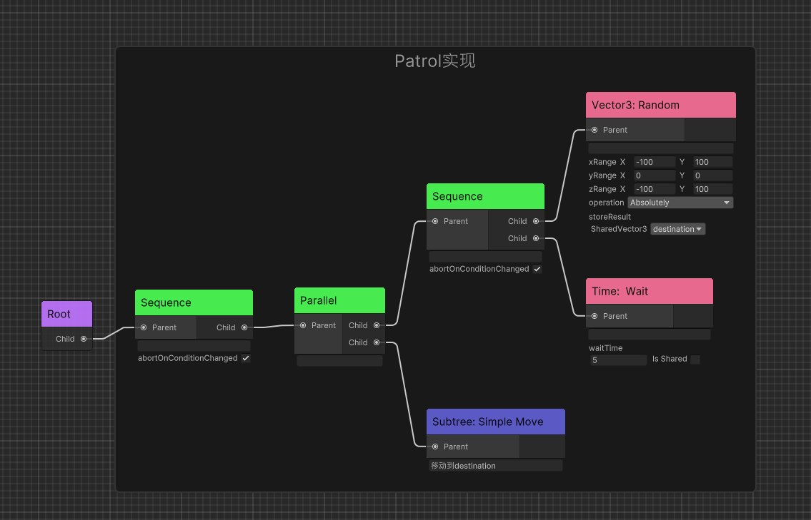

# Unity射击游戏AI实现: 初级篇

<!-- more -->

笔者在学生时代的游戏开发经历中开发过`Behavior Tree`、`GOAP`等AI工具，对传统的游戏AI设计方法都均有涉猎。本篇我们将在`Unity`中实现一下射击游戏AI。

## 前置知识

在开发AI之前，你应了解游戏开发中的一些常见设计模式，并且熟悉`Unity`、`Unreal`等游戏引擎提供的开发范式（例如`Unity`推荐的组件式模块开发）。

## GamePlay实现

以下`Pawn`代指游戏世界中的射击角色（玩家和人机），`Controller`用于控制`Pawn`的演绎。我们可以通过继承，为玩家和AI实现不同的`Controller`来指导`Pawn`进行一些通用的行为，例如开火和瞄准。

### 瞄准功能

开火之前通常需要先瞄准。

通常玩家的瞄准使用IK进行调整。对于AI也可适用此方法。

```C#
// 在Pawn中处理瞄准逻辑
public void ProcessAim()
{
    float speed = Time.deltaTime * 10f;
    float aimWeight;

    // 判断瞄准可用：例如是否有敌人
    if (CanAim())
    {
        aimWeight = 1;
    }
    else
    {
        aimWeight = 0;
    }

    // 控制IK的权重
    UpdateAimIKWeight(aimWeight, speed);
}
```


### 开火功能

这里的结构是`Pawn`中根据表现逻辑处理是否开火，开火由额外的`WeaponCtrl`对象进行执行，将计算和表现分离。为了简化，也可以将计算耦合在`Pawn`中。

```C#
// 在Pawn中处理开火逻辑
public void ProcessFire()
{
    // 判断开火可用：例如动画是否能播放，瞄准IK是否就绪等表现逻辑
    if (CanFire())
    {
        Animator.SetBool(_animIDFire, true);
        if (IsReloading) return;

        // 可选：换弹检测
        if (weapon.BulletsAmounts == 0)
        {
            WeaponCtrl.ReloadWeapon();
            // 简化：
            //ReloadWeapon();
        }
        else
        {
            //实际射击的方法：射线检测、特效播放等
            WeaponCtrl.UseWeapon();
            // 简化：
            //UseWeapon();
        }
        return;
    }

    Animator.SetBool(_animIDFire, false);
}
```


### 移动实现

因为玩家和AI的移动方式不同（后者常使用NavMesh），我们需要分别实现各自的逻辑。

这里AI的`Pawn`继承后称为`AIPawn`，玩家的`Pawn`继承后称为`Character`。下面就是`AIPawn`移动最简单的实现：

```C#
// AIPawn.cs
public void Move(Vector3 pos)
{
   this.navMeshAgent.SetDestination(pos);
}
```


!!! Tips
    关于`Character`的移动实现，你可以直接使用Unity官方提供的`StarterAssets`中的代码。


## AI实现

由于射击类AI有反应式的行为（例如和玩家之间的对抗），我们通常会使用行为树。

对于大部分3A射击类游戏，AI本身除了对抗也会有别的行为例如巡逻，搜点。可以抽象出额外的状态来控制这些行为之间的切换，因此也很适合用状态机。

所有我们采取自顶向下，由状态机控制行为树的方式来开发AI。

> 类似的设计架构在《最终幻想15》中也有使用，感兴趣的可以阅读以下文章：
> 
> A Character Decision-Making System for FINAL FANTASY XV
by Combining Behavior 
Trees and State Machines 《GameAIPro3》

### 状态机实现

首先定义一下状态枚举

```C#
public enum AIPhase
{
    /// <summary>
    /// AI default state
    /// </summary>
    IDLE,
    /// <summary>
    /// AI patrol around battle field
    /// </summary>
    PATROL,
    /// <summary>
    /// AI combat with current target, may have substates
    /// </summary>
    COMBAT
}
```
定义状态类

```C#
public abstract class AIState : IDisposable
{
    protected TPSAIController Controller { get; private set; }
    public AIState(TPSAIController controller)
    {
        Controller = controller;
    }
    public virtual void OnStateEnter()
    {

    }

    public virtual void OnStateUpdate()
    {

    }
    public virtual void OnStateExit()
    {

    }
}

```

在`TPSAIController`中实现状态初始化和切换

```C#
// TPSAIController.cs
private void Awake()
{
    states = new Dictionary<AIPhase, AIState>()
    {
        {AIPhase.IDLE,new IdleState(this)},
        {AIPhase.PATROL,new PatrolState(this)},
        {AIPhase.COMBAT,new CombatState(this)}
    };
    currentState = states[AIPhase.IDLE];
}

 public void TransitionState(AIPhase phase)
{
    currentState.OnStateExit();
    currentState = states[phase];
    currentState.OnStateEnter();
}

```

巡逻和战斗状态的移动逻辑在行为树中编写。

开火为了和状态逻辑并行，可以在`Controller`中编写。如在不同状态中有着不同的开火行为，也可以在行为树中使用`Parallel`编写。

```C#
// TPSAIController.cs
private void Update()
{
    // 更新状态机
    currentState.OnStateUpdate();
    // 开火前置逻辑：例如是否有目标
    if(...)
   {
        // AI 开火逻辑
        Pawn.ProcessFire();
        // AI 瞄准逻辑
        Pawn.ProcessAim();
    }
}
```


### 行为树实现

继承Action并获取`Controller`

```C#
public abstract class TPSAction : Action
{
    protected TPSAIController Controller { get; private set; }
    public override void Awake()
    {
        base.Awake();
        Controller = GameObject.GetComponent<TPSAIController>();
    }
}
```
巡逻状态行为树



战斗状态行为树


### 状态机控制行为树

如何在状态机中切换行为树呢？在我的`AkiFramework`中已经提供了这样的工具，`BehaviorTask`可用于配置不同的行为树资产。


如果继承自`AkiFramework`的`AIController`，则可以使用`GetTask(string TaskId)`方法获取行为树。

```C#
// 静态类标注TaskIDHostAttribute，用于编辑器内选择`TaskID`
[TaskIDHost]
public static class TPSAITasks
{
    public const string Patrol = nameof(Patrol);
    public const string Combat = nameof(Combat);
}
public class PatrolState : AIState
{
    public PatrolState(TPSAIController controller) : base(controller)
    {
    }
    public override void OnStateEnter()
    {
        base.OnStateEnter();
        // 运行Patrol行为树
        Controller.GetTask(TPSAITasks.Patrol).Start();
    }
     public override void OnStateExit()
    {
        base.OnStateExit();
        // 停止Patrol行为树
        Controller.GetTask(TPSAITasks.Patrol).Pause();
    }
}
```

### 状态机和行为树数据交换

#### 方式1：Controller作为数据中介

此方法需要行为节点和状态结点都获取了`Controller`，当然也可以获取其他对象作为数据中介。

```C#
// 状态机Write
public class CombatState : AIState
{
    public override void OnStateUpdate()
    {
        Controller.Target = target;
    }
}
// 行为树Read
[AkiGroup("TPS")]
[AkiLabel("TPS: LookAtTarget")]
public class LookAtTarget : TPSAction
{
    protected override Status OnUpdate()
    {
        Pawn.LookAtTarget(Controller.Target);
        return Status.Success;
    }
}
```

#### 方式2：BlackBoard作为数据中介

`AkiFramework`提供了`BlackBoard`专门用于数据交换。

```C#
// 状态机Write
public class CombatState : AIState
{
    public CombatState(TPSAIController controller) : base(controller)
    {
        // 需要在行为树初始化前先注册变量到黑板上
        BlackBoard.SetVector3("Target",default(Vector3));
    }
    public override void OnStateUpdate()
    {
        BlackBoard.GetSharedVariable<Vector3>("Target").Value=target;
        // 或者使用
        // BlackBoard.SetVector3("Target",target);
    }
}
// 行为树Read
[AkiGroup("TPS")]
[AkiLabel("TPS: LookAtTarget")]
public class LookAtTarget : TPSAction
{
    // 共享变量会在行为树初始化后自动绑定
    [ForceShared]
    public SharedVector3 target=new(){Name="Target",IsExposed=true};

    protected override Status OnUpdate()
    {
        Pawn.LookAtTarget(target.Value);
        return Status.Success;
    }
}
```

## 展示

以下是AI的视角


你可以在动图中看到三个状态之间的切换，由此我们实现了一个最简单的射击游戏AI。

实际上要完成图中的AI，你还需要`射线检测`来查看面前是否有敌人。

!!! Question
    对于射击游戏AI，如何进行射线检测才比较合理呢？


## 改良AI

上面的问题将在下一章进行解答，我将继续改良这个AI，让它变得更加智能和自然。