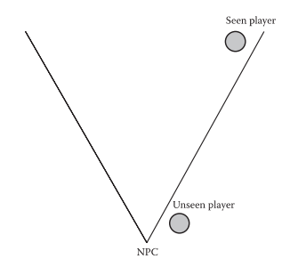
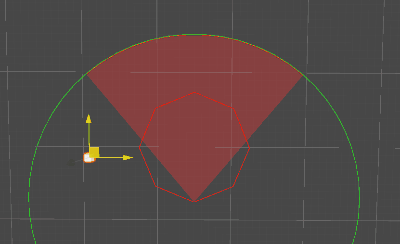

# Unity射击游戏AI实现: 中级篇

<!-- more -->

本篇将继续完善上一章制作的射击游戏AI，并增加一些高级的AI Feature。

## AI视野

AI怎么发现它的敌人呢？玩家通过相机提供的视野来发现对手，那么AI也可以拥有一个虚拟的视野，以下简称`FOV`。

> 以上就是由angle和radius控制的一个简单扇形FOV。

!!! Quesion
    从上图可以看到如果目标在扇形外，即使离得很近AI也看不到，怎么样优化这一点呢？

在GameAIPro3中，Naughty Dog分享了一种方案，就是在近处使用更复杂的多边形来圈定视野范围，在Unity中实现后如下图所示：

!!! Tips
    因为此步骤是一个粗筛，不需要考虑物体之间的遮挡问题，我们可以完全在2D平面内计算，又因为是个纯数学运算，我们可以用JobSystem进行优化。

## AI状态拓展

上期的AI几个状态比较简单，我们在这章增加几个新行为。

### 搜点

