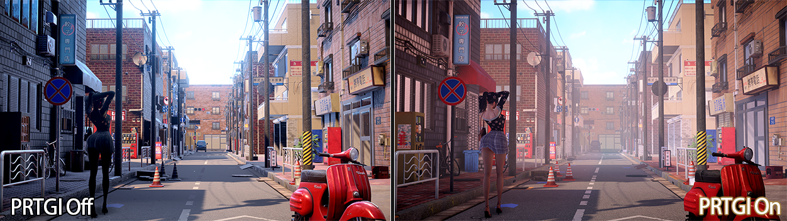
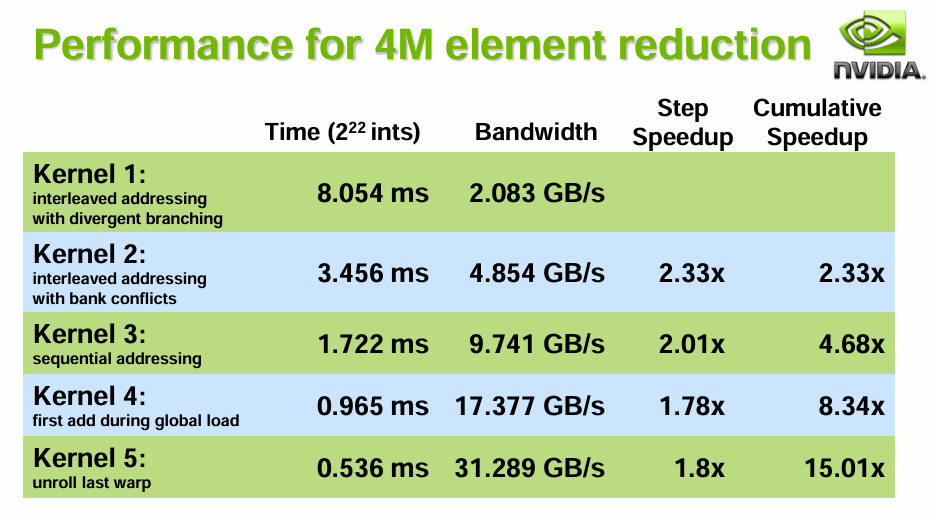
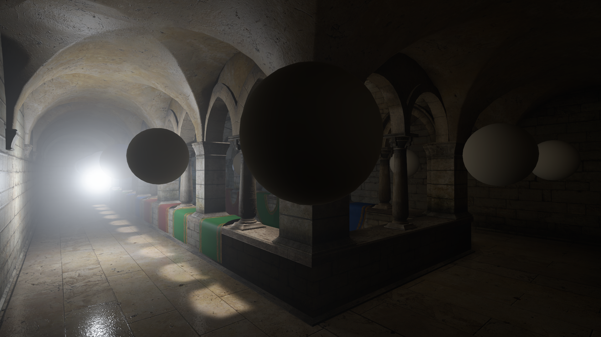
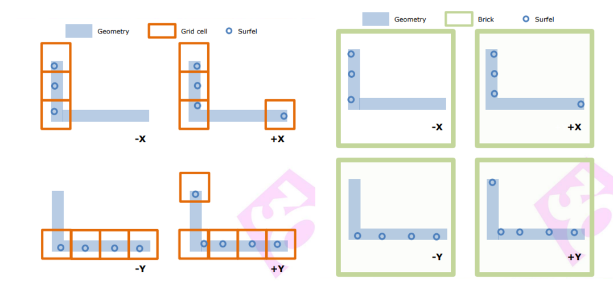
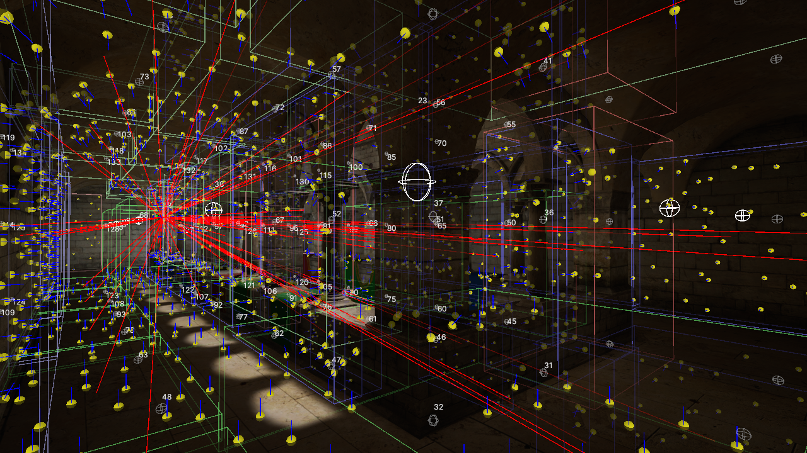

# Unity预计算辐照度全局光照PRTGI实践与拓展（上）

<!-- more -->

知乎这块最早有网易提供了其参考育碧《Global Illumination in Tom Clancy's The Division》GDC分享后的实现思路 [实时PRTGI技术与实现](https://zhuanlan.zhihu.com/p/541137978)。

后有[AKG4e3](https://www.zhihu.com/people/long-ruo-li-21)大佬提供了示例工程，见[预计算辐照度全局光照（PRTGI）从理论到实战](https://zhuanlan.zhihu.com/p/571673961)。

[方木君](https://www.zhihu.com/people/sun-wen-bin-90-50)则在[Unity移动端可用实时GI方案细节补充](https://zhuanlan.zhihu.com/p/654050347)中扩展了一下Local Light的Relight和优化方案。

笔者本篇文章也是基于该项目Fork在学习过程中继续完善和扩展，其中一小部分的写在了我的Fork版本[AkiKurisu/UnityPRTGI](https://github.com/AkiKurisu/UnityPRTGI)中，但由于我后来需要在Forward渲染路径下开发，就集成到别的项目了，Fork版本不再维护。

其他实现会之后和别的在URP下实现（抄来）的Feature一起开源，敬请期待~



## 流程概述

先总结一下AKG4e3大佬项目中的流程，方便后续对比：

1. 离线烘焙生成Surfel（总计512 * Probe）
2. 按Probe顺序存储Surfel
3. 运行时Probe拿到对应的512个Surfel
4. Relight所有Probe

## 烘焙提速

原作者使用Camera.RenderToCubemap来抓取Cubemap，这个函数在GPU上的开销实际不大，手动渲染每一个面的成本并没有减少，但可以考虑改成使用另一个拓展方法，来在构建RenderList的时候忽略非静态物体：

```C#
public static bool RenderToCubemap(
    this Camera camera,
    Texture target,
    int faceMask,
    StaticEditorFlags culledFlags);
```

通过不同场景的性能测试，烘焙这里更拖延速度的是CPU侧设置Material Shader的开销，由于需要分别设置Shader来采样Position、Albedo、Normal数据，实际开销 ≈ $3 \cdot N_\text{materials} \cdot N_\text{probes}$ 次 Shader 设置，时间复杂度为$O(N_\text{materials} \cdot N_\text{probes})$。

所以优化方式就是使用一个Shader，烘焙时只需要设置一次，每个Probe烘焙时通过切换Keyword来抓取所需数据。

```c++
#pragma multi_compile _ _GBUFFER_WORLDPOS _GBUFFER_NORMAL

float4 frag (v2f i) : SV_Target
{
    #if defined(_GBUFFER_WORLDPOS)
        // Output world position
        return float4(i.worldPos, 1.0);
    #elif defined(_GBUFFER_NORMAL)
        // Output world space normal
        return float4(i.normal, 1.0);
    #else
        // Default output albedo
        half4 albedo = SAMPLE_TEXTURE2D(_MainTex, sampler_MainTex, i.uv) * _Color;
        return albedo;
    #endif
}
```

```C#
private static void SetGlobalGBufferCaptureMode(GBufferCaptureMode captureMode)
{
    // Enable the specific keyword based on capture mode
    switch (captureMode)
    {
        case GBufferCaptureMode.WorldPosition:
            Shader.EnableKeyword("_GBUFFER_WORLDPOS");
            Shader.DisableKeyword("_GBUFFER_NORMAL");
            break;
        case GBufferCaptureMode.Normal:
            Shader.DisableKeyword("_GBUFFER_WORLDPOS");
            Shader.EnableKeyword("_GBUFFER_NORMAL");
            break;
        case GBufferCaptureMode.Albedo:
            Shader.DisableKeyword("_GBUFFER_WORLDPOS");
            Shader.DisableKeyword("_GBUFFER_NORMAL");
            break;
    }
}

// 对于每个Probe执行下面的代码
SetGlobalGBufferCaptureMode(GBufferCaptureMode.WorldPosition);
camera.RenderToCubemap(_worldPosRT, -1, StaticEditorFlags.ContributeGI);
SetGlobalGBufferCaptureMode(GBufferCaptureMode.Normal);
camera.RenderToCubemap(_normalRT, -1, StaticEditorFlags.ContributeGI);
SetGlobalGBufferCaptureMode(GBufferCaptureMode.Albedo);
camera.RenderToCubemap(_albedoRT, -1, StaticEditorFlags.ContributeGI);
```

如此一来时间复杂度为$O(1)$，大大提升了复杂场景下的烘焙速度。

## 球谐优化

可能是因为Unity 2023和Unity 6在中国封禁，Unity新推出的APV（Adaptive Probe Volume）系统在国内的讨论非常少。然而，作为Unity官方新推出的GI方案，APV有大量值得学习的优化技巧。

PRT（Precomputed Radiance Transfer）和APV实际上师出同门，共通点是都不需要UV2、比LightMap方便，需要烘焙，仅支持静态场景，两者的核心差异在于：

- **APV**: 每个Probe离线存储球谐系数，不支持动态光照（如TOD系统），但因为存储了SkyVisibility，可以实现动态的天光遮蔽。
- **PRT**: 存储Radiance数据（指育碧这种基于Surfel Radiance Cache的，也有其他类型的PRT）和SkyVisbility，支持动态光照。

PRT缺点也很明显，因为要存储的数据更多了，使得实践上Probe放置的密度小于APV的密度，这使得高频的Diffuse信息会被忽略，所以更适合（半）室外。

尽管应用场景不同，APV作为Unity官方实现，其优化策略具有重要的参考价值。


原项目`SH.hlsl`中的球谐函数实现使用大量条件判断：

```c++
// 老版本 - 大量分支判断
float SH(in int l, in int m, in float3 s) 
{
    if (l == 0) return kSHBasis0;
    if (l == 1 && m == -1) return kSHBasis1 * y;
    if (l == 1 && m == 0) return kSHBasis1 * z;
    // ... 更多条件判断
    return 0.0;
}

// 在循环中重复调用
for (int shIndex = 0; shIndex < 9; shIndex++)
{
    contribution = SHProject(shIndex, dir) * totalRadiance * 4.0 * PI / SampleCount;
    // 每次调用都要执行完整的条件判断逻辑
}
```
这种GPU上的条件分支会导致warp divergence，且影响性能。

而下面是参考Unity的`SphericalHarmonics.hlsl`的实现方式，使用向量化方式来优化。

对照用的公式，数学不好不会推没事，直接抄即可：


向量化版本：
```C++
// 新版本 - 向量化计算
void EvaluateSH9(in float3 dir, out float sh[9])
{
    // Cartesian (right-handed, Z up) coordinate.
    float x = dir.x;
    float y = dir.z;
    float z = dir.y;
    
    // L0 (constant)
    sh[0] = 1.0; // Constant term (will be multiplied by kSHBasisCoef[0])
    
    // L1 (linear)
    sh[1] = y;    // Y_1_-1
    sh[2] = z;    // Y_1_0
    sh[3] = x;    // Y_1_1
    
    // L2 (quadratic)
    sh[4] = x * y;                          // Y_2_-2
    sh[5] = y * z;                          // Y_2_-1
    sh[6] = 3.0 * z * z - 1.0;              // Y_2_0  (Equals 2.0 * z * z - x * x - y * y)
    sh[7] = x * z;                          // Y_2_1
    sh[8] = x * x - y * y;                  // Y_2_2
    
    // Apply kSHBasisCoef to get the final SH basis values
    [unroll]
    for (int i = 0; i < 9; ++i)
    {
        sh[i] = sh[i] * kSHBasisCoef[i];
    }
}

// 优化后的使用方式
float shCoeffs[9];
EvaluateSH9(dir, shCoeffs); // 一次计算所有系数

[unroll]
for (int shIndex = 0; shIndex < 9; shIndex++)
{
    contribution = shCoeffs[shIndex] * totalRadiance * 4.0 * PI / SampleCount;
    // 直接数组访问，无分支判断
}
```

这种方式可以连续访问，性能更好。

除了向量化外，APV系统中一个巧妙的优化是在球谐系数上预除PI，减少Radiance转为Irradiance时的ALU开销：

```C++
// Clamped cosine convolution coefs (pre-divided by PI)
// See https://seblagarde.wordpress.com/2012/01/08/pi-or-not-to-pi-in-game-lighting-equation/
#define kClampedCosine0 1.0f
#define kClampedCosine1 2.0f / 3.0f
#define kClampedCosine2 1.0f / 4.0f

static const float kClampedCosineCoefs[] = { 
    kClampedCosine0, kClampedCosine1, kClampedCosine1, kClampedCosine1, 
    kClampedCosine2, kClampedCosine2, kClampedCosine2, kClampedCosine2, kClampedCosine2 
};
```

这个优化基于Sébastien Lagarde的经典文章：[《Pi or not to Pi in game lighting equation》](https://seblagarde.wordpress.com/2012/01/08/pi-or-not-to-pi-in-game-lighting-equation/)。什么时候应该乘PI也是实时渲染中一个比较经典的问题，例如URP中的Lambert BRDF就没有除PI，目的是简化灯光流程，让灯光颜色调整时所见即所得。


## 3D纹理

原作者存储球谐是将27位float存在一个巨大的ComputeBuffer中，这导致需要使用定点数Encode并且使用较多的原子操作。

这个方式弊病很多，一方面没有利用GPU的优势（对3D纹理的硬件优化），另一方面原子操作导致写入前需要Clear，需要使用双缓冲来维护，内存翻倍。

```cpp
// 使用定点数存储小数, 因为 compute shader 的 InterlockedAdd 不支持 float
// array size: 3x9=27
RWStructuredBuffer<int> _coefficientSH9;  

// storage to volume
if(_indexInProbeVolume >= 0)
{
    const int coefficientByteSize = 27;
    int offset = _indexInProbeVolume * coefficientByteSize;
    for(int i = 0; i < 9; i++)
    {
        InterlockedAdd(_coefficientVoxel[offset + i * 3 + 0], EncodeFloatToInt(c[i].x));
        InterlockedAdd(_coefficientVoxel[offset + i * 3 + 1], EncodeFloatToInt(c[i].y));
        InterlockedAdd(_coefficientVoxel[offset + i * 3 + 2], EncodeFloatToInt(c[i].z));
    }
}
```

我将其修改为probeSizeX, probeSizeZ, probeSizeY * 9大小，格式为RGB111110Float的3D纹理。虽然这样还是会有一定的CacheMiss，但相比使用ComputeBuffer来存储球谐系数性能更好，并且可以方便在FrameDebugger中查看。

```cpp
// Layout: [probeSizeX, probeSizeZ, probeSizeY * 9]
RWTexture3D<float3> _coefficientVoxel3D;

if (_indexInProbeVolume >= 0)
{
    // Write to 3D texture
    int3 texCoord = ProbeIndexToTexture3DCoord(_indexInProbeVolume, index, _coefficientVoxelSize);
    _coefficientVoxel3D[texCoord] = groupCoefficients[0];
}

```


需要注意Relight时为了计算MultiBounce我们依然需要访问上一帧的球谐系数，这使得在一个线程中可能存在同时访问和写入的可能，所以只是将ComputeBuffer修改为3D纹理后，还不能去除双缓冲，还需要之后的几步优化。

## 并行规约

由于改成3D纹理，我们需要解决原来作者没处理的球谐系数求和问题，这本质是GPU中的多线程求和问题即并行规约问题。


无需掌握底层原理，英伟达直接提供了最佳实践[Optimizing Parallel Reduction in CUDA](https://developer.download.nvidia.cn/assets/cuda/files/reduction.pdf)。

在CS中实现起来非常简单，我们有512个Thread，刚好是2次幂，因此可以直接使用PPT中的方法3。


```cpp
// Parallel reduction
for (uint stride = 256; stride > 0; stride >>= 1)
{
    if (groupIndex < stride)
    {
        groupCoefficients[groupIndex] += groupCoefficients[groupIndex + stride];
    }

    GroupMemoryBarrierWithGroupSync();
}
```

由于利用了多线程能力，带宽换时间，性能大概提升2倍，还有两个进阶版本可以更有效利用带宽，但代码实在有些繁琐，用第三种基本足够了。



但需要注意这里如果直接存所有二阶球谐系数（27个float）到LDS后再并行规约，可能会导致超出阈值或使用了过多寄存器造成性能下降，为了消除该问题，我将二阶球谐的9个维度放在循环里分别进行规约。

```cpp
UNITY_UNROLL
for (int shIndex = 0; shIndex < 9; shIndex++)
{
    float3 contribution = ...;
    
    groupCoefficients[groupIndex] = contribution;
    GroupMemoryBarrierWithGroupSync();
    
    // Parallel reduction for non-power-of-2 size
    for (uint stride = ThreadCount / 2; stride > 0; stride >>= 1)
    {
        if (groupIndex < stride)
        {
            groupCoefficients[groupIndex] += groupCoefficients[groupIndex + stride];
        }
        GroupMemoryBarrierWithGroupSync();
    }
    
    // Write results
    if (groupIndex == 0 && _indexInProbeVolume >= 0)
    {
        uint3 texCoord = ProbeIndexToTexture3DCoord(_indexInProbeVolume, shIndex, _coefficientVoxelSize);
        _coefficientVoxel3D[texCoord] = groupCoefficients[0];
    }
    
    GroupMemoryBarrierWithGroupSync();
}
```

但这样明显会增多同步次数，后续我们会再次来优化这部分。

## 分帧Relight

由于现有方法是需要每帧遍历所有Probe进行Relight，这导致场景越大或Probe密度越大，Relight成本越高，时间复杂度为$O(N_\text{probes})$。为了性能可控，我们可以利用Diffuse GI低频的特点，将Relight的步骤分摊到多帧。

```c#
void DoRelight(CommandBuffer cmd, PRTProbeVolume volume)
{
    volume.SwapCoefficientVoxels();

    // 如果是多帧Relight，则不需要清空体素
    if (!multiFrameRelight)
        volume.ClearCoefficientVoxel(cmd);

    // May only update a subset of probes each frame
    using (ListPool<PRTProbe>.Get(out var probesToUpdate))
    {
        volume.GetProbesToUpdate(probesToUpdate);
        foreach (var probe in probesToUpdate)
        {
            probe.ReLight(cmd, _relightCS, _relightKernel);
        }
    }

    // Advance volume render frame
    volume.AdvanceRenderFrame();
}

// 滚动获取当前帧要更新的Probe
public void GetProbesToUpdate(List<PRTProbe> probes)
{
    for (int i = _currentProbeUpdateIndex; i < _currentProbeUpdateIndex + probesToUpdateCount; i++)
    {
        probes.Add(Probes[i]);
    }
}

public void AdvanceRenderFrame()
{
    // Advance the update index for next frame
    _currentProbeUpdateIndex = (_currentProbeUpdateIndex + probesToUpdateCount) % Probes.Length;
}
```


回到育碧的方案，育碧并不是使用简单的轮询法（Round Robin），而是将一组组Probe划分为一个个Sector，每帧Relight两组，并且对于相机周围的Probe再额外Relight一组。

这里是否要划分Sector笔者觉得不太重要，但Relight玩家相机附近的Probe确实是有必要的，我们可以修改为每帧计算相机附近的Probe，添加到上面的`GetProbesToUpdate`中。

```c#
/// <summary>
/// Update local probe indices based on camera position
/// </summary>
private void UpdateLocalProbeIndices()
{
    if (!_mainCamera || Probes == null || Probes.Length == 0)
        return;

    Vector3 cameraPos = _mainCamera.transform.position;

    // Only recalculate if camera has moved significantly
    if (Vector3.Distance(cameraPos, _lastCameraPosition) < CameraMovementThreshold)
        return;

    _lastCameraPosition = cameraPos;
    _localProbeIndices.Clear();

    // Convert camera position to probe grid coordinates for more efficient distance calculation
    Vector3 gridPos = (cameraPos - transform.position) / probeGridSize;

    // Calculate distances from camera to all probes using grid coordinates
    using (ListPool<(int index, float distance)>.Get(out var probeDistances))
    {
        for (int i = 0; i < Probes.Length; i++)
        {
            if (Probes[i])
            {
                // Calculate probe position in grid coordinates
                Vector3 probeGridPos = (Probes[i].transform.position - transform.position) / probeGridSize;

                // Use squared distance for efficiency (avoiding sqrt)
                float sqrDistance = (gridPos - probeGridPos).sqrMagnitude;
                probeDistances.Add((i, sqrDistance));
            }
        }

        // Sort by distance and take the closest ones
        probeDistances.Sort(static (a, b) => a.distance.CompareTo(b.distance));

        int count = Mathf.Min(localProbeCount, probeDistances.Count);
        for (int i = 0; i < count; i++)
        {
            _localProbeIndices.Add(probeDistances[i].index);
        }
    }
}
```


## Forward+多光源适配

理论上只要添加`_FOWARD_PLUS`宏后就可以使用了，但从URP 14后会遇到一个离谱的编译问题。

```
Can't find included file `Packages/com.unity.render-pipelines.ps5/ShaderLibrary/API/FoveatedRendering_PSSL.hlsl`
```

CS的编译似乎无视了`SHADER_API_PS5`宏，导致找不到平台文件报错，问题是散修开发者也没PS5平台的引擎拓展。

国内有开发者问了团结但只得到了AI答复[URP14.0.7及之后的版本下计算着色器库文件引用问题](https://developer.unity.cn/ask/question/66dfb568edbc2a001cb709d3)。

因此在不修改源码的情况下，最佳的解决方案就是本地创建一个空的`com.unity.render-pipelines.ps5`库，里面写一个空的`FoveatedRendering_PSSL.hlsl`。

然后我们在LightLoop前加上下面的代码，初始化Cluster需要拿到surfel的屏幕坐标和世界坐标：

```cpp
#if _FORWARD_PLUS
    float2 uv = ComputeNormalizedDeviceCoordinates(surfel.position, UNITY_MATRIX_VP);
    InputData inputData = (InputData)0;
    inputData.normalizedScreenSpaceUV = uv;
    inputData.positionWS = surfel.position;
#endif
    uint pixelLightCount = GetAdditionalLightsCount();
    LIGHT_LOOP_BEGIN(pixelLightCount) // 这里会创建Cluster
    // Light Loop...
    LIGHT_LOOP_END
```



## 体积雾适配

育碧的分享中也谈到了体积雾可以在Raymarch时同时采样PRT Volume，笔者这里使用了一个开源的体积光方案[CristianQiu/Unity-URP-Volumetric-Light](https://github.com/CristianQiu/Unity-URP-Volumetric-Light)。

把其中采样APV的贡献改成采样PRT Volume后，就实现了类似的效果：


## 阴影缓存


育碧和网易都提到不在视锥内的物体会被CSM剔除，因此对于离屏物体，我们需要添加一个Shadow Cache来保留最近一次有效的主光源阴影信息。

```cpp
// mainlight shadow
float4 shadowCoord = TransformWorldToShadowCoord(surfel.position);
if (!BEYOND_SHADOW_FAR(shadowCoord))
{
    // Shadow is valid, sample and update cache
    atten = SampleShadowmap(
        TEXTURE2D_ARGS(_MainLightShadowmapTexture, sampler_MainLightShadowmapTexture), 
        shadowCoord, 
        GetMainLightShadowSamplingData(), 
        GetMainLightShadowParams(), 
        false
    );
    
    // Update shadow cache with new valid result
    _shadowCache[surfelGlobalIndex] = atten;
}
else
{
    // Shadow is invalid, use cached result if available
    atten = _shadowCache[surfelGlobalIndex];
}
```

## Surfel合并Brick

我们回过头看下现在的数据存储，对于每个Probe我们都存放了其512个Surfel数据，如果两个Probe挨着很近，那很大概率Surfel的数据是比较重复的，对于离得很近、方向基本一致的Surfel，我们实际可以清理一部分冗余数据。



育碧全境封锁给予了一个方案，即根据Grid大小（4*4*4）和Surfel的法线的主方向来聚集为<b>Brick</b>。同一个Brick中的Surfel数据就可以提取一下特征（比如对于坐标相同、法线方向相近的Surfel进行合并）。

下面是数据结构：

```C#
/// <summary>
/// Represents the indices of a Surfel
/// </summary>
[Serializable]
public struct SurfelIndices
{
    public int start;

    public int end;
}

/// <summary>
/// Represents a 4x4x4 brick containing merged Surfels
/// </summary>
public class SurfelBrick
{
    public readonly List<int> SurfelIndices = new();

    public readonly HashSet<PRTProbe> ReferencedProbes = new();
}
```


`SurfelBrick`即为烘焙时的Brick存储结构，由于Surfel不再唯一对应一个Probe，我们还需要在烘焙期间存储Probe的引用关系，直到存储数据时再扁平化为索引。

从实现细节上来讲，对于每个Probe完成Sample后，需要将Surfel注册到一个具有HashGrid结构的BrickManager中（根据Surfel世界坐标和主方向计算Hash），BrickPool找到对应位置的`SurfelBrick`将其添加或合并，并记录引用的Probe。

其次因为Surfel被合并为Brick，Probe不再直接引用其烘焙阶段命中的512个Surfel，在序列化前我们需要额外的数据来存储Relight时Probe所需的数据。
参考育碧，下面是一个示例：

```C#

/// <summary>
/// Factor structure: contains Brick index and the contribution weight of that Brick to the Probe
/// </summary>
[Serializable]
public struct BrickFactor
{
    public int brickIndex;

    public float weight;
}

/// <summary>
/// Factor range: each Probe stores the range of Factors it uses
/// </summary>
[Serializable]
public struct FactorIndices
{
    public int start;

    public int count;
}
```

这里`BrickFactor`对应了一个Brick对于一个Probe的贡献权重，可以离线通过Brick中所有Surfel的平均法线计算，空间换时间。`FactorIndices`即是一个Probe所对应的Factor范围。

最后我们根据Probe顺序将FactorIndices、BrickFactor、SurfelIndices和Surfel进行排序，尽可能保证数据访问时的连续性。

结合上面的数据结构，下面是从烘焙到使用的新流程：

1. Probe发射512个射线采样生成Surfel
2. Surfel合并聚集到Brick
3. Brick平均法线计算Probe贡献系数，存到Factor中
4. 存储Factor、Brick、以及合并后的全部Surfel
5. 运行时Volume拿到全部Surfel、Brick、Factor数据，提交GPU
6. Relight所有Brick
7. Relight所有Probe


为了验证数据正确，这里优先编写一下Brick的Gizmos视图，方便在编辑器看到各个Brick对选中Probe的贡献值以及Brick中各个Surfel方向是否朝向一致。



我们对比下性能，因为Surfel数据大量进行了合并，Relight Brick开销非常小，而Probe在Relight时采样的Brick数量也远远小于原先的512个，因此开销也有所下降。但需要注意这个合并实际会让GI精度下降，所以对于室内部分，我认为肯定是需要结合SSGI使用的。

注意这里开启了`Multi Frame Relight`来控制每帧更新的Probe数量（这里为1帧15个Probe）。


在我们完成Surfel和Probe的Relight分离后，还可以额外获得两个免费的优化效果：

1. 由于不再存在3D纹理的写入和读取冲突，Relight不再需要历史帧缓冲，可以减少一张3D纹理使用。
2. 由于ProbeRelight所需的Brick变少了（从512减到小于256），带宽足够我们将二阶球谐27个float直接写入LDS中。现在的并行规约代码如下：

```cpp
#define ThreadCount 256 // Max Brick Num
groupshared float3 groupCoefficients[9][ThreadCount];

// Compute all SH coefficients at once using vectorized approach
float shCoeffs[9];
EvaluateSH9(dir, shCoeffs);

float weight = 4.0 * PI / sampleCount;

// Process each SH coefficient and store to LDS
UNITY_UNROLL
for (int shIndex = 0; shIndex < 9; shIndex++)
{
    float3 contribution = shCoeffs[shIndex] * totalRadiance * weight;

    groupCoefficients[shIndex][groupIndex] = contribution;
}
GroupMemoryBarrierWithGroupSync();

// Parallel reduction for non-power-of-2 size
for (uint stride = ThreadCount / 2; stride > 0; stride >>= 1)
{
    if (groupIndex < stride)
    {
        UNITY_UNROLL
        for (int shIndex = 0; shIndex < 9; shIndex++)
        {
            groupCoefficients[shIndex][groupIndex] += groupCoefficients[shIndex][groupIndex + stride];
        }
    }
    GroupMemoryBarrierWithGroupSync();
}
```

那么上半部分就是这些了，下半部分我们继续优化和拓展PRTGI，
虽说分了上下两篇，实际笔者是写完全部一起发的，但因为图片比较多，必须分两篇。那么我们下半部分再会~