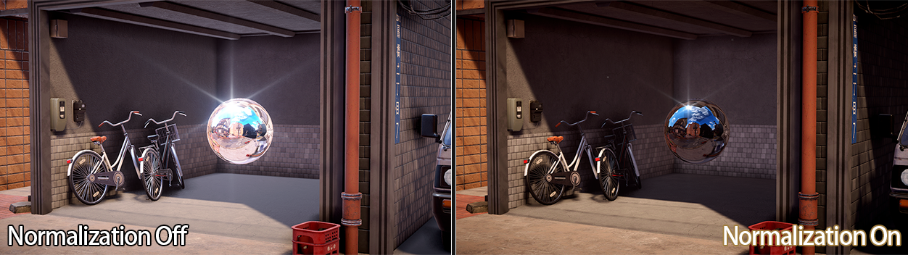

# Unity预计算辐照度全局光照PRTGI实践与拓展（下）

<!-- more -->

知乎这块最早有网易提供了其参考育碧《Global Illumination in Tom Clancy's The Division》GDC分享后的实现思路 [实时PRTGI技术与实现](https://zhuanlan.zhihu.com/p/541137978)。

后有[AKG4e3](https://www.zhihu.com/people/long-ruo-li-21)大佬提供了示例工程，见[预计算辐照度全局光照（PRTGI）从理论到实战](https://zhuanlan.zhihu.com/p/571673961)。

[方木君](https://www.zhihu.com/people/sun-wen-bin-90-50)则在[Unity移动端可用实时GI方案细节补充](https://zhuanlan.zhihu.com/p/654050347)中扩展了一下Local Light的Relight和优化方案。

笔者本篇文章也是基于该项目Fork在学习过程中继续完善和扩展，其中一小部分的写在了我的Fork版本[AkiKurisu/UnityPRTGI](https://github.com/AkiKurisu/UnityPRTGI)中，但由于我后来需要在Forward渲染路径下开发，就集成到别的项目了，Fork版本不再维护。

其他实现会之后和别的在URP下实现（抄来）的Feature一起开源，敬请期待~


## 前情提要

上一篇我们主要对PRTGI的数据结构进行了优化，从而降低运行时Relight的开销，其次零零散散适配了例如阴影缓存、多光源的功能。

稍微复杂一些的是复刻育碧方案中的Surfel-Brick-Factor结构，那么本篇我们继续看看有哪些可拓展的地方。

## 大场景Irradiance Volume滚动

在不考虑于大世界对场景分块加载的情况下，对于一个较大的箱庭场景，一个Volume的Probe数量也会变得非常大。

我以封面的日本街道场景为例，以12 * 3 * 20的Grid，4米一个Probe的Layout布置Probe存储需要12.44MB。


运行时3D纹理也需要这么大的大小，如果进一步提高Grid大小或减少Probe距离，那么可见3D纹理的存储也会进一步提高。

对此，我们需要控制3D纹理的大小，并且通过滚动的方式来动态替换3D纹理中的Probe球谐数据。

在Volume的Update中需要根据相机位置计算最近的包围盒。
```C#
private void CalculateCameraBoundingBox()
{
    if (!_mainCamera || Probes == null || Probes.Length == 0)
        return;

    Vector3 cameraPos = _mainCamera.transform.position;

    // Convert camera position to grid coordinates relative to Volume corner
    // Volume position is the corner (0,0,0) of the probe grid
    Vector3 gridPos = (cameraPos - transform.position) / probeGridSize;

    // Calculate the maximum valid bounding box position for each axis
    int maxX = Mathf.Max(0, probeSizeX - _grid.X);
    int maxY = Mathf.Max(0, probeSizeY - _grid.Y);
    int maxZ = Mathf.Max(0, probeSizeZ - _grid.Z);

    // Calculate ideal bounding box center (grid coordinates)
    Vector3Int idealCenterGrid = new Vector3Int(
        Mathf.RoundToInt(gridPos.x),
        Mathf.RoundToInt(gridPos.y),
        Mathf.RoundToInt(gridPos.z)
    );

    // Calculate ideal bounding box minimum corner
    Vector3Int idealBoundingBoxMin = new Vector3Int(
        idealCenterGrid.x - _grid.X / 2,
        idealCenterGrid.y - _grid.Y / 2,
        idealCenterGrid.z - _grid.Z / 2
    );

    Vector3Int newBoundingBoxMin = FindClosestValidBoundingBox(cameraPos, idealBoundingBoxMin, maxX, maxY, maxZ);

    // Check if bounding box has changed
    int newHash = newBoundingBoxMin.GetHashCode();
    if (newHash != _lastBoundingBoxHash)
    {
        _boundingBoxMin = newBoundingBoxMin;
        _lastBoundingBoxHash = newHash;
        _boundingBoxChanged = true;

        // Update bounding box world coordinates
        Vector3 worldMin = transform.position + new Vector3(
            _boundingBoxMin.x * probeGridSize,
            _boundingBoxMin.y * probeGridSize,
            _boundingBoxMin.z * probeGridSize
        );
        Vector3 worldSize = new Vector3(
            _grid.X * probeGridSize,
            _grid.Y * probeGridSize,
            _grid.Z * probeGridSize
        );
        _currentBoundingBox = new Bounds(worldMin + worldSize * 0.5f, worldSize);
    }
    else
    {
        _boundingBoxChanged = false;
    }
}
```

GPU侧在ProbeRelight后需要根据Volume的Grid大小和当前的BoundingBox来计算纹理存储位置：

```cpp
uint3 ProbeIndexToTexture3DCoord(uint probeIndex, uint shIndex, float4 voxelSize, float4 boundingBoxMin)
{
    // Convert probe index to voxel 3D grid coordinates
    uint probeSizeY = uint(voxelSize.y);
    uint probeSizeZ = uint(voxelSize.z);
    
    uint x = probeIndex / (probeSizeY * probeSizeZ);
    uint temp = probeIndex % (probeSizeY * probeSizeZ);
    uint y = temp / probeSizeZ;
    uint z = temp % probeSizeZ;
    
    // 注意这里为了减少计算，是在转纹理坐标前计算BoundingBox内的相对坐标
    uint3 bboxCoord = uint3(x, y, z) - uint3(boundingBoxMin.xyz);
    
    // Convert to 3D texture coordinates
    uint3 texCoord;
    texCoord.x = bboxCoord.x;
    texCoord.y = bboxCoord.z;  // Z becomes Y in texture
    texCoord.z = bboxCoord.y * 9 + shIndex;  // Y * 9 + SH index
    
    return texCoord;
}
```

同理修改采样时的坐标计算，结果如下：


## 环形寻址

可以看到上一节开启Scrolling后，BoundingBox移动后会有明显的跳变。这是因为3D纹理坐标不再唯一对应一个Probe，BoundingBox移动后，纹理数据实际是失效的，但前面我们又把ClearCoefficientVoxel关了，所以移动后3D纹理原本的数据就错位了。

一种简单的解决方案是移动后ClearCoefficientVoxel，然后更新全部Probe。但这样会有很大的浪费，因为实际上移动后3D纹理中大部分数据对应的Probe依然包含在当前BoundingBox中，如果可以移动后的Probe正确映射回纹理空间，那么就可以节省大量计算，只需要更新多出来的Probe数据。

这个方法即为Toroidal Addressing环形寻址，参考资料中[The Clipmap: A Virtual Mipmap](https://notkyon.moe/vt/Clipmap.pdf)给出了2维上的原理：


但说实话，笔者实际一开始完全没搞懂，以为是移动后将纹理翻转多个轴来寻址，后来在纸上画了个图推演才搞明白问题实际是怎么解决网格坐标到纹理（纹素）坐标的映射。如果读者对这个方法感兴趣，可以尝试看下面的问题尝试推理：


在BoundingBox移动后，我们需要保持3D纹理中紫色区域不变，因此实际要解决的是如何让Grid坐标映射为右侧的纹理坐标，搞懂这个就自然懂了啥叫环形寻址。

推理出2维空间中Cell Id转为Texture2DCoord后，我们就可以改为3D版本将ProbeIndex转为Texture3DCoord，代码如下：

```cpp

int WrapInt(int idx, int length)
{
    return (idx % length + length ) % length;
}

int3 WrapInt3(int3 idx, int3 length)
{
    return int3(WrapInt(idx.x, length.x), WrapInt(idx.y, length.y), WrapInt(idx.z, length.z));
}

// Convert probe grid 3D coordinates to 3D Texture coordinates
int3 GetProbeTexture3DCoordFrom3DCoord(int3 probeCoord, uint shIndex)
{
    return int3(probeCoord.x, probeCoord.z, probeCoord.y * 9 + shIndex);
}

// Convert probe index to 3D texture coordinates
uint3 GetProbeTexture3DCoordFromIndex(uint probeIndex, uint shIndex, float4 voxelSize,
    float4 boundingBoxMin, float4 boundingBoxSize, float4 originalBoundingBoxMin)
{
    // Convert probe index to 3D grid coordinates
    uint probeSizeY = uint(voxelSize.y);
    uint probeSizeZ = uint(voxelSize.z);
    
    uint x = probeIndex / (probeSizeY * probeSizeZ);
    uint temp = probeIndex % (probeSizeY * probeSizeZ);
    uint y = temp / probeSizeZ;
    uint z = temp % probeSizeZ;

#ifdef TOROIDAL_ADDRESSING
    // Calculate relative coordinates within original bounding box
    int3 bboxCoord = int3(x, y, z) - int3(originalBoundingBoxMin.xyz);

    // Toroidal Addressing
    bboxCoord = WrapInt3(bboxCoord, boundingBoxSize.xyz);
#else
    // Calculate relative coordinates within current bounding box
    uint3 bboxCoord = uint3(x, y, z) - uint3(boundingBoxMin.xyz);
#endif
    
    // Convert to 3D texture coordinates
    uint3 texCoord = GetProbeTexture3DCoordFrom3DCoord(bboxCoord, shIndex);
    return texCoord;
}
```

同理修改采样时的坐标计算，结果如下：


可以看到滚动更新后，重合部分数据不变，衔接更自然了，当然实际游戏中BoundingBox不可能这么小，玩家不可能看到边界。

## Reflection Normalization

战神4在GDC演讲[The Indirect Lighting Pipeline of 'God of War'](https://gdcvault.com/play/1026323/The-Indirect-Lighting-Pipeline-of)中提到在暗处的ReflectionProbe往往会和GI亮度不一致，所以需要进行Normalization。


参考APV中的流程，我们可以在计算完GI后计算NormalizationFactor乘到EnvironmentSpecular上。

这里需要增加的功能是在烘焙PRT时对场景中的ReflectionProbe也同时计算一份SH。

ComputeShader可以直接魔改一下`SurfelSampleCS.compute`，修改后如下，这里因为LDS不够用了用的还是老的并行规约方式，不过好在是跑在离线的，问题不大：

```cpp
[numthreads(32, 16, 1)]
void CSMain(uint3 id : SV_DispatchThreadID, uint groupIndex : SV_GroupIndex)
{
    float2 xy = float2(id.x, id.y) / float2(32, 16);
    xy += float2(1, 1) * _randSeed;

    float u = rand(xy * 1.0);
    float v = rand(xy * 2.0);
    float3 dir = UniformSphereSample(u, v);

    float weight = 4.0f * PI / ThreadCount;
    float3 lighting = _InputCubemap.SampleLevel(sampler_point_clamp, dir, 0).rgb;
    float shCoeffs[9];
    EvaluateSH9(dir, shCoeffs);

    // Process each SH coefficient
    UNITY_UNROLL
    for (int shIndex = 0; shIndex < 9; shIndex++)
    {
        float3 contribution = shCoeffs[shIndex] * lighting * weight;
        
        groupCoefficients[groupIndex] = contribution;
        GroupMemoryBarrierWithGroupSync();
        
        // Parallel reduction for non-power-of-2 size
        for (uint stride = ThreadCount / 2; stride > 0; stride >>= 1)
        {
            if (groupIndex < stride)
            {
                groupCoefficients[groupIndex] += groupCoefficients[groupIndex + stride];
            }
            GroupMemoryBarrierWithGroupSync();
        }
        
        // Write results
        if (groupIndex == 0)
        {
            _coefficientSH9[shIndex * 3 + 0] = groupCoefficients[0].x;
            _coefficientSH9[shIndex * 3 + 1] = groupCoefficients[0].y;
            _coefficientSH9[shIndex * 3 + 2] = groupCoefficients[0].z;
        }
        
        GroupMemoryBarrierWithGroupSync();
    }
}
```

参考APV的实现，运行时我们可以只使用3个系数来计算NormalizationFactor，为了使用Peter-Pike Sloan大神优化过的SH方法（这块比较偏原理，笔者不是很懂，可以参考大神的文章[Stupid Spherical Harmonics (SH) 
Tricks](https://www.ppsloan.org/publications/StupidSH36.pdf)），CPU侧需要提前将常数项和变量项分离。

```C#
 public bool TryGetSHForNormalization(out Vector4 outL0L1, out Vector4 outL2_1, out float outL2_2)
{
    if (!hasValidSHForNormalization)
    {
        // No valid data, so we disable the feature.
        outL0L1 = outL2_1 = Vector4.zero; outL2_2 = 0f;
        return false;
    }

    if (shForNormalization[0, 0] == float.MaxValue)
    {
        // Valid data, but probe is fully black. Setup coefficients so that light loop cancels out reflection probe contribution.
        outL0L1 = new Vector4(float.MaxValue, 0f, 0f, 0f);
        outL2_1 = Vector4.zero;
        outL2_2 = 0f;
        return true;
    }

    var L0 = SphericalHarmonicsL2Utils.GetCoefficient(shForNormalization, 0);
    var L1_0 = SphericalHarmonicsL2Utils.GetCoefficient(shForNormalization, 1);
    var L1_1 = SphericalHarmonicsL2Utils.GetCoefficient(shForNormalization, 2);
    var L1_2 = SphericalHarmonicsL2Utils.GetCoefficient(shForNormalization, 3);
    var L2_0 = SphericalHarmonicsL2Utils.GetCoefficient(shForNormalization, 4);
    var L2_1 = SphericalHarmonicsL2Utils.GetCoefficient(shForNormalization, 5);
    var L2_2 = SphericalHarmonicsL2Utils.GetCoefficient(shForNormalization, 6);
    var L2_3 = SphericalHarmonicsL2Utils.GetCoefficient(shForNormalization, 7);
    var L2_4 = SphericalHarmonicsL2Utils.GetCoefficient(shForNormalization, 8);

    // To evaluate L2, we need to fixup the coefficients.
    L0 -= L2_2;
    L2_2 *= 3.0f;

    outL0L1.x = ColorUtils.Luminance(new Color(L0.x, L0.y, L0.z));
    outL0L1.y = ColorUtils.Luminance(new Color(L1_0.x, L1_0.y, L1_0.z));
    outL0L1.z = ColorUtils.Luminance(new Color(L1_1.x, L1_1.y, L1_1.z));
    outL0L1.w = ColorUtils.Luminance(new Color(L1_2.x, L1_2.y, L1_2.z));
    outL2_1.x = ColorUtils.Luminance(new Color(L2_0.x, L2_0.y, L2_0.z));
    outL2_1.y = ColorUtils.Luminance(new Color(L2_1.x, L2_1.y, L2_1.z));
    outL2_1.z = ColorUtils.Luminance(new Color(L2_2.x, L2_2.y, L2_2.z));
    outL2_1.w = ColorUtils.Luminance(new Color(L2_3.x, L2_3.y, L2_3.z));
    outL2_2 = ColorUtils.Luminance(new Color(L2_4.x, L2_4.y, L2_4.z));

    return true;
}

private struct ReflectionProbeData
{
    public Vector4 L0L1;
    
    public Vector4 L2_1; // First 4 coeffs of L2 {-2, -1, 0, 1}
    
    public float L2_2;   // Last L2 coeff {2}
}
```

计算完SH后需要参考URP的`ReflectionProbeManager`构建一个长度为`UniversalRenderPipeline.maxVisibleReflectionProbes`的Buffer写入后上传GPU。

Shader在做`CalculateIrradianceFromReflectionProbes`时拿到ProbeIndex获取对应的SH计算NormalizationFactor，这里只考虑Forward+的情况，Forward还需要手动传入Index，感觉也没必要开启这个效果。

```cpp
#if USE_FORWARD_PLUS
half CalculateNormalizationFactorFromReflectionProbes(float3 lightingInReflDir, half3 sampleDir, float3 positionWS, float2 normalizedScreenSpaceUV)
{
    float totalWeight = 0.0f;
    float totalFactor = 0.0f;
    uint probeIndex;
    ClusterIterator it = ClusterInit(normalizedScreenSpaceUV, positionWS, 1);
    [loop] while (ClusterNext(it, probeIndex) && totalWeight < 0.99f)
    {
        probeIndex -= URP_FP_PROBES_BEGIN;

        float weight = CalculateProbeWeight(positionWS, urp_ReflProbes_BoxMin[probeIndex], urp_ReflProbes_BoxMax[probeIndex]);
        weight = min(weight, 1.0f - totalWeight);
        // Calculate Normalization Factor
        ReflectionProbeData probeData = _reflectionProbeNormalizationData[probeIndex];
        float factor = 1.0f;
        if (probeData.normalizeWithProbeVolume > 0)
        {
            factor = GetReflectionProbeNormalizationFactor(lightingInReflDir, sampleDir, probeData.L0L1, probeData.L2_1, probeData.L2_1);
        }
        totalFactor += factor * weight;
        totalWeight += weight;
    }
    return totalFactor;
}
#endif

half SampleProbeVolumeReflectionNormalize(float3 worldPos, float3 normal, float2 normalizedScreenSpaceUV,
    float3 bakedGI, float3 reflectionDir)
{
#if USE_FORWARD_PLUS && _PRT_GLOBAL_ILLUMINATION_ON
    UNITY_BRANCH
    if (_coefficientVoxelGridSize == 0)
    {
        return 1.0f;
    }
    
    float3 lightingInReflDir = EvaluateProbeVolumeSH(
                       worldPos, 
                       reflectionDir,
                       bakedGI,
                       _coefficientVoxel3D,
                       _coefficientVoxelGridSize,
                       _coefficientVoxelCorner,
                       _coefficientVoxelSize,
                       _boundingBoxMin,
                       _boundingBoxSize,
                       _originalBoundingBoxMin
                   ) * _indirectIntensity;
    return CalculateNormalizationFactorFromReflectionProbes(lightingInReflDir, normal, worldPos, normalizedScreenSpaceUV);
#else
    return 1.0f;
#endif
}
```

效果如下，左侧反射明显不自然，右侧压暗了一些：



## Fallback Skylight

IrradianceVolume的采样需要获取最近的8个Probe进行三线性插值，但如果片元位置不在Volume中呢？这时就需要fallback回天光。

```cpp
#if defined(DYNAMICLIGHTMAP_ON)
    inputData.bakedGI = SAMPLE_GI(IN.lightmapUVOrVertexSH.xy, IN.dynamicLightmapUV.xy, SH, inputData.normalWS);
#else
    inputData.bakedGI = SAMPLE_GI(IN.lightmapUVOrVertexSH.xy, SH, inputData.normalWS);
#endif

inputData.bakedGI = SAMPLE_PROBE_VOLUME(inputData.positionWS, inputData.normalWS, inputData.bakedGI);

#if _PRT_GLOBAL_ILLUMINATION_ON
    #define SAMPLE_PROBE_VOLUME(worldPos, normal, bakedGI) SampleProbeVolume(worldPos, normal, bakedGI)
#else
    #define SAMPLE_PROBE_VOLUME(worldPos, normal, bakedGI) bakedGI
#endif

// Evaluate SH coefficients from 3D texture
float3 EvaluateProbeVolumeSH(
    in float3 worldPos, 
    in float3 normal,
    in float3 bakedGI,
    in Texture3D<float3> coefficientVoxel3D,
    in float voxelGridSize,
    in float4 voxelCorner,
    in float4 voxelSize,
    in float4 boundingBoxMin,
    in float4 boundingBoxSize,
    in float4 originalBoundingBoxMin
)
{
    float4 boundingBoxVoxelSize = boundingBoxSize;
    float4 boundingBoxVoxelCorner = boundingBoxMin * voxelGridSize + voxelCorner;
    
    // probe grid is already converted to bounding box coordinate
    int3 probeCoord = GetProbe3DCoordFromPosition(worldPos, voxelGridSize, boundingBoxVoxelCorner);
    int3 offset[8] = {
        int3(0, 0, 0), int3(0, 0, 1), int3(0, 1, 0), int3(0, 1, 1), 
        int3(1, 0, 0), int3(1, 0, 1), int3(1, 1, 0), int3(1, 1, 1), 
    };

    float3 c[9];
    float3 Lo[8] = {
        float3(0, 0, 0),
        float3(0, 0, 0),
        float3(0, 0, 0),
        float3(0, 0, 0),
        float3(0, 0, 0),
        float3(0, 0, 0),
        float3(0, 0, 0),
        float3(0, 0, 0)
    };

    // near 8 probes
    for (int i = 0; i < 8; i++)
    {
        int3 neighborCoord = probeCoord + offset[i];
        bool isInsideVoxel = IsProbeCoordInsideVoxel(neighborCoord, boundingBoxVoxelSize);
        if (!isInsideVoxel)
        {
            Lo[i] = bakedGI;
            continue;
        }
        
#ifdef TOROIDAL_ADDRESSING
        int3 voxelCoord = neighborCoord + (int3)boundingBoxMin.xyz;

        // Calculate relative coordinates within original bounding box
        int3 neighborProbeCoord = voxelCoord - int3(originalBoundingBoxMin.xyz);

        // Toroidal Addressing
        neighborProbeCoord = WrapInt3(neighborProbeCoord, boundingBoxSize.xyz);
#else
        int3 neighborProbeCoord = neighborCoord;
#endif
        
        // decode SH9 from 3D texture
        DecodeSHCoefficientFromVoxel3D(c, coefficientVoxel3D, neighborProbeCoord);
        Lo[i] = IrradianceSH9(c, normal);
    }

    // trilinear interpolation
    float3 minCorner = GetProbePositionFromTexture3DCoord(probeCoord, voxelGridSize, boundingBoxVoxelCorner);
    float3 rate = saturate((worldPos - minCorner) / voxelGridSize);
    float3 color = TrilinearInterpolationFloat3(Lo, rate);
    
    return color;
}
```

这种方式的不足是边界也会有比较明显的跳变，大世界中常见做法是使用Clipmap，让Irradiance Volume足够大的同时保持3D纹理大小，然后分不同Level采样，这里笔者没空实现了。

不过在工程实践上，我发现了另一个必须解决的问题：Probe在采样的时候如果在地下，结果肯定有错误，所以我们希望把Probe往上移一些，但这样又会导致Probe之下地面之上边界区域的像素不在Volume中，被fallback到天光，于是就需要下一步的优化。

## Virtual Offset

Unity的APV为每个Probe提供了一个Virtual Offset，用于在采样时偏移Probe的位置（例如解决卡墙里、地面下的Probe），运行时仍使用Uniform Grid来查找。


如此一来就很方便解决了上文边界区域不在Volume中的问题。

但正如我前文所说，APV可以参考的东西有很多，例如APV提供了一个[Probe Adjustment Volume](https://docs.unity3d.com/6000.0/Documentation/Manual/urp/probevolumes-adjustment-volume-component-reference.html)来偏移一定范围内的Probe。方便开发者or设计师进行细微调整。

为了避免漏光，我们希望Probe可以吸附在墙体周围。APV使用引擎新支持的ray tracing shader来遍历Geometry找到离障碍物最近的点进行吸附，根据吸附点计算Virtual Offset。我们也可以参考其算法编写（抄）一份CPU版本的Virtual Offset烘焙器：

```C#
private Vector3 CalculateRayTracedVirtualOffsetPosition(Vector3 probePosition)
{
    const float DISTANCE_THRESHOLD = 5e-5f;
    const float DOT_THRESHOLD = 1e-2f;
    const float VALIDITY_THRESHOLD = 0.5f; // 50% backface threshold

    Vector3[] sampleDirections = GetSampleDirections();
    Vector3 bestDirection = Vector3.zero;
    float maxDotSurface = -1f;
    float minDistance = float.MaxValue;
    int validHits = 0;

    foreach (Vector3 direction in sampleDirections)
    {
        Vector3 rayOrigin = probePosition + direction * rayOriginBias;
        Vector3 rayDirection = direction;

        // Cast ray to find geometry intersection
        if (Physics.Raycast(rayOrigin, rayDirection, out RaycastHit hit, 10f))
        {
            // Skip front faces
            if (hit.triangleIndex >= 0) // Check if it's a valid hit
            {
                // Check if it's a back face by checking normal direction
                Vector3 hitNormal = hit.normal;
                float dotSurface = Vector3.Dot(rayDirection, hitNormal);

                // If it's a front face, skip it
                if (dotSurface > 0)
                {
                    validHits++;
                    continue;
                }

                float distanceDiff = hit.distance - minDistance;

                // If distance is within threshold
                if (distanceDiff < DISTANCE_THRESHOLD)
                {
                    // If new distance is smaller by at least threshold, or if ray is more colinear with normal
                    if (distanceDiff < -DISTANCE_THRESHOLD || dotSurface - maxDotSurface > DOT_THRESHOLD)
                    {
                        bestDirection = rayDirection;
                        maxDotSurface = dotSurface;
                        minDistance = hit.distance;
                    }
                }
            }
        }
    }

    // Calculate validity (percentage of backfaces seen)
    float validity = 1.0f - validHits / (float)(sampleDirections.Length - 1.0f);

    // Disable VO for probes that don't see enough backface
    if (validity <= VALIDITY_THRESHOLD)
        return probePosition;

    if (minDistance == float.MaxValue)
        minDistance = 0f;

    // Calculate final offset position
    float offsetDistance = minDistance * 1.05f + geometryBias;
    return probePosition + bestDirection * offsetDistance;
}

/// <summary>
/// Get sample directions for ray tracing
/// </summary>
/// <returns>Array of normalized direction vectors</returns>
private static Vector3[] GetSampleDirections()
{
    // 3x3x3 - 1, excluding center
    const float k0 = 0f, k1 = 1f, k2 = 0.70710678118654752440084436210485f, k3 = 0.57735026918962576450914878050196f;

    return new Vector3[]
    {
        // Top layer (y = +1)
        new(-k3, +k3, -k3), // -1  1 -1
        new( k0, +k2, -k2), //  0  1 -1
        new(+k3, +k3, -k3), //  1  1 -1
        new(-k2, +k2,  k0), // -1  1  0
        new( k0, +k1,  k0), //  0  1  0
        new(+k2, +k2,  k0), //  1  1  0
        new(-k3, +k3, +k3), // -1  1  1
        new( k0, +k2, +k2), //  0  1  1
        new(+k3, +k3, +k3), //  1  1  1

        // Middle layer (y = 0)
        new(-k2,  k0, -k2), // -1  0 -1
        new( k0,  k0, -k1), //  0  0 -1
        new(+k2,  k0, -k2), //  1  0 -1
        new(-k1,  k0,  k0), // -1  0  0
        // k0, k0, k0 - skip center position (which would be a zero-length ray)
        new(+k1,  k0,  k0), //  1  0  0
        new(-k2,  k0, +k2), // -1  0  1
        new( k0,  k0, +k1), //  0  0  1
        new(+k2,  k0, +k2), //  1  0  1

        // Bottom layer (y = -1)
        new(-k3, -k3, -k3), // -1 -1 -1
        new( k0, -k2, -k2), //  0 -1 -1
        new(+k3, -k3, -k3), //  1 -1 -1
        new(-k2, -k2,  k0), // -1 -1  0
        new( k0, -k1,  k0), //  0 -1  0
        new(+k2, -k2,  k0), //  1 -1  0
        new(-k3, -k3, +k3), // -1 -1  1
        new( k0, -k2, +k2), //  0 -1  1
        new(+k3, -k3, +k3), //  1 -1  1
    };
}

```


## 变体优化

由于我是在Forward渲染路径下开发，采样Volume的代码需要写在每个Shader的ForwardPass中，我是加了个关键词来控制是否打开PRT。

但在调试修改ProbeVolume结构的时候，很容易牵一发而动全身，所有Shader都要重编一遍。使用关键词会导致关掉PRT又要编一遍，更不提打包后变体又要翻一倍。

所以这里可以考虑移除关键词，改成通过全局变量控制，注意这里需要使用`UNITY_BRANCH`来保证编译为动态分支。值得一提的是URP中也有多个地方在没有纹理或不可以采样时使用动态分支跳过，而非选择使用关键词。

```cpp
float3 SampleProbeVolume(float3 worldPos, float3 normal, float3 bakedGI)
{
#ifndef SHADER_STAGE_COMPUTE // 这里是为了确保PRT Relight的CS不受分支影响性能
    UNITY_BRANCH
    if (_coefficientVoxelGridSize == 0)
    {
        return bakedGI;
    }
#endif
    
    float3 radiance = EvaluateProbeVolumeSH(
                       worldPos, 
                       normal,
                       bakedGI,
                       _coefficientVoxel3D,
                       _coefficientVoxelGridSize,
                       _coefficientVoxelCorner + _boundingBoxMin * _coefficientVoxelGridSize,
                       _boundingBoxSize
                   );
    return radiance * _indirectIntensity;
}
```

当然分支也会带来一定开销，这部分属于工程实践上的取舍，仁者见仁智者见智，这里查阅资料时倒是发现一个不错的文章[A Note on Branching Within a Shader](https://www.peterstefek.me/shader-branch.html)，其中提到动态分支会导致同一个Warp中的线程不能同步执行而互相等待。

## 总结

本篇文章着重于现有开源PRTGI方案工程上的优化和拓展，这也是笔者一个月边实践边写，写的最久的一篇，所以很多内容并非一蹴而就，脉络上可能不是那么清晰，还请见谅。

回到PRTGI上，笔者认为即使完成了上述文章中的优化内容后，也只是从玩具级别到达了景品级别，要达到手办级别用于商业项目还有许多待完善的空间。

例如：远处未覆盖GI的问题，使用Clipmap多级采样的方式来优化；如果场景进行分块加载，Probe数据也需要进行分块并实现流送；烘焙部分为了更精确可以使用Path Tracer。

不过总体上当前的方案已经非常靠近育碧全境封锁的方案了，欢迎各位大佬在评论区讨论（不过笔者对图形学纯民科，只会工程实践哈哈）。

那么感谢各位的阅读，我们下期再会~