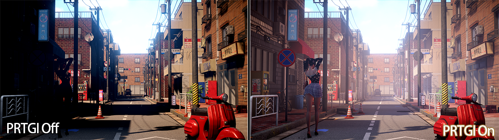
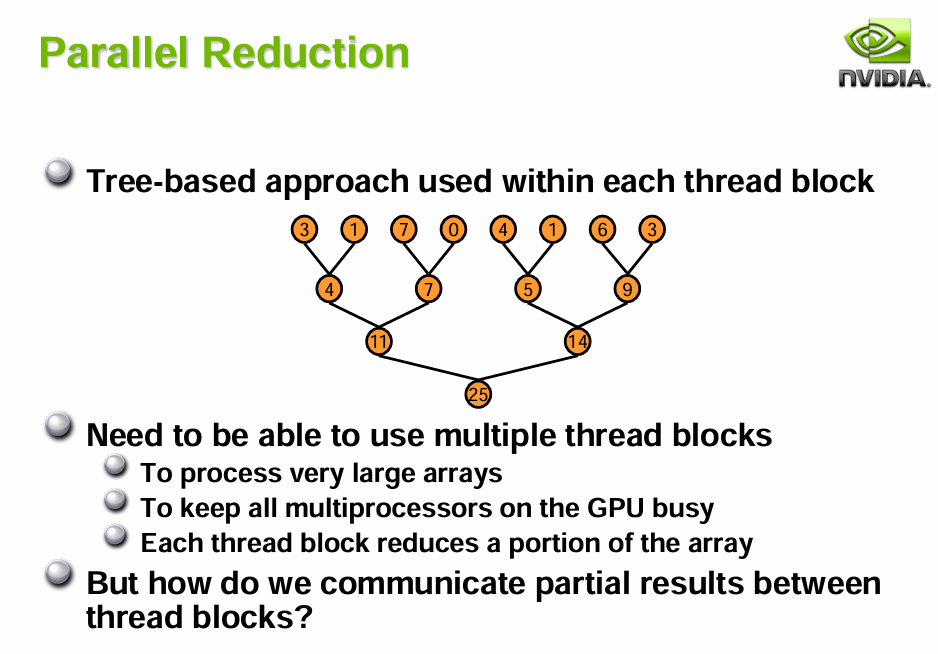
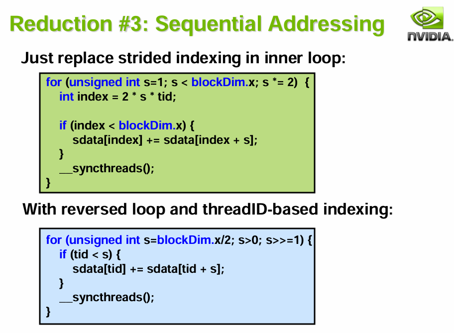
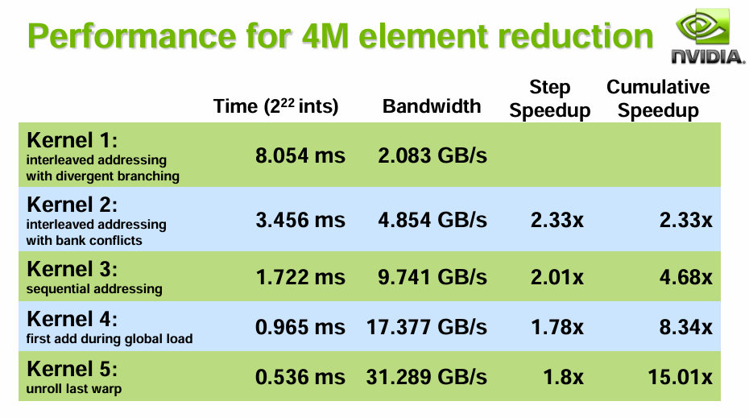
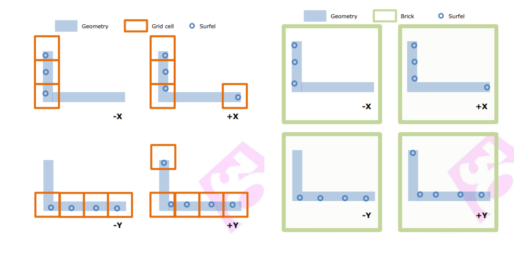
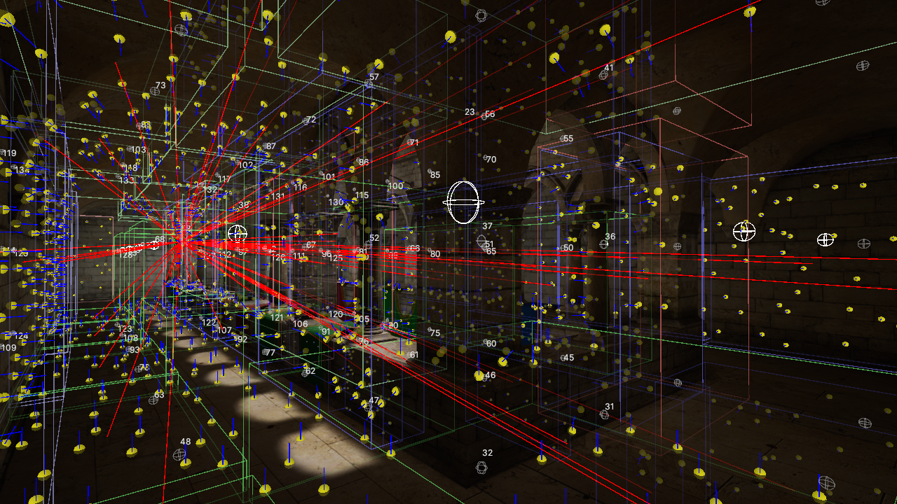
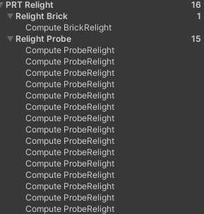

# Unity URP渲染管线PRTGI实践

<!-- more -->

知乎这块最早有网易提供了其参考育碧《Global Illumination in Tom Clancy's The Division》GDC分享后的实现思路 [实时PRTGI技术与实现](https://zhuanlan.zhihu.com/p/541137978)。

后有[AKG4e3](https://www.zhihu.com/people/long-ruo-li-21)大佬提供了示例工程，见[预计算辐照度全局光照（PRTGI）从理论到实战](https://zhuanlan.zhihu.com/p/571673961)。

[方木君](https://www.zhihu.com/people/sun-wen-bin-90-50)则在[Unity移动端可用实时GI方案细节补充](https://zhuanlan.zhihu.com/p/654050347)中扩展了一下Local Light的Relight和优化方案。

笔者本篇文章也是基于该项目Fork在学习过程中继续完善和扩展。



## 3D纹理

原作者存储球谐是将27位float存在一个巨大的ComputeBuffer中，这导致需要使用定点数Encode并且使用较多的原子操作。这并没有有效利用ComputeShader的优势。

```cpp
// 使用定点数存储小数, 因为 compute shader 的 InterlockedAdd 不支持 float
// array size: 3x9=27
RWStructuredBuffer<int> _coefficientSH9;  

// storage to volume
if(_indexInProbeVolume >= 0)
{
    const int coefficientByteSize = 27;
    int offset = _indexInProbeVolume * coefficientByteSize;
    for(int i = 0; i < 9; i++)
    {
        InterlockedAdd(_coefficientVoxel[offset + i * 3 + 0], EncodeFloatToInt(c[i].x));
        InterlockedAdd(_coefficientVoxel[offset + i * 3 + 1], EncodeFloatToInt(c[i].y));
        InterlockedAdd(_coefficientVoxel[offset + i * 3 + 2], EncodeFloatToInt(c[i].z));
    }
}
```

我将其修改为probeSizeX, probeSizeZ, probeSizeY * 9大小，格式为RGBA32的3D纹理，虽然这样还是会有一定的CacheMiss，但相比使用ComputeBuffer来存储球谐系数，性能提升明显，并且可以方便在FrameDebugger中查看。

```cpp
// Layout: [probeSizeX, probeSizeZ, probeSizeY * 9]
RWTexture3D<float3> _coefficientVoxel3D;

if (_indexInProbeVolume >= 0)
{
    // Write to 3D texture
    int3 texCoord = ProbeIndexToTexture3DCoord(_indexInProbeVolume, index, _coefficientVoxelSize);
    _coefficientVoxel3D[texCoord] = groupCoefficients[0];
}

```
注意这里我们还未写入3D纹理的Alpha通道，这部分可供自定义数据使用，例如Probe的Validation。

## 并行规约

由于改成3D纹理，我们需要解决原来作者没处理的球谐系数求和问题，这本质是GPU中的多线程求和问题即并行规约问题。



英伟达官方提供了最佳实践[Optimizing Parallel Reduction in CUDA](https://developer.download.nvidia.cn/assets/cuda/files/reduction.pdf)

实现起来也非常简单，我们有512个Thread，刚好是2次幂，因此可以使用PPT中的方法3。


```cpp
// Parallel reduction
for (uint stride = 256; stride > 0; stride >>= 1)
{
    if (groupIndex < stride)
    {
        groupCoefficients[groupIndex] += groupCoefficients[groupIndex + stride];
    }

    GroupMemoryBarrierWithGroupSync();
}
```

由于利用了多线程能力，带宽换时间，性能大概提升2倍，其他方法可以更有效利用带宽，但代码实在有些繁琐，用第三种基本足够了。



## 分帧Relight

由于现有方法是需要每帧遍历所有Probe进行Relight，这导致场景越大或Probe密度越大，Relight成本越高。为了性能可控，我们可以利用Diffuse GI低频的特点，将Relight的步骤分摊到多帧。

```cpp
void DoRelight(CommandBuffer cmd, PRTProbeVolume volume)
{
    volume.SwapCoefficientVoxels();

    // 如果是多帧Relight，则不需要清空体素
    if (!multiFrameRelight)
        volume.ClearCoefficientVoxel(cmd);

    // May only update a subset of probes each frame
    using (ListPool<PRTProbe>.Get(out var probesToUpdate))
    {
        volume.GetProbesToUpdate(probesToUpdate);
        foreach (var probe in probesToUpdate)
        {
            probe.ReLight(cmd, _relightCS, _relightKernel);
        }
    }

    // Advance volume render frame
    volume.AdvanceRenderFrame();
}

// 滚动获取当前帧要更新的Probe
public void GetProbesToUpdate(List<PRTProbe> probes)
{
    for (int i = _currentProbeUpdateIndex; i < _currentProbeUpdateIndex + probesToUpdateCount; i++)
    {
        probes.Add(Probes[i]);
    }
}

public void AdvanceRenderFrame()
{
    // Advance the update index for next frame
    _currentProbeUpdateIndex = (_currentProbeUpdateIndex + probesToUpdateCount) % Probes.Length;
}
```

由于我们不再使用原子操作来修改ComputeBuffer，我们只要在CPU侧跳过ClearCoefficientVoxel这一步骤就相当于实现了Load and Dont Care的效果。

## Surfel合并

我们回过头看下现在的数据存储，对于每个Probe我们都存放了其512个Surfel数据，如果两个Probe挨着很近，那很大概率Surfel的数据是比较重复的，对于离得很近、方向基本一致的Surfel，我们实际可以清理一部分冗余数据。



育碧全境封锁给予了一个方案，即根据Grid大小和Surfel的法线的主方向来聚集为Brick。同一个Brick中的Surfel数据就可以提取一下特征（比如对于坐标相同、法线方向相近的Surfel进行合并）。

其次因为Surfel被合并为Brick，Probe不再直接引用其烘焙阶段命中的Surfel，这就需要修改CPU侧的整个数据结构，即将Sample的Surfel数据和Relight的Surfel数据分离。



## Relight分离

前面我们参考了全境封锁的做法在烘焙阶段将Surfel聚集为Brick，那么运行时Relight逻辑也要进行修改。

为了方便理解以及理清修改代码的目的，我们不妨先看看在不修改ComputeShader的情况下我们会遇到什么问题。

问题1是由于Surfel被聚集为Brick后，每个Probe实际引用的Surfel数量大量增加，这个情况下原先基于射线数量的512 Thread就不够用了。

一种简单的方式是增加Thread，然后传入实际长度来避免超出范围。

```C#
#define ThreadCount 1024
[numthreads(ThreadCount, 1, 1)]
void CSMain (uint3 id : SV_DispatchThreadID, uint groupIndex : SV_GroupIndex)
{
    if (groupIndex < _surfelNum)
    {
        // EvaluateSurfelRadiance
    }

    // Parallel reduction
    for (uint stride = ThreadCount / 2; stride > 0; stride >>= 1)
    {
        if (groupIndex < stride && groupIndex + stride < _surfelNum)
        {
            groupCoefficients[groupIndex] += groupCoefficients[groupIndex + stride];
        }
        GroupMemoryBarrierWithGroupSync();
    }
}
```

问题2是由于多个Probe会引用同一个Brick，那么按现在的逻辑Surfel Relight就会大量重复。

要完整解决问题1和2就需要将Brick的Relight和Probe的Relight分离，这样可以大大减少计算。



这也是育碧这套方案在GPU侧的优化目的，其他细节的地方是一些可以离线合并的数据就没必要在运行时计算，例如Surfel对于Probe的权重依赖于法线计算，而合并为Brick后可以离线算出平均法线，点乘获取权重保存在Probe中。同理SkyVisibility也可以离线求平均保存。