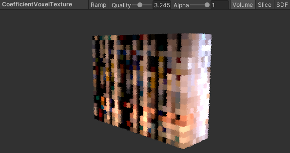
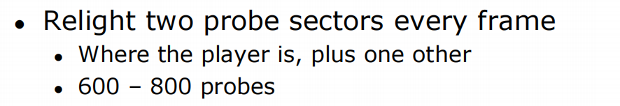
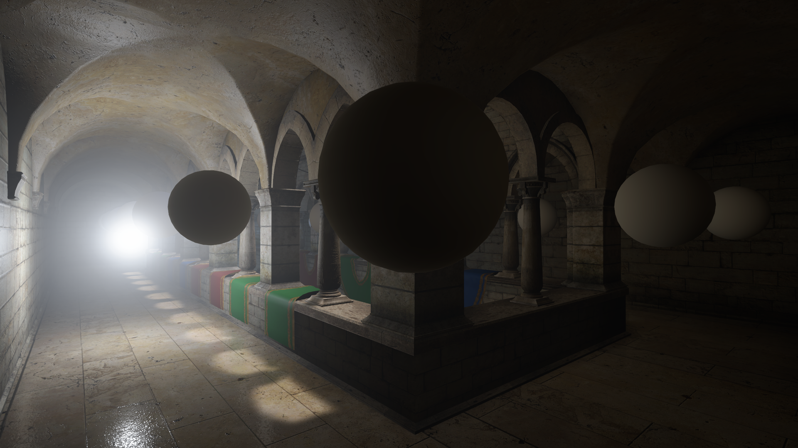
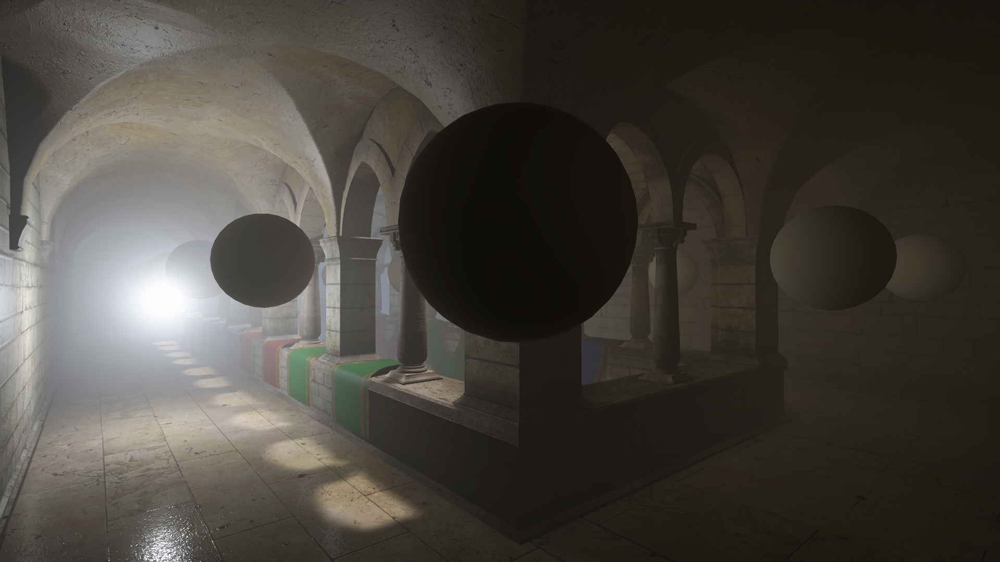
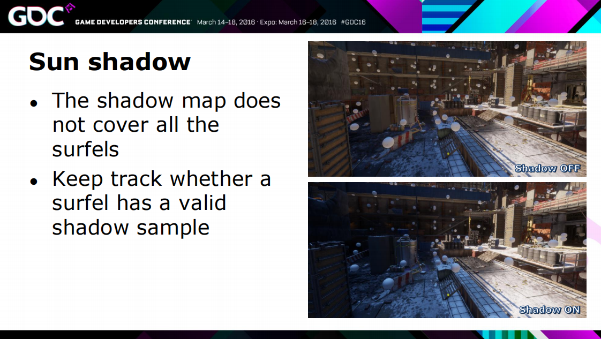
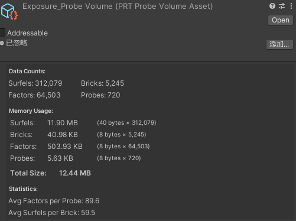
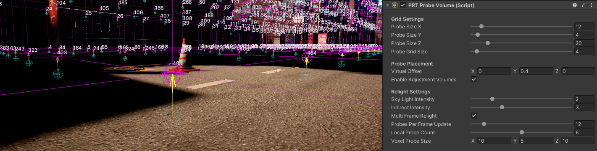
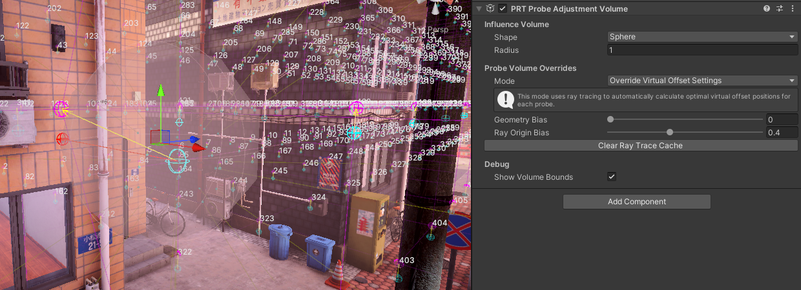

# Unity URP渲染管线PRTGI拓展

<!-- more -->

知乎这块最早有网易提供了其参考育碧《Global Illumination in Tom Clancy's The Division》GDC分享后的实现思路 [实时PRTGI技术与实现](https://zhuanlan.zhihu.com/p/541137978)。

后有[AKG4e3](https://www.zhihu.com/people/long-ruo-li-21)大佬提供了示例工程，见[预计算辐照度全局光照（PRTGI）从理论到实战](https://zhuanlan.zhihu.com/p/571673961)。

[方木君](https://www.zhihu.com/people/sun-wen-bin-90-50)则在[Unity移动端可用实时GI方案细节补充](https://zhuanlan.zhihu.com/p/654050347)中扩展了一下Local Light的Relight和优化方案。

笔者本篇文章也是基于该项目Fork在学习过程中继续完善和扩展。


## 流程概述

先总结一下AKG4e3大佬项目中的流程，方便后续对比：

1. 离线烘焙生成Surfel（总计512 * Probe）
2. 按Probe顺序存储Surfel
3. 运行时Probe拿到对应的512个Surfel
4. Relight所有Probe

## 烘焙提速

原作者使用Camera.RenderToCubemap来抓取Cubemap，这个函数在GPU上的开销实际不大，手动渲染每一个面的成本并没有减少，但可以考虑改成使用另一个拓展方法，来在构建RenderList的时候忽略非静态物体：

```C#
public static bool RenderToCubemap(
    this Camera camera,
    Texture target,
    int faceMask,
    StaticEditorFlags culledFlags);
```

通过不同场景的性能测试，烘焙这里更拖延速度的是CPU侧设置Material Shader的开销，由于需要分别设置Shader来采样Position、Albedo、Normal数据，实际开销 ≈ $3 \cdot N_\text{materials} \cdot N_\text{probes}$ 次 Shader 设置，时间复杂度为$O(N_\text{materials} \cdot N_\text{probes})$。

所以优化方式就是使用一个Shader，烘焙时只需要设置一次，每个Probe烘焙时通过切换Keyword来抓取所需数据。

```c++
#pragma multi_compile _ _GBUFFER_WORLDPOS _GBUFFER_NORMAL

float4 frag (v2f i) : SV_Target
{
    #if defined(_GBUFFER_WORLDPOS)
        // Output world position
        return float4(i.worldPos, 1.0);
    #elif defined(_GBUFFER_NORMAL)
        // Output world space normal
        return float4(i.normal, 1.0);
    #else
        // Default output albedo
        half4 albedo = SAMPLE_TEXTURE2D(_MainTex, sampler_MainTex, i.uv) * _Color;
        return albedo;
    #endif
}
```

```C#
private static void SetGlobalGBufferCaptureMode(GBufferCaptureMode captureMode)
{
    // Enable the specific keyword based on capture mode
    switch (captureMode)
    {
        case GBufferCaptureMode.WorldPosition:
            Shader.EnableKeyword("_GBUFFER_WORLDPOS");
            Shader.DisableKeyword("_GBUFFER_NORMAL");
            break;
        case GBufferCaptureMode.Normal:
            Shader.DisableKeyword("_GBUFFER_WORLDPOS");
            Shader.EnableKeyword("_GBUFFER_NORMAL");
            break;
        case GBufferCaptureMode.Albedo:
            Shader.DisableKeyword("_GBUFFER_WORLDPOS");
            Shader.DisableKeyword("_GBUFFER_NORMAL");
            break;
    }
}

// 对于每个Probe执行下面的代码
SetGlobalGBufferCaptureMode(GBufferCaptureMode.WorldPosition);
camera.RenderToCubemap(_worldPosRT, -1, StaticEditorFlags.ContributeGI);
SetGlobalGBufferCaptureMode(GBufferCaptureMode.Normal);
camera.RenderToCubemap(_normalRT, -1, StaticEditorFlags.ContributeGI);
SetGlobalGBufferCaptureMode(GBufferCaptureMode.Albedo);
camera.RenderToCubemap(_albedoRT, -1, StaticEditorFlags.ContributeGI);
```

如此一来时间复杂度为$O(1)$，大大提升了复杂场景下的烘焙速度。

## 球谐优化

可能是因为Unity 2023和Unity 6在中国封禁，Unity新推出的APV（Adaptive Probe Volume）系统在国内的讨论非常少。然而，作为Unity官方新推出的GI方案，APV有大量值得学习的优化技巧。

PRT（Precomputed Radiance Transfer）和APV实际上师出同门，共通点是都不需要UV2、比LightMap方便，需要烘焙，仅支持静态场景，两者的核心差异在于：

- **APV**: 每个Probe离线存储球谐系数，不支持动态光照（如TOD系统），但因为存储了SkyVisibility，可以实现动态的天光遮蔽。
- **PRT**: 存储Radiance数据和SkyVisbility，支持动态光照

PRT缺点也很明显，因为要存储的数据更多了，使得实践上Probe放置的密度小于APV的密度，这使得高频的Diffuse信息会被忽略，所以更适合（半）室外。

尽管应用场景不同，APV作为Unity官方实现，其优化策略具有重要的参考价值。


原项目`SH.hlsl`中的球谐函数实现使用大量条件判断：

```c++
// 老版本 - 大量分支判断
float SH(in int l, in int m, in float3 s) 
{
    if (l == 0) return kSHBasis0;
    if (l == 1 && m == -1) return kSHBasis1 * y;
    if (l == 1 && m == 0) return kSHBasis1 * z;
    // ... 更多条件判断
    return 0.0;
}

// 在循环中重复调用
for (int shIndex = 0; shIndex < 9; shIndex++)
{
    contribution = SHProject(shIndex, dir) * totalRadiance * 4.0 * PI;
    // 每次调用都要执行完整的条件判断逻辑
}
```
这种GPU上的条件分支会导致warp divergence，且影响性能。

而下面是参考Unity的`SphericalHarmonics.hlsl`的实现方式，使用向量化方式来优化。

```C++
// 新版本 - 向量化计算
void EvaluateSH9(in float3 dir, out float sh[9])
{
    float x = dir.x;
    float y = dir.z; // 坐标变换保持一致性
    float z = dir.y;
    
    // L0 (常数项)
    sh[0] = kSHBasis0;
    
    // L1 (线性项) - 并行计算
    sh[1] = kSHBasis1 * y;    // Y_1_-1
    sh[2] = kSHBasis1 * z;    // Y_1_0
    sh[3] = kSHBasis1 * x;    // Y_1_1
    
    // L2 (二次项) - 并行计算
    sh[4] = kSHBasis2 * x * y;                          // Y_2_-2
    sh[5] = kSHBasis2 * y * z;                          // Y_2_-1
    sh[6] = kSHBasis3 * (2.0 * z * z - x * x - y * y);  // Y_2_0
    sh[7] = kSHBasis2 * x * z;                          // Y_2_1
    sh[8] = kSHBasis4 * (x * x - y * y);                // Y_2_2
}

// 优化后的使用方式
float shCoeffs[9];
EvaluateSH9(dir, shCoeffs); // 一次计算所有系数

for (int shIndex = 0; shIndex < 9; shIndex++)
{
    contribution = shCoeffs[shIndex] * totalRadiance * 4.0 * PI;
    // 直接数组访问，无分支判断
}
```

这种方式可以连续访问，性能更好。

接着我们需要相应修改下`ProbeRelight.compute`中的Irradiance计算，来支持向量化的优化.

**优化前**：
```hlsl
for (int shIndex = 0; shIndex < 9; shIndex++)
{
    // 每次循环都重新计算SH基函数
    contribution = SHProject(shIndex, dir) * totalRadiance * 4.0 * PI;
}
```

**优化后**：
```hlsl
// 一次性计算所有SH系数
float shCoeffs[9];
EvaluateSH9(dir, shCoeffs);

for (int shIndex = 0; shIndex < 9; shIndex++)
{
    // 直接使用预计算的系数
    contribution = shCoeffs[shIndex] * totalRadiance * 4.0 * PI;
}
```


除了向量化外，APV系统中一个巧妙的优化是在球谐系数上预除PI，减少Radiance转为Irradiance时的ALU开销：

```C++
// Clamped cosine convolution coefs (pre-divided by PI)
// See https://seblagarde.wordpress.com/2012/01/08/pi-or-not-to-pi-in-game-lighting-equation/
#define kClampedCosine0 1.0f
#define kClampedCosine1 2.0f / 3.0f
#define kClampedCosine2 1.0f / 4.0f

static const float kClampedCosineCoefs[] = { 
    kClampedCosine0, kClampedCosine1, kClampedCosine1, kClampedCosine1, 
    kClampedCosine2, kClampedCosine2, kClampedCosine2, kClampedCosine2, kClampedCosine2 
};
```

这个优化基于Sébastien Lagarde的经典文章：[《Pi or not to Pi in game lighting equation》](https://seblagarde.wordpress.com/2012/01/08/pi-or-not-to-pi-in-game-lighting-equation/)。这也是实时渲染中一个比较经典的问题，例如在URP中的Lambert BRDF故意没有除PI，目的是简化灯光流程，让灯光颜色调整时所见即所得。


## 3D纹理

原作者存储球谐是将27位float存在一个巨大的ComputeBuffer中，这导致需要使用定点数Encode并且使用较多的原子操作。

这个方式弊病很多，一方面没有利用GPU的优势（对3D纹理的硬件优化），另一方面原子操作导致写入前需要Clear，需要使用双缓冲来维护，内存翻倍。

```cpp
// 使用定点数存储小数, 因为 compute shader 的 InterlockedAdd 不支持 float
// array size: 3x9=27
RWStructuredBuffer<int> _coefficientSH9;  

// storage to volume
if(_indexInProbeVolume >= 0)
{
    const int coefficientByteSize = 27;
    int offset = _indexInProbeVolume * coefficientByteSize;
    for(int i = 0; i < 9; i++)
    {
        InterlockedAdd(_coefficientVoxel[offset + i * 3 + 0], EncodeFloatToInt(c[i].x));
        InterlockedAdd(_coefficientVoxel[offset + i * 3 + 1], EncodeFloatToInt(c[i].y));
        InterlockedAdd(_coefficientVoxel[offset + i * 3 + 2], EncodeFloatToInt(c[i].z));
    }
}
```

我将其修改为probeSizeX, probeSizeZ, probeSizeY * 9大小，格式为RGB111110Float的3D纹理。虽然这样还是会有一定的CacheMiss，但相比使用ComputeBuffer来存储球谐系数性能更好，并且可以方便在FrameDebugger中查看。

```cpp
// Layout: [probeSizeX, probeSizeZ, probeSizeY * 9]
RWTexture3D<float3> _coefficientVoxel3D;

if (_indexInProbeVolume >= 0)
{
    // Write to 3D texture
    int3 texCoord = ProbeIndexToTexture3DCoord(_indexInProbeVolume, index, _coefficientVoxelSize);
    _coefficientVoxel3D[texCoord] = groupCoefficients[0];
}

```



需要注意Relight时为了计算MultiBounce我们依然需要访问上一帧的球谐系数，这使得在一个线程中可能存在同时访问和写入的可能，所以只是将ComputeBuffer修改为3D纹理后，还不能去除双缓冲，还需要之后的几步优化。

## 并行规约

由于改成3D纹理，我们需要解决原来作者没处理的球谐系数求和问题，这本质是GPU中的多线程求和问题即并行规约问题。


原理不难，英伟达也提供了最佳实践[Optimizing Parallel Reduction in CUDA](https://developer.download.nvidia.cn/assets/cuda/files/reduction.pdf)。

在CS中实现起来也非常简单，我们有512个Thread，刚好是2次幂，因此可以直接使用PPT中的方法3。


```cpp
// Parallel reduction
for (uint stride = 256; stride > 0; stride >>= 1)
{
    if (groupIndex < stride)
    {
        groupCoefficients[groupIndex] += groupCoefficients[groupIndex + stride];
    }

    GroupMemoryBarrierWithGroupSync();
}
```

由于利用了多线程能力，带宽换时间，性能大概提升2倍，还有两个进阶版本可以更有效利用带宽，但代码实在有些繁琐，用第三种基本足够了。


但需要注意这里如果直接并行规约二阶球谐，可能会导致寄存器数量不够，性能下降，为了消除该问题，我将二阶球谐的9个维度放在循环里分别进行规约。

```cpp
UNITY_UNROLL
for (int shIndex = 0; shIndex < 9; shIndex++)
{
    float3 contribution = ...;
    
    groupCoefficients[groupIndex] = contribution;
    GroupMemoryBarrierWithGroupSync();
    
    // Parallel reduction for non-power-of-2 size
    for (uint stride = ThreadCount / 2; stride > 0; stride >>= 1)
    {
        if (groupIndex < stride)
        {
            groupCoefficients[groupIndex] += groupCoefficients[groupIndex + stride];
        }
        GroupMemoryBarrierWithGroupSync();
    }
    
    // Write results
    if (groupIndex == 0 && _indexInProbeVolume >= 0)
    {
        uint3 texCoord = ProbeIndexToTexture3DCoord(_indexInProbeVolume, shIndex, _coefficientVoxelSize);
        _coefficientVoxel3D[texCoord] = groupCoefficients[0];
    }
    
    GroupMemoryBarrierWithGroupSync();
}
```

## 分帧Relight

由于现有方法是需要每帧遍历所有Probe进行Relight，这导致场景越大或Probe密度越大，Relight成本越高，时间复杂度为$O(N_\text{probes})$。为了性能可控，我们可以利用Diffuse GI低频的特点，将Relight的步骤分摊到多帧。

```c#
void DoRelight(CommandBuffer cmd, PRTProbeVolume volume)
{
    volume.SwapCoefficientVoxels();

    // 如果是多帧Relight，则不需要清空体素
    if (!multiFrameRelight)
        volume.ClearCoefficientVoxel(cmd);

    // May only update a subset of probes each frame
    using (ListPool<PRTProbe>.Get(out var probesToUpdate))
    {
        volume.GetProbesToUpdate(probesToUpdate);
        foreach (var probe in probesToUpdate)
        {
            probe.ReLight(cmd, _relightCS, _relightKernel);
        }
    }

    // Advance volume render frame
    volume.AdvanceRenderFrame();
}

// 滚动获取当前帧要更新的Probe
public void GetProbesToUpdate(List<PRTProbe> probes)
{
    for (int i = _currentProbeUpdateIndex; i < _currentProbeUpdateIndex + probesToUpdateCount; i++)
    {
        probes.Add(Probes[i]);
    }
}

public void AdvanceRenderFrame()
{
    // Advance the update index for next frame
    _currentProbeUpdateIndex = (_currentProbeUpdateIndex + probesToUpdateCount) % Probes.Length;
}
```




回到育碧的方案，育碧并不是使用简单的轮盘滚动，而是将Probe分割为一个个Sector，每帧Relight两组，并且对于相机周围的Probe再额外Relight一组。

这里Sector的实现不是非常重要，但Relight相机附近的Probe确实比较重要，我们可以修改为每帧计算相机附近的Probe，添加到上面的`GetProbesToUpdate`中。

```c#
/// <summary>
/// Update local probe indices based on camera position
/// </summary>
private void UpdateLocalProbeIndices()
{
    if (!_mainCamera || Probes == null || Probes.Length == 0)
        return;

    Vector3 cameraPos = _mainCamera.transform.position;

    // Only recalculate if camera has moved significantly
    if (Vector3.Distance(cameraPos, _lastCameraPosition) < CameraMovementThreshold)
        return;

    _lastCameraPosition = cameraPos;
    _localProbeIndices.Clear();

    // Convert camera position to probe grid coordinates for more efficient distance calculation
    Vector3 gridPos = (cameraPos - transform.position) / probeGridSize;

    // Calculate distances from camera to all probes using grid coordinates
    using (ListPool<(int index, float distance)>.Get(out var probeDistances))
    {
        for (int i = 0; i < Probes.Length; i++)
        {
            if (Probes[i])
            {
                // Calculate probe position in grid coordinates
                Vector3 probeGridPos = (Probes[i].transform.position - transform.position) / probeGridSize;

                // Use squared distance for efficiency (avoiding sqrt)
                float sqrDistance = (gridPos - probeGridPos).sqrMagnitude;
                probeDistances.Add((i, sqrDistance));
            }
        }

        // Sort by distance and take the closest ones
        probeDistances.Sort(static (a, b) => a.distance.CompareTo(b.distance));

        int count = Mathf.Min(localProbeCount, probeDistances.Count);
        for (int i = 0; i < count; i++)
        {
            _localProbeIndices.Add(probeDistances[i].index);
        }
    }
}
```


## Forward+多光源适配

理论上只要添加`_FOWARD_PLUS`宏后就可以使用了，但从URP 14后会遇到一个离谱的编译问题。

```
Can't find included file `Packages/com.unity.render-pipelines.ps5/ShaderLibrary/API/FoveatedRendering_PSSL.hlsl`
```

CS的编译似乎无视了`SHADER_API_PS5`宏，导致找不到平台文件报错，问题是散修开发者也没PS5平台的引擎拓展。

国内有开发者问了团结但只得到了AI答复[URP14.0.7及之后的版本下计算着色器库文件引用问题](https://developer.unity.cn/ask/question/66dfb568edbc2a001cb709d3)。

因此在不修改源码的情况下，最佳的解决方案就是本地创建一个空的`com.unity.render-pipelines.ps5`库，里面写一个空的`FoveatedRendering_PSSL.hlsl`。

最后在LightLoop前加上下面的代码，初始化Cluster需要拿到surfel的屏幕坐标和世界坐标：

```cpp
#if _FORWARD_PLUS
    float2 uv = ComputeNormalizedDeviceCoordinates(surfel.position, UNITY_MATRIX_VP);
    InputData inputData = (InputData)0;
    inputData.normalizedScreenSpaceUV = uv;
    inputData.positionWS = surfel.position;
#endif
    uint pixelLightCount = GetAdditionalLightsCount();
    LIGHT_LOOP_BEGIN(pixelLightCount) // 这里会创建Cluster
    // Light Loop...
    LIGHT_LOOP_END
```



上面的示例图里用到另一个开源的基于Raymarching的体积光方案[CristianQiu/Unity-URP-Volumetric-Light](https://github.com/CristianQiu/Unity-URP-Volumetric-Light)。

把其中采样APV的贡献改成采样PRT Volume后：



## 阴影缓存



育碧和网易都提到不在视锥内的物体会被CSM剔除，因此对于离屏物体，我们需要添加一个Shadow Cache来保留最近一次有效的主光源阴影信息。

```cpp
// mainlight shadow
float4 shadowCoord = TransformWorldToShadowCoord(surfel.position);
if (!BEYOND_SHADOW_FAR(shadowCoord))
{
    // Shadow is valid, sample and update cache
    atten = SampleShadowmap(
        TEXTURE2D_ARGS(_MainLightShadowmapTexture, sampler_MainLightShadowmapTexture), 
        shadowCoord, 
        GetMainLightShadowSamplingData(), 
        GetMainLightShadowParams(), 
        false
    );
    
    // Update shadow cache with new valid result
    _shadowCache[surfelGlobalIndex] = atten;
}
else
{
    // Shadow is invalid, use cached result if available
    atten = _shadowCache[surfelGlobalIndex];
}
```

## Surfel合并Brick

我们回过头看下现在的数据存储，对于每个Probe我们都存放了其512个Surfel数据，如果两个Probe挨着很近，那很大概率Surfel的数据是比较重复的，对于离得很近、方向基本一致的Surfel，我们实际可以清理一部分冗余数据。


育碧全境封锁给予了一个方案，即根据Grid大小（4*4*4）和Surfel的法线的主方向来聚集为<b>Brick</b>。同一个Brick中的Surfel数据就可以提取一下特征（比如对于坐标相同、法线方向相近的Surfel进行合并）。

下面是数据结构：

```C#
/// <summary>
/// Represents the indices of a Surfel
/// </summary>
[Serializable]
public struct SurfelIndices
{
    public int start;

    public int end;
}

/// <summary>
/// Represents a 4x4x4 brick containing merged Surfels
/// </summary>
public class SurfelBrick
{
    public readonly List<int> SurfelIndices = new();

    public readonly HashSet<PRTProbe> ReferencedProbes = new();
}
```


`SurfelBrick`即为烘焙时的Brick存储结构，由于Surfel不再唯一对应一个Probe，我们还需要在烘焙期间存储Probe的引用关系，直到存储数据时再扁平化为索引。

从实现细节上来讲，对于每个Probe完成Sample后，需要将Surfel注册到一个具有HashGrid结构的BrickManager中（根据Surfel世界坐标和主方向计算Hash），BrickPool找到对应位置的`SurfelBrick`将其添加或合并，并记录引用的Probe。

其次因为Surfel被合并为Brick，Probe不再直接引用其烘焙阶段命中的512个Surfel，在序列化前我们需要额外的数据来存储Relight时Probe所需的数据。
参考育碧，下面是一个示例：

```C#

/// <summary>
/// Factor structure: contains Brick index and the contribution weight of that Brick to the Probe
/// </summary>
[Serializable]
public struct BrickFactor
{
    public int brickIndex;

    public float weight;
}

/// <summary>
/// Factor range: each Probe stores the range of Factors it uses
/// </summary>
[Serializable]
public struct FactorIndices
{
    public int start;

    public int count;
}
```

这里`BrickFactor`对应了一个Brick对于一个Probe的贡献权重，可以离线通过Brick中所有Surfel的平均法线计算，空间换时间。`FactorIndices`即是一个Probe所对应的Factor范围。

最后我们根据Probe顺序依次将FactorIndices、BrickFactor、SurfelIndices和Surfel进行排序，保证运行时数据访问上的连续性。

结合上面的数据结构，下面是从烘焙到使用的新流程：

1. Probe发射512个射线采样生成Surfel
2. Surfel合并聚集到Brick
3. Brick平均法线计算Probe贡献系数，存到Factor中
4. 存储Factor、Brick、以及合并后的全部Surfel
5. 运行时Volume拿到全部Surfel、Brick、Factor数据，提交GPU
6. Relight所有Brick
7. Relight所有Factor


为了验证数据正确，这里优先编写一下Brick的Gizmos视图，方便在编辑器看到各个Brick对选中Probe的贡献值以及Brick中各个Surfel方向是否朝向一致。


我们对比下性能，因为Surfel数据大量进行了合并，Relight Brick开销非常小，而Probe在Relight时采样的Brick数量也远远小于原先的512个，因此开销也有所下降。但需要注意这个合并实际会让GI精度下降，所以对于室内部分，我认为肯定是需要结合SSGI使用的。

注意这里开启了`Multi Frame Relight`来控制每帧更新的Probe数量（这里为1帧15个Probe）。


最后，在完成Surfel和Probe的Relight分离后，由于不再存在3D纹理的写入和读取冲突，我们不再需要原本的HistoryBuffer，可以减少一张3D纹理使用。

## 大场景Irradiance Volume滚动

在不考虑于大世界对场景分块加载的情况下，对于一个较大的箱庭场景，一个Volume的Probe数量也会变得非常大。

我以封面的日本街道场景为例，以12 * 3 * 20的Grid，4米一个Probe的Layout布置Probe存储需要12.44MB。



运行时3D纹理也需要这么大的大小，如果进一步提高Grid大小或减少Probe距离，那么可见3D纹理的存储也会进一步提高。

对此，我们需要控制3D纹理的大小，并且通过滚动的方式来动态替换3D纹理中的Probe球谐数据。

在Volume的Update中需要根据相机位置计算最近的包围盒。
```C#
private void CalculateCameraBoundingBox()
{
    if (!_mainCamera || Probes == null || Probes.Length == 0)
        return;

    Vector3 cameraPos = _mainCamera.transform.position;

    // Convert camera position to grid coordinates relative to Volume corner
    // Volume position is the corner (0,0,0) of the probe grid
    Vector3 gridPos = (cameraPos - transform.position) / probeGridSize;

    // Calculate the maximum valid bounding box position for each axis
    int maxX = Mathf.Max(0, probeSizeX - _grid.X);
    int maxY = Mathf.Max(0, probeSizeY - _grid.Y);
    int maxZ = Mathf.Max(0, probeSizeZ - _grid.Z);

    // Calculate ideal bounding box center (grid coordinates)
    Vector3Int idealCenterGrid = new Vector3Int(
        Mathf.RoundToInt(gridPos.x),
        Mathf.RoundToInt(gridPos.y),
        Mathf.RoundToInt(gridPos.z)
    );

    // Calculate ideal bounding box minimum corner
    Vector3Int idealBoundingBoxMin = new Vector3Int(
        idealCenterGrid.x - _grid.X / 2,
        idealCenterGrid.y - _grid.Y / 2,
        idealCenterGrid.z - _grid.Z / 2
    );

    Vector3Int newBoundingBoxMin = FindClosestValidBoundingBox(cameraPos, idealBoundingBoxMin, maxX, maxY, maxZ);

    // Check if bounding box has changed
    int newHash = newBoundingBoxMin.GetHashCode();
    if (newHash != _lastBoundingBoxHash)
    {
        _boundingBoxMin = newBoundingBoxMin;
        _lastBoundingBoxHash = newHash;
        _boundingBoxChanged = true;

        // Update bounding box world coordinates
        Vector3 worldMin = transform.position + new Vector3(
            _boundingBoxMin.x * probeGridSize,
            _boundingBoxMin.y * probeGridSize,
            _boundingBoxMin.z * probeGridSize
        );
        Vector3 worldSize = new Vector3(
            _grid.X * probeGridSize,
            _grid.Y * probeGridSize,
            _grid.Z * probeGridSize
        );
        _currentBoundingBox = new Bounds(worldMin + worldSize * 0.5f, worldSize);
    }
    else
    {
        _boundingBoxChanged = false;
    }
}
```

GPU侧在ProbeRelight后需要根据Volume的Grid大小和当前的BoundingBox来计算纹理存储位置：

```cpp
uint3 ProbeIndexToTexture3DCoord(uint probeIndex, uint shIndex, float4 voxelSize, float4 boundingBoxMin)
{
    // Convert probe index to 3D grid coordinates
    uint probeSizeY = uint(voxelSize.y);
    uint probeSizeZ = uint(voxelSize.z);
    
    uint x = probeIndex / (probeSizeY * probeSizeZ);
    uint temp = probeIndex % (probeSizeY * probeSizeZ);
    uint y = temp / probeSizeZ;
    uint z = temp % probeSizeZ;
    
    // Calculate relative coordinates within bounding box
    uint3 bboxCoord = uint3(x, y, z) - uint3(boundingBoxMin.xyz);
    
    // Convert to 3D texture coordinates
    uint3 texCoord;
    texCoord.x = bboxCoord.x;
    texCoord.y = bboxCoord.z;  // Z becomes Y in texture
    texCoord.z = bboxCoord.y * 9 + shIndex;  // Y * 9 + SH index
    
    return texCoord;
}
```

同理修改采样时的坐标计算，最终结果如下：


## Fallback Skylight

本来写到上面就准备结束了，正好遇到国庆，就想着再多完善几个地方。前文里我忽略了一个点即IrradianceVolume的采样需要进行三线性插值，但如果片元位置不在Volume中呢？这时就需要fallback回天光。

```cpp
#if defined(DYNAMICLIGHTMAP_ON)
    inputData.bakedGI = SAMPLE_GI(IN.lightmapUVOrVertexSH.xy, IN.dynamicLightmapUV.xy, SH, inputData.normalWS);
#else
    inputData.bakedGI = SAMPLE_GI(IN.lightmapUVOrVertexSH.xy, SH, inputData.normalWS);
#endif

inputData.bakedGI = SAMPLE_PROBE_VOLUME(inputData.positionWS, inputData.normalWS, inputData.bakedGI);

#if _PRT_GLOBAL_ILLUMINATION_ON
    #define SAMPLE_PROBE_VOLUME(worldPos, normal, bakedGI) SampleProbeVolume(worldPos, normal, bakedGI)
#else
    #define SAMPLE_PROBE_VOLUME(worldPos, normal, bakedGI) bakedGI
#endif

float3 EvaluateProbeVolumeSH(
    in float3 worldPos, 
    in float3 normal,
    in float3 bakedGI,
    in Texture3D<float3> coefficientVoxel3D,
    in float coefficientVoxelGridSize,
    in float4 coefficientVoxelCorner,
    in float4 coefficientVoxelSize
)
{
    // probe grid index for current fragment
    int3 probeCoord = GetProbeTexture3DCoordFromPosition(worldPos, coefficientVoxelGridSize, coefficientVoxelCorner);
    int3 offset[8] = {
        int3(0, 0, 0), int3(0, 0, 1), int3(0, 1, 0), int3(0, 1, 1), 
        int3(1, 0, 0), int3(1, 0, 1), int3(1, 1, 0), int3(1, 1, 1), 
    };

    float3 c[9];
    float3 Lo[8] = {
        float3(0, 0, 0),
        float3(0, 0, 0),
        float3(0, 0, 0),
        float3(0, 0, 0),
        float3(0, 0, 0),
        float3(0, 0, 0),
        float3(0, 0, 0),
        float3(0, 0, 0)
    };

    // near 8 probes
    for (int i = 0; i < 8; i++)
    {
        int3 idx3 = probeCoord + offset[i];
        bool isInsideVoxel = IsProbeCoordInsideVoxel(idx3, coefficientVoxelSize);
        if (!isInsideVoxel)
        {
            Lo[i] = bakedGI; // falback to skylight
            continue;
        }

        // decode SH9 from 3D texture using bounding box coordinates
        DecodeSHCoefficientFromVoxel3D(c, coefficientVoxel3D, idx3);
        Lo[i] = IrradianceSH9(c, normal);
    }

    // trilinear interpolation
    float3 minCorner = GetProbePositionFromTexture3DCoord(probeCoord, coefficientVoxelGridSize, coefficientVoxelCorner);
    float3 rate = saturate((worldPos - minCorner) / coefficientVoxelGridSize);
    float3 color = TrilinearInterpolationFloat3(Lo, rate);
    
    return color;
}
```

这种方式的不足是边界也会有比较明显的跳变，大世界中常见做法是使用Clipmap，让Irradiance Volume足够大的同时保持3D纹理大小，然后分不同Level采样，这里笔者没空实现了。

不过在工程实践上，我发现了另一个必须解决的问题：Probe在采样的时候如果在地下，结果肯定有错误，所以我们希望把Probe往上移一些，但这样又会导致Probe之下地面之上边界区域的像素不在Volume中，被fallback到GI，于是就需要下一步的优化。

## Virtual Offset

Unity的APV为每个Probe提供了一个Virtual Offset，用于在采样时偏移Probe的位置（例如解决卡墙里、地面下的Probe），运行时仍使用Uniform Grid来查找。



如此一来就很方便解决了上文边界区域不在Volume中的问题。

但正如我前文所说，APV可以参考的东西有很多，例如APV提供了一个[Probe Adjustment Volume](https://docs.unity3d.com/6000.0/Documentation/Manual/urp/probevolumes-adjustment-volume-component-reference.html)来偏移一定范围内的Probe。方便开发者or设计师进行细微调整。

为了避免漏光，我们希望Probe可以吸附在墙体周围。APV使用引擎新支持的ray tracing shader来遍历Geometry找到离障碍物最近的点进行吸附，根据吸附点计算Virtual Offset。我们也可以参考其算法编写一个CPU版本的Virtual Offset烘焙器：

```C#
private Vector3 CalculateRayTracedVirtualOffsetPosition(Vector3 probePosition)
{
    const float DISTANCE_THRESHOLD = 5e-5f;
    const float DOT_THRESHOLD = 1e-2f;
    const float VALIDITY_THRESHOLD = 0.5f; // 50% backface threshold

    Vector3[] sampleDirections = GetSampleDirections();
    Vector3 bestDirection = Vector3.zero;
    float maxDotSurface = -1f;
    float minDistance = float.MaxValue;
    int validHits = 0;

    foreach (Vector3 direction in sampleDirections)
    {
        Vector3 rayOrigin = probePosition + direction * rayOriginBias;
        Vector3 rayDirection = direction;

        // Cast ray to find geometry intersection
        if (Physics.Raycast(rayOrigin, rayDirection, out RaycastHit hit, 10f))
        {
            // Skip front faces
            if (hit.triangleIndex >= 0) // Check if it's a valid hit
            {
                // Check if it's a back face by checking normal direction
                Vector3 hitNormal = hit.normal;
                float dotSurface = Vector3.Dot(rayDirection, hitNormal);

                // If it's a front face, skip it
                if (dotSurface > 0)
                {
                    validHits++;
                    continue;
                }

                float distanceDiff = hit.distance - minDistance;

                // If distance is within threshold
                if (distanceDiff < DISTANCE_THRESHOLD)
                {
                    // If new distance is smaller by at least threshold, or if ray is more colinear with normal
                    if (distanceDiff < -DISTANCE_THRESHOLD || dotSurface - maxDotSurface > DOT_THRESHOLD)
                    {
                        bestDirection = rayDirection;
                        maxDotSurface = dotSurface;
                        minDistance = hit.distance;
                    }
                }
            }
        }
    }

    // Calculate validity (percentage of backfaces seen)
    float validity = 1.0f - validHits / (float)(sampleDirections.Length - 1.0f);

    // Disable VO for probes that don't see enough backface
    if (validity <= VALIDITY_THRESHOLD)
        return probePosition;

    if (minDistance == float.MaxValue)
        minDistance = 0f;

    // Calculate final offset position
    float offsetDistance = minDistance * 1.05f + geometryBias;
    return probePosition + bestDirection * offsetDistance;
}

/// <summary>
/// Get sample directions for ray tracing
/// </summary>
/// <returns>Array of normalized direction vectors</returns>
private static Vector3[] GetSampleDirections()
{
    // 3x3x3 - 1, excluding center
    const float k0 = 0f, k1 = 1f, k2 = 0.70710678118654752440084436210485f, k3 = 0.57735026918962576450914878050196f;

    return new Vector3[]
    {
        // Top layer (y = +1)
        new(-k3, +k3, -k3), // -1  1 -1
        new( k0, +k2, -k2), //  0  1 -1
        new(+k3, +k3, -k3), //  1  1 -1
        new(-k2, +k2,  k0), // -1  1  0
        new( k0, +k1,  k0), //  0  1  0
        new(+k2, +k2,  k0), //  1  1  0
        new(-k3, +k3, +k3), // -1  1  1
        new( k0, +k2, +k2), //  0  1  1
        new(+k3, +k3, +k3), //  1  1  1

        // Middle layer (y = 0)
        new(-k2,  k0, -k2), // -1  0 -1
        new( k0,  k0, -k1), //  0  0 -1
        new(+k2,  k0, -k2), //  1  0 -1
        new(-k1,  k0,  k0), // -1  0  0
        // k0, k0, k0 - skip center position (which would be a zero-length ray)
        new(+k1,  k0,  k0), //  1  0  0
        new(-k2,  k0, +k2), // -1  0  1
        new( k0,  k0, +k1), //  0  0  1
        new(+k2,  k0, +k2), //  1  0  1

        // Bottom layer (y = -1)
        new(-k3, -k3, -k3), // -1 -1 -1
        new( k0, -k2, -k2), //  0 -1 -1
        new(+k3, -k3, -k3), //  1 -1 -1
        new(-k2, -k2,  k0), // -1 -1  0
        new( k0, -k1,  k0), //  0 -1  0
        new(+k2, -k2,  k0), //  1 -1  0
        new(-k3, -k3, +k3), // -1 -1  1
        new( k0, -k2, +k2), //  0 -1  1
        new(+k3, -k3, +k3), //  1 -1  1
    };
}

```




## 总结

本篇文章着重于现有开源PRTGI方案工程上的优化和拓展，即使完成上述后，仍然有大量待完善的内容。

例如：滚动更新可以配合环形寻址修复滚动后GI的跳变；远处未覆盖GI的问题，使用Clipmap多级采样的方式来优化；如果场景进行分块加载，Probe数据也需要进行分块并实现流送；烘焙部分为了更精确可以使用Path Tracer。

其中一小部分的实现分享在了我的Fork版本[AkiKurisu/UnityPRTGI](https://github.com/AkiKurisu/UnityPRTGI)中，但由于我后来需要在Forward渲染路径下开发，就集成到别的项目了，Fork版本不再维护。

其他实现会之后和别的在URP下实现的渲染Feature一起开源，敬请期待。