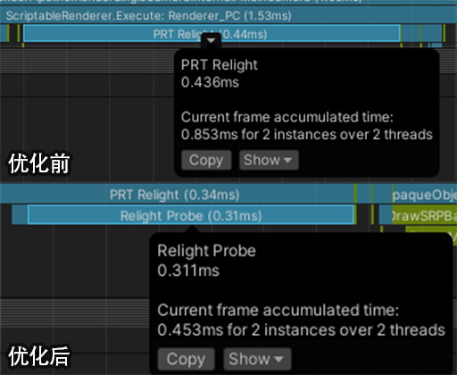

# Unity URP渲染管线PRTGI拓展

<!-- more -->

知乎这块最早有网易提供了其参考育碧《Global Illumination in Tom Clancy's The Division》GDC分享后的实现思路 [实时PRTGI技术与实现](https://zhuanlan.zhihu.com/p/541137978)。

后有[AKG4e3](https://www.zhihu.com/people/long-ruo-li-21)大佬提供了示例工程，见[预计算辐照度全局光照（PRTGI）从理论到实战](https://zhuanlan.zhihu.com/p/571673961)。

[方木君](https://www.zhihu.com/people/sun-wen-bin-90-50)则在[Unity移动端可用实时GI方案细节补充](https://zhuanlan.zhihu.com/p/654050347)中扩展了一下Local Light的Relight和优化方案。

笔者本篇文章也是基于该项目Fork在学习过程中继续完善和扩展。


## 流程概述

先总结一下AKG4e3大佬项目中的流程，方便后续对比：

1. Probe发射512个射线采样生成Surfel（总计512 * Probe个）
2. 按Probe顺序存储Surfel
3. 运行时Probe拿到对应的512个Surfel
4. Relight所有Probe

## 3D纹理

原作者存储球谐是将27位float存在一个巨大的ComputeBuffer中，这导致需要使用定点数Encode并且使用较多的原子操作。这并没有有效利用ComputeShader的优势。

```cpp
// 使用定点数存储小数, 因为 compute shader 的 InterlockedAdd 不支持 float
// array size: 3x9=27
RWStructuredBuffer<int> _coefficientSH9;  

// storage to volume
if(_indexInProbeVolume >= 0)
{
    const int coefficientByteSize = 27;
    int offset = _indexInProbeVolume * coefficientByteSize;
    for(int i = 0; i < 9; i++)
    {
        InterlockedAdd(_coefficientVoxel[offset + i * 3 + 0], EncodeFloatToInt(c[i].x));
        InterlockedAdd(_coefficientVoxel[offset + i * 3 + 1], EncodeFloatToInt(c[i].y));
        InterlockedAdd(_coefficientVoxel[offset + i * 3 + 2], EncodeFloatToInt(c[i].z));
    }
}
```

我将其修改为probeSizeX, probeSizeZ, probeSizeY * 9大小，格式为RGBA32的3D纹理，虽然这样还是会有一定的CacheMiss，但相比使用ComputeBuffer来存储球谐系数，性能提升明显，并且可以方便在FrameDebugger中查看。

```cpp
// Layout: [probeSizeX, probeSizeZ, probeSizeY * 9]
RWTexture3D<float3> _coefficientVoxel3D;

if (_indexInProbeVolume >= 0)
{
    // Write to 3D texture
    int3 texCoord = ProbeIndexToTexture3DCoord(_indexInProbeVolume, index, _coefficientVoxelSize);
    _coefficientVoxel3D[texCoord] = groupCoefficients[0];
}

```
注意这里我们还未写入3D纹理的Alpha通道，这部分可供自定义数据使用，例如Probe的Validation（例如区分室内室外），这块笔者暂时还没做，后续需要搭配编辑器可视化标记一同实现。

## 并行规约

由于改成3D纹理，我们需要解决原来作者没处理的球谐系数求和问题，这本质是GPU中的多线程求和问题即并行规约问题。


原理不难，英伟达也提供了最佳实践[Optimizing Parallel Reduction in CUDA](https://developer.download.nvidia.cn/assets/cuda/files/reduction.pdf)。

在CS中实现起来也非常简单，我们有512个Thread，刚好是2次幂，因此可以直接使用PPT中的方法3。


```cpp
// Parallel reduction
for (uint stride = 256; stride > 0; stride >>= 1)
{
    if (groupIndex < stride)
    {
        groupCoefficients[groupIndex] += groupCoefficients[groupIndex + stride];
    }

    GroupMemoryBarrierWithGroupSync();
}
```

由于利用了多线程能力，带宽换时间，性能大概提升2倍，还有两个进阶版本可以更有效利用带宽，但代码实在有些繁琐，用第三种基本足够了。


## 分帧Relight

由于现有方法是需要每帧遍历所有Probe进行Relight，这导致场景越大或Probe密度越大，Relight成本越高。为了性能可控，我们可以利用Diffuse GI低频的特点，将Relight的步骤分摊到多帧。

```c#
void DoRelight(CommandBuffer cmd, PRTProbeVolume volume)
{
    volume.SwapCoefficientVoxels();

    // 如果是多帧Relight，则不需要清空体素
    if (!multiFrameRelight)
        volume.ClearCoefficientVoxel(cmd);

    // May only update a subset of probes each frame
    using (ListPool<PRTProbe>.Get(out var probesToUpdate))
    {
        volume.GetProbesToUpdate(probesToUpdate);
        foreach (var probe in probesToUpdate)
        {
            probe.ReLight(cmd, _relightCS, _relightKernel);
        }
    }

    // Advance volume render frame
    volume.AdvanceRenderFrame();
}

// 滚动获取当前帧要更新的Probe
public void GetProbesToUpdate(List<PRTProbe> probes)
{
    for (int i = _currentProbeUpdateIndex; i < _currentProbeUpdateIndex + probesToUpdateCount; i++)
    {
        probes.Add(Probes[i]);
    }
}

public void AdvanceRenderFrame()
{
    // Advance the update index for next frame
    _currentProbeUpdateIndex = (_currentProbeUpdateIndex + probesToUpdateCount) % Probes.Length;
}
```

由于我们不再使用原子操作来修改ComputeBuffer，我们只要在CPU侧跳过ClearCoefficientVoxel这一步骤就相当于实现了Load and Dont Care的效果。

## Surfel合并

我们回过头看下现在的数据存储，对于每个Probe我们都存放了其512个Surfel数据，如果两个Probe挨着很近，那很大概率Surfel的数据是比较重复的，对于离得很近、方向基本一致的Surfel，我们实际可以清理一部分冗余数据。


育碧全境封锁给予了一个方案，即根据Grid大小和Surfel的法线的主方向来聚集为Brick。同一个Brick中的Surfel数据就可以提取一下特征（比如对于坐标相同、法线方向相近的Surfel进行合并）。

下面是数据结构：

```C#
/// <summary>
/// Represents the indices of a Surfel
/// </summary>
[Serializable]
public struct SurfelIndices
{
    public int start;

    public int end;
}

/// <summary>
/// Represents a 4x4x4 brick containing merged Surfels
/// </summary>
public class SurfelBrick
{
    public const float BrickSize = 4.0f; // 4x4x4 meters

    public readonly List<int> SurfelIndices = new(); // Store indices instead of actual surfels

    public readonly HashSet<PRTProbe> ReferencedProbes = new(); // Store probes that reference this brick

    public int Index { get; } // Global index in the brick array
}
```

SurfelBrick即为烘焙时的Brick存储结构，由于Surfel不再唯一对应一个Probe，我们还需要存储引用关系，直到存储数据时再扁平化为索引。


其次因为Surfel被合并为Brick，Probe不再直接引用其烘焙阶段命中的Surfel，我们需要额外的数据结构将Sample的Surfel数据和Relight的Surfel数据分离。参考育碧，下面是一个示例：

```C#

/// <summary>
/// Factor structure: contains Brick index and the contribution weight of that Brick to the Probe
/// </summary>
[Serializable]
public struct BrickFactor
{
    public int brickIndex;    // Index of the Brick in the global array

    public float weight;      // Contribution weight of this Brick to the Probe [0,1]
}

/// <summary>
/// Factor range: each Probe stores the range of Factors it uses
/// </summary>
[Serializable]
public struct FactorIndices
{
    public int start;         // Start index in the Factor array

    public int end;           // End index in the Factor array
}
```

这里Factor对应了一个Brick对于一个Probe的贡献权重（由Brick中所有Surfel的平均法线计算），FactorIndices则对应一个Probe的Factor范围，由此可以保持运行时索引上的连续。

结合上面的数据结构，下面是从烘焙到使用的新流程：

1. Probe发射512个射线采样生成Surfel
2. Surfel合并聚集到Brick
3. Brick平均法线计算Probe贡献系数，存到Factor中
4. 存储Factor、Brick、以及合并后的全部Surfel
5. 运行时Volume拿到全部Surfel、Brick、Factor数据，提交GPU
6. Relight所有Brick
7. Relight所有Factor

为了验证数据正确，这里优先编写一下Brick的Gizmos视图，方便在编辑器看到各个Brick对选中Probe的贡献值以及Brick中各个Surfel方向是否朝向一致。


最后我们对比下性能，因为Surfel数据大量进行了合并，Relight Brick开销非常小，而Probe在Relight时采样的Brick数量也小于原先的512个，因此开销也有所下降。

注意这里是使用了Multi Frame Relight来控制每帧更新的Probe数量（图中示例为15个Probe）。




## 总结

本篇文章着重于现有开源PRTGI方案的优化和拓展，即使完成上述后，仍然有大量待完善的内容。

前三个部分的实现在我的Fork版本[AkiKurisu/UnityPRTGI](https://github.com/AkiKurisu/UnityPRTGI)中已经基本完成（可能存在构建、Gizmos的问题，后续也不维护了）。

第四个部分的实现会之后和其他渲染功能一起开源，敬请期待。