# 让Unity IL2CPP下的反射性能提高100倍的方法

<!-- more -->

## 起因

在开发[Ceres](https://github.com/AkiKurisu/Ceres)(Unity蓝图插件)时，我对反射进行过一系列优化尝试。

例如对于静态函数，可以直接获取函数指针来避免反射调用。

对于实例方法，我们可以使用`Open Delegate`和泛型字典来缓存委托实例，用一点内存开销来提高调用性能。

然后我看到了一个有意思的仓库[Meetem/ILCall](https://github.com/Meetem/ILCall)，里面提到了可以使用`Calli`指令来<b>直接</b>调用IL2CPP为托管函数生成的C++函数。

这里<b>直接</b>非常重要，因为IL2CPP会生成一系列Invoker函数来支持反射调用。具体可以参考车神的[深入浅出il2cpp：反射篇](https://zhuanlan.zhihu.com/p/14469318468)。

而`ILCall`仓库通过一个Hacky的方式即使用`unmanaged[Cdecl]`约定直接调用托管函数对应的C++函数。我们可以通过下面的方式来获取函数指针。
> void* ptr = *(ulong*)MethodInfo.MethodHandle.Value

这利用了il2cpp中`methodPointer`对于`MethodInfo`的地址偏移量刚好为0的特性。

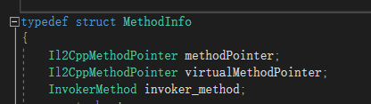

## 直接调用托管函数

我修改了一下代码(把结构体改成了静态类)，为了方便阅读，仅保留了IL2CPP下的代码。

用dnspy反编译一部分如下：

```c#
[MethodImpl(MethodImplOptions.AggressiveInlining)]
public unsafe static TReturn Generic<TReturn, TThis, T1>(TThis _this, T1 arg1, IntPtr methodPtr, void* runtimeHandleIL2CPP = null)
{
  return calli(TReturn(TThis,T1,System.Void*), _this, arg1, runtimeHandleIL2CPP, methodPtr);
}

[MethodImpl(MethodImplOptions.AggressiveInlining)]
public unsafe static TReturn Generic<TReturn, TThis, T1, T2>(TThis _this, T1 arg1, T2 arg2, IntPtr methodPtr, void* runtimeHandleIL2CPP = null)
{
  return calli(TReturn(TThis,T1,T2,System.Void*), _this, arg1, arg2, runtimeHandleIL2CPP, methodPtr);
}
```

我们看看它是否有效：

C#部分：

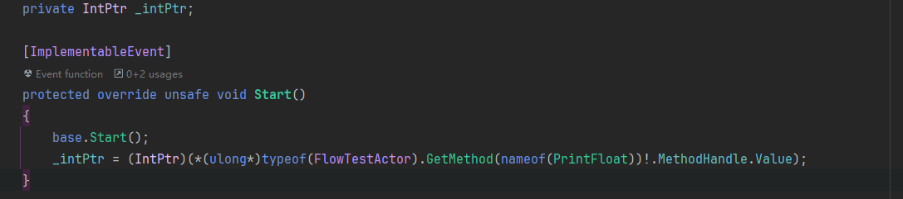
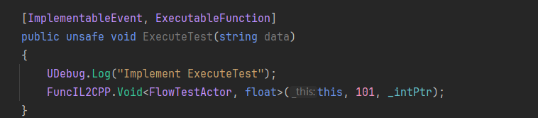

C++部分：
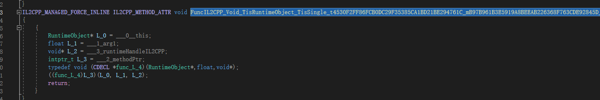

可以看到这里确实直接调用了生成的C++函数。因此在非泛型方法中使用这个Hacky方法确实是最佳实践了！

但事实上，我们可以利用C# 9提供的`delegate*`函数指针来实现一样的功能。

```c#
[ImplementableEvent, ExecutableFunction]
public unsafe void ExecuteTest(string data)
{
	UDebug.Log("Implement ExecuteTest");
	((delegate* unmanaged[Cdecl]<FlowTestActor, float, void>)_intPtr)(this, 101);
}
```

## 完全泛型共享问题

然后我尝试在蓝图的泛型Invoke方法中使用这个方法，但是发现打包后抛出了异常。
```c#
public TR Invoke<T1, TR>(TTarget target, T1 arg1)
{
    if (IsStatic)
    {
        return ((delegate* <T1, TR>)_functionPtr)(arg1);
    }
#if ENABLE_IL2CPP
    return FuncIL2CPP.Generic<TR, TTarget, T1>(target, arg1, _functionPtr, null);
#else
    ReallocateDelegateIfNeed<T1, TR>();
    Assert.IsNotNull(_delegate);
    return ((Func<TTarget, T1, TR>)_delegate).Invoke(target, arg1);
#endif
}
```

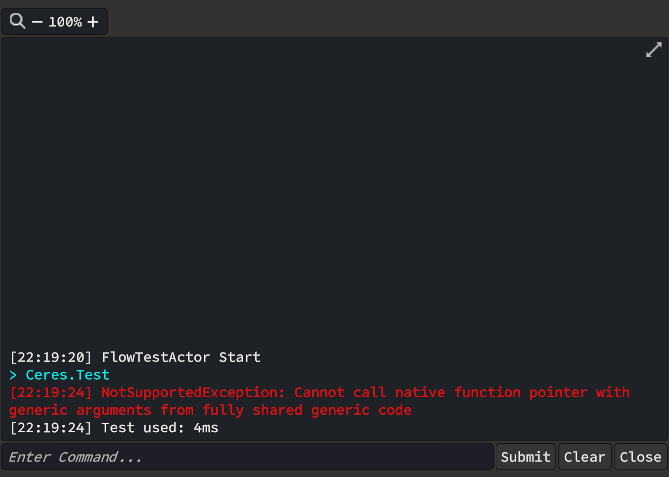

[Full Generic Sharing完全泛型共享](https://unity.com/cn/blog/engine-platform/il2cpp-full-generic-sharing-in-unity-2022-1-beta)是Unity2022版本后推出的特性，以支持用户态不需要担心泛型方法被裁剪。

以下是IL2CPP翻译后的C++代码，可以看到IL2CPP不支持在泛型共享函数中调用Native指针，因为无法在编译期确定指针的类型。

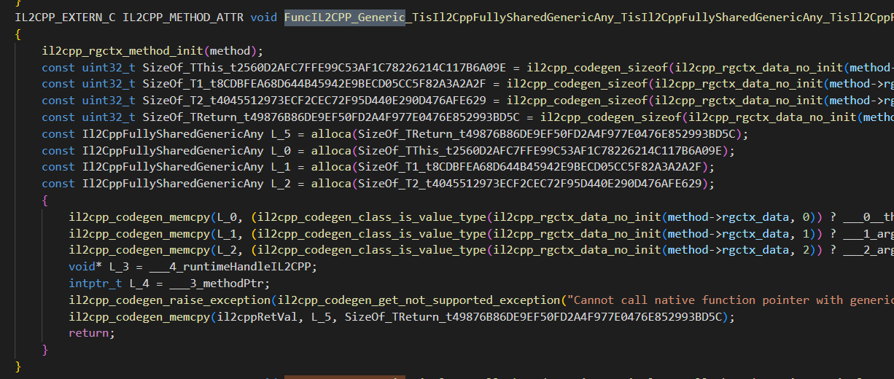


但有趣的是，IL2CPP是支持Invoke中的managed static函数指针调用的。虽然C#不支持获取和调用managed Instance函数指针，但IL实际上是支持的，可以参考Issue：[Calling instance-based methods with function pointers is not supported](https://github.com/dotnet/runtime/issues/110061)和Discussion：[Proposal: Function pointers on instance methods](https://github.com/dotnet/csharplang/discussions/7331)。

我们看下IL2CPP是如何翻译Invoke中对managed static函数指针调用的。

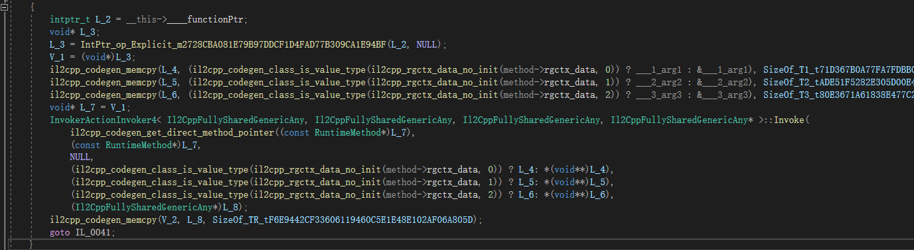

这里参考车神的文章，IL2CPP使用了一个公共的Invoker来间接调用最终的C++函数。

因此理论上IL2CPP如果能将NULL替换为我们传入的对象，就可以实现间接调用托管函数对应的C++函数，虽然不是直接调用，但相对于生成委托或直接使用反射API，开销小了很多。


## 间接调用托管函数

因此我修改了`ILCall`仓库，将其改为了IL2CPP下对Managed Instance函数的调用，因为Static函数我们可以用`delegate*`，不需要额外的库来做这件事了，详见[AkiKurisu/IL2CPPCall](https://github.com/AkiKurisu/IL2CPPCall)。

理论上我们可以像这样使用更低开销的使用反射。

```c#
public class MyClass
{
    private int addValue = 1;

    public int AddOne(int inputValue)
    {
        return inputValue + addValue;
    }
}
int input = 5;
MyClass target = new MyClass();
var functionPtr = (void*)typeof(MyClass).GetMethod("AddOne").MethodHandle.Value;
var result = FuncIL2CPP.Generic<int, MyClass, Tint1>(target, input, functionPtr);
Debug.Log(result); // Console: 6
```

Generic方法对应的IL如下，使用了[HasThis约定](https://learn.microsoft.com/zh-cn/dotnet/api/system.reflection.callingconventions?view=net-8.0)

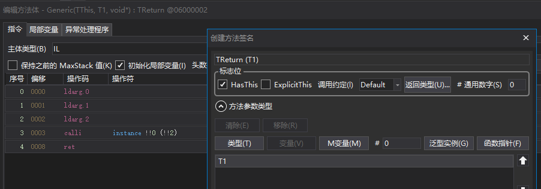

但打包后出现了错误：

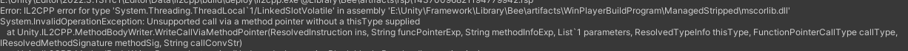

因为问题出在IL2CPP内部，我们只能用dnspy来反编译`Unity.IL2CPP.dll`一探究竟了。

然后就发现IL2CPP在处理`OpCode.Calli`时未支持`HasThis`约定。

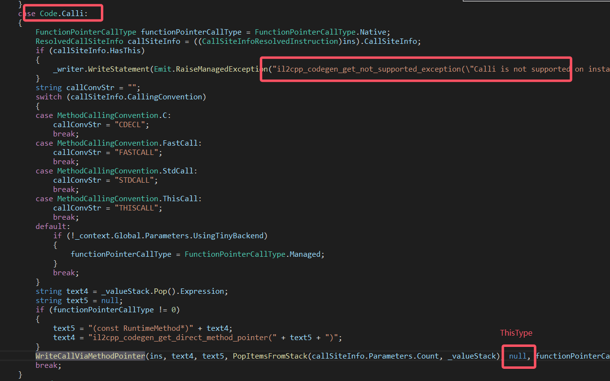

因此我们通过dnspy修改了IL2CPP的`Unity.IL2CPP.dll`，添加了对于`IL2CPPCall`中`HasThis`约定下的支持。

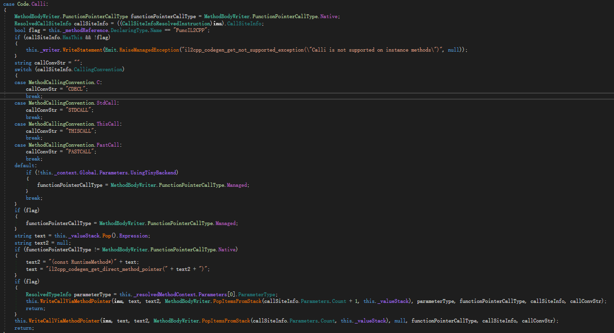

还有另一处修改，具体可参考中的步骤。但由于IL2CPP的代码会随着Unity版本更新而更新，这个修改不保证在各个版本上统一，我这里测试的版本是Unity2022.3.13。

最后，我们打包后，发现成功了。IL2CPP为`FuncIL2CPP.Generic`生成了正确的C++代码。

```c++
/* FuncIL2CPP.Generic<TR, TThisType, T1>(TThisType thisType, T1 arg1, void* methodPtr); */
IL2CPP_EXTERN_C IL2CPP_METHOD_ATTR void FuncIL2CPP_Generic_gshared (
    Il2CppFullySharedGenericAny thisType, 
    Il2CppFullySharedGenericAny arg1, 
    void* methodPtr, 
    Il2CppFullySharedGenericAny* il2cppRetVal, 
    const RuntimeMethod* method
) 
{
	il2cpp_rgctx_method_init(method);
	const uint32_t SizeOf_TThis = il2cpp_codegen_sizeof(il2cpp_rgctx_data_no_init(method->rgctx_data, 0));
	const uint32_t SizeOf_T1 = il2cpp_codegen_sizeof(il2cpp_rgctx_data_no_init(method->rgctx_data, 1));
	const uint32_t SizeOf_TReturn = il2cpp_codegen_sizeof(il2cpp_rgctx_data_no_init(method->rgctx_data, 2));
	const Il2CppFullySharedGenericAny L_3 = alloca(SizeOf_TReturn);
	const Il2CppFullySharedGenericAny L_0 = alloca(SizeOf_TThis);
	const Il2CppFullySharedGenericAny L_1 = alloca(SizeOf_T1);
	{
		il2cpp_codegen_memcpy(L_0, (il2cpp_codegen_class_is_value_type(il2cpp_rgctx_data_no_init(method->rgctx_data, 0)) ? thisType : &thisType), SizeOf_TThis);
		il2cpp_codegen_memcpy(L_1, (il2cpp_codegen_class_is_value_type(il2cpp_rgctx_data_no_init(method->rgctx_data, 1)) ? arg1 : &arg1), SizeOf_T1);
		void* L_2 = methodPtr;
		InvokerActionInvoker2< Il2CppFullySharedGenericAny, Il2CppFullySharedGenericAny* >::Invoke(
            il2cpp_codegen_get_direct_method_pointer((const RuntimeMethod*)L_2),
            (const RuntimeMethod*)L_2,
            (il2cpp_codegen_class_is_value_type(il2cpp_rgctx_data_no_init(method->rgctx_data, 0)) ? L_0: *(void**)L_0),
            (il2cpp_codegen_class_is_value_type(il2cpp_rgctx_data_no_init(method->rgctx_data, 1)) ? L_1: *(void**)L_1),
            (Il2CppFullySharedGenericAny*)L_3
        );
		il2cpp_codegen_memcpy(il2cppRetVal, L_3, SizeOf_TReturn);
		return;
	}
}
```

## Benchmark

最后我们对比下性能

```C#

private IntPtr _intPtr;
    
private IntPtr _intPtrManaged;

private MethodInfo _methodInfo;

private Func<FlowTestActor, float, float> _delegate;

[ImplementableEvent]
protected override unsafe void Start()
{
	base.Start();
	_methodInfo = typeof(FlowTestActor).GetMethod(nameof(BenchmarkTestFunc));
	_intPtr = (IntPtr)(*(ulong*)_methodInfo!.MethodHandle.Value);
	_intPtrManaged = _methodInfo!.MethodHandle.Value;
	_delegate =  (Func<FlowTestActor, float, float>)Delegate.CreateDelegate(typeof(Func<FlowTestActor, float, float>), null, _methodInfo);
}

[ImplementableEvent, ExecutableFunction]
public unsafe void ExecuteTest(string data)
{
	int iterations = 1000000;
	float result = 0;
	var stopWatch = new Stopwatch();
	stopWatch.Start();
	for (int i = 0; i < iterations; i++) 
	{
		result = ((delegate* unmanaged[Cdecl]<FlowTestActor, float, float>)_intPtr)(this, result);
	}
	stopWatch.Stop(); 
	UDebug.Log($"Execute unmanaged[Cdecl], result {result}, used: {stopWatch.ElapsedMilliseconds}ms");
	
	result = 0;
	stopWatch.Restart();
	for (int i = 0; i < iterations; i++) 
	{
		result = FuncIL2CPP.Generic<float, FlowTestActor, float>(this, result, (void *)_intPtrManaged);
	}
	stopWatch.Stop(); 
	UDebug.Log($"Execute managed[HasThis], result {result}, used: {stopWatch.ElapsedMilliseconds}ms");
	
	result = 0;
	stopWatch.Restart();
	for (int i = 0; i < iterations; i++) 
	{
		result = (float)_methodInfo.Invoke(this, new object[] { result });
	}
	stopWatch.Stop(); 
	UDebug.Log($"Execute MethodInfo.Invoke, result {result}, used: {stopWatch.ElapsedMilliseconds}ms");
	
	result = 0;
	stopWatch.Restart();
	for (int i = 0; i < iterations; i++) 
	{
		result = _delegate(this, result);
	}
	stopWatch.Stop(); 
	UDebug.Log($"Execute Delegate, result {result}, used: {stopWatch.ElapsedMilliseconds}ms");
}

public float BenchmarkTestFunc(float data)
{
	return data + 1;
}
```

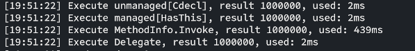

可粗略估计`managed[HasThis]`的性能是Invoke方式调用的百倍左右，但该用例下Delegate的性能与其基本一致，所以使用委托缓存MethodInfo是个更通用的方案。

## 致谢

感谢[知乎/车雄生](https://www.zhihu.com/people/che-xiong-sheng-16)大佬的文章让我关注到反射的性能优化空间。

感谢[GitHub/Meetemq](https://github.com/Meetem)的项目启发了我对反射优化的实现。

感谢[Github/Stalo](https://github.com/stalomeow)对我在学习`IL`语法和实现`IL2CPPCall`上极大的帮助。