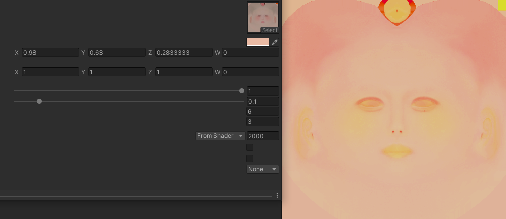
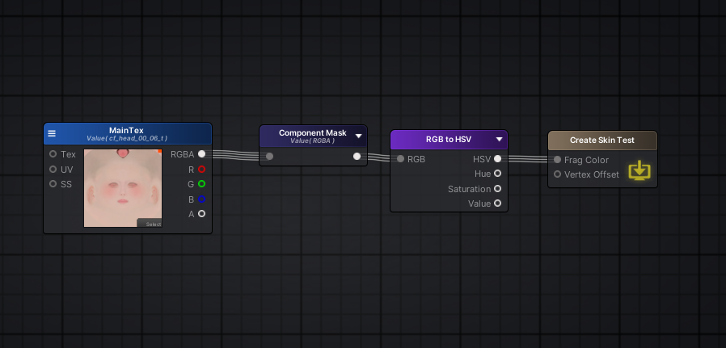
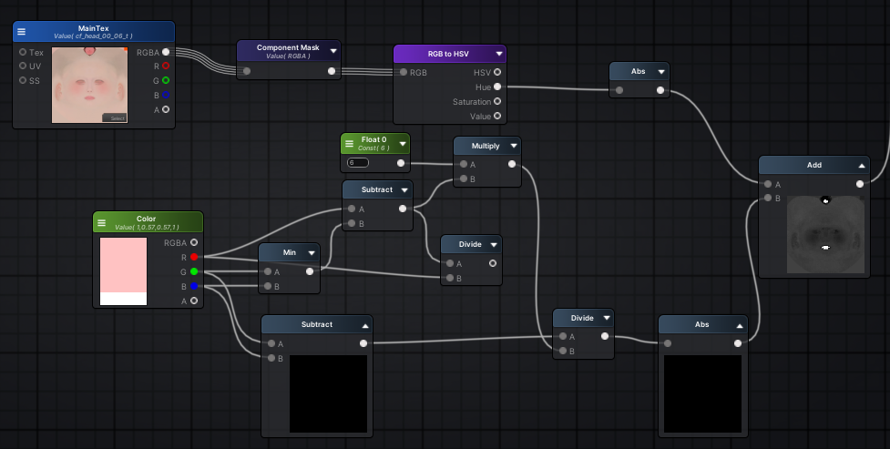
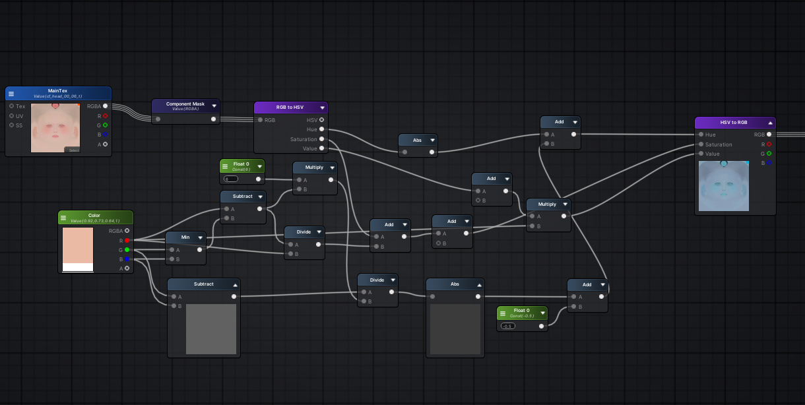
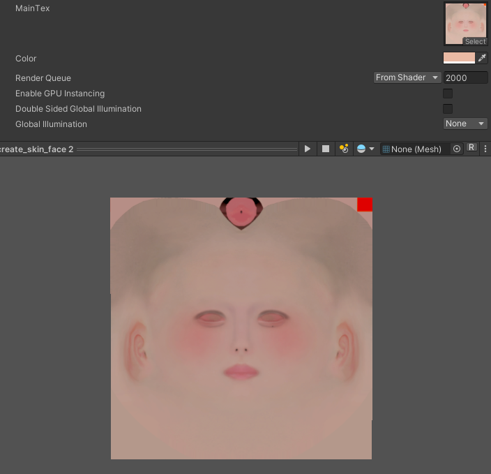
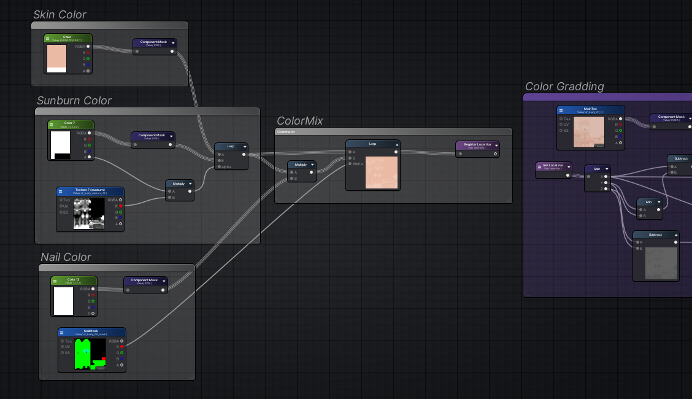
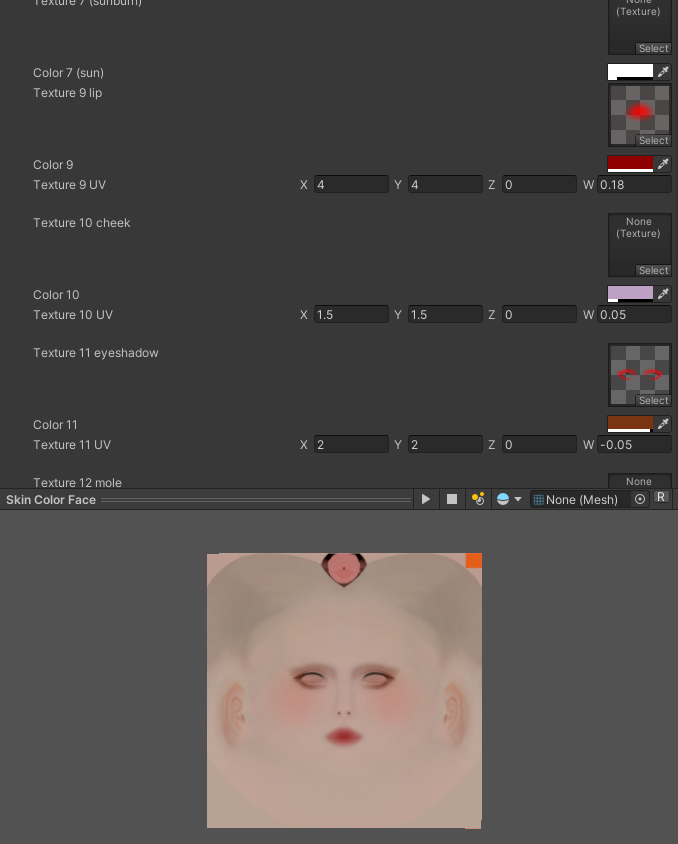
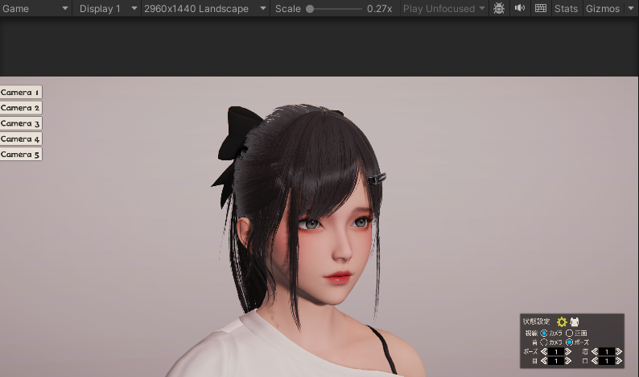

# 像人工智能一样学习：Shader逆向实验

<!-- more -->

AssetRipper能帮助我们逆向游戏模型、贴图、材质等资产，同时也能实验性地反编译GLSL回ShaderLab，虽然大概率不可用，但也能提供一些关键的参数。

本博客用以记录逆向实验的过程，因为我对手写的Shader完全不熟，我想同时通过该实验验证我一个大胆的学习方法：“像人工智能一样学习”。


## 反编译的Shader

```C#
fout frag(v2f inp)
{
          fout o;
          
          float4 mainTex = tex2D(_MainTex, inp.texcoord.xy);
          float4 tmp0;
          tmp0.zw = float2(-1.0, 0.6666667);
          float4 mask1;
          mask1.x = mainTex.x >= mainTex.y ? 1.0 : 0.0;
          tmp0.xy = mainTex.yx;
          float4 tmp1;
          tmp1.xy = mainTex.xy - mainTex.yx;
          tmp1.zw = float2(1.0, -1.0);
          tmp0 = mask1.xxxx * tmp1 + tmp0;
          mainTex.xyz = tmp0.xyw;
          tmp1.x = mainTex.w >= mainTex.x ? 1.0 : 0.0;
          tmp0.xyw = mainTex.wyx;
          tmp0 = lerp(mainTex,tmp0,tmp1.x);
          
          tmp1.x = tmp0.x - min(tmp0.y, tmp0.w);

          tmp0.y = (tmp0.w - tmp0.y) / (tmp1.x * 6.0) + tmp0.z;

          tmp0.xz = tmp0.xx + float2(0.0, -0.1);

          tmp0.w = _Color.x - min(_Color.y, _Color.z);

          tmp1.z = _Color.z - _Color.y;
          tmp1.y = tmp1.z /(tmp0.w * 6.0) - 2 ;

          tmp0.y = abs(tmp0.y) + abs(tmp1.y);
          tmp1.yzw = tmp0.yyy + float3(0.95, 0.6166667, 0.2833333);
          tmp1.yzw = frac(tmp1.yzw) * 6 - 3;
          tmp1.yzw = saturate(abs(tmp1.yzw) - 1) - 1;

          tmp0.y = tmp0.z * _Color.x;
          tmp0.x =  tmp0.w / _Color.x + tmp1.x / tmp0.x- 0.5;
          tmp0.xzw = tmp0.xxx * tmp1.yzw + 1;
          tmp0.xyz = tmp0.xzw * tmp0.yyy;
 
          o.sv_target =  tmp0;
          return o;
}
```

该部分代码为反编译`HoneySelect2`中`Create Skin Color`的一部分，功能为将输入颜色和贴图进行混合用以改变皮肤的颜色，但反编译的版本的色调存在问题，因为我对编写Shader不熟悉，我一开始也无从下手（大佬应该能直接看出来这些对应的操作是什么吧）。



但有一个有趣的地方是反编译的ShaderLab告诉我们`Inspector`使用的是`ASE Inspector`，那该Shader大概率是用ASE连线完成的，事情就简单很多。

## 对比实验

我不懂这些函数，但如开题所说我想像人工智能一样解决问题。

具体而言：
1. 通过已学知识（结点连线）尝试复原一个小功能并编译它
2. 比对这部分代码和之前反编译的代码之间的差异，提取差异点
3. 再次尝试复原直至收敛

下面我们会对编译后重合的代码块增加注释`Signal{n}`进行标记。

我大概知道色调是通过HSV颜色空间操作的，在ASE中，我们可以使用`RGB2HSV`将`MainTex`转换为HSV空间。




然后我们对其进行编译得到：

```C#
void main()
{
    //Start
    u_xlat0.z = float(-1.0);
    u_xlat0.w = float(0.666666687);
    u_xlat1.z = float(1.0);
    u_xlat1.w = float(-1.0);
    u_xlat2.xyw = texture(_MainTex, vs_TEXCOORD1.xy).yzx;
    u_xlatb3 = u_xlat2.x>=u_xlat2.y;
    u_xlat3 = u_xlatb3 ? 1.0 : float(0.0);
    u_xlat0.xy = u_xlat2.yx;
    u_xlat1.xy = (-u_xlat0.xy) + u_xlat2.xy;
    u_xlat0 = vec4(u_xlat3) * u_xlat1 + u_xlat0;
    u_xlat2.xyz = u_xlat0.xyw;
    u_xlatb1 = u_xlat2.w>=u_xlat2.x;
    u_xlat1.x = u_xlatb1 ? 1.0 : float(0.0);
    u_xlat0.xyw = u_xlat2.wyx;
    u_xlat0 = u_xlat0 + (-u_xlat2);
    u_xlat0 = u_xlat1.xxxx * u_xlat0.yzxw + u_xlat2.yzxw;
    u_xlat1.x = min(u_xlat0.x, u_xlat0.w);
    u_xlat1.x = u_xlat0.z + (-u_xlat1.x);
    u_xlat5 = u_xlat1.x * 6.0 + 1.00000001e-10;
    u_xlat9 = (-u_xlat0.x) + u_xlat0.w;
    u_xlat5 = u_xlat9 / u_xlat5;
    u_xlat5 = u_xlat0.y + u_xlat5;
    //Signal1
    u_xlat0.x = abs(u_xlat5);
    u_xlat5 = u_xlat0.z + 1.00000001e-10;
    u_xlat0.y = u_xlat1.x / u_xlat5;
    u_xlat0.w = 0.0;
    //End
    SV_Target0 = u_xlat0;
    return;
}
```

因为我们直接输入的是HSV，所以这里`u_xlat0`就是我们的HSV值了，中间的细节我们完全可以忽视掉。

同时把反编译的Shader编译比对得到：
```C#
void main()
{
   //Start
    u_xlat0.z = float(1.0);
    u_xlat0.w = float(-1.0);
    u_xlat1.z = float(-1.0);
    u_xlat1.w = float(0.666666687);
    u_xlat2.xyw = texture(_MainTex, vs_TEXCOORD0.xy).xyw;
    u_xlatb3 = u_xlat2.x>=u_xlat2.y;
    u_xlat3 = u_xlatb3 ? 1.0 : float(0.0);
    u_xlat0.xy = (-u_xlat2.yx) + u_xlat2.xy;
    u_xlat1.xy = u_xlat2.yx;
    u_xlat0 = vec4(u_xlat3) * u_xlat0 + u_xlat1;
    u_xlat2.xyz = u_xlat0.xyw;
    u_xlatb1 = u_xlat2.w>=u_xlat2.x;
    u_xlat1.x = u_xlatb1 ? 1.0 : float(0.0);
    u_xlat0.xyw = u_xlat2.wyx;
    u_xlat0 = u_xlat0 + (-u_xlat2);
    u_xlat0 = u_xlat1.xxxx * u_xlat0 + u_xlat2;
    u_xlat1.x = min(u_xlat0.w, u_xlat0.y);
    u_xlat1.x = u_xlat0.x + (-u_xlat1.x);
    u_xlat5 = u_xlat1.x * 6.0;
    u_xlat4 = (-u_xlat0.y) + u_xlat0.w;
    u_xlat4 = u_xlat4 / u_xlat5;
    u_xlat4 = u_xlat0.z + u_xlat4;
    // 可推理出
    // u_xlat4=>hsv.x  u_xlat1.x/u_xlat0.x=>hsv.y
    // u_xlat0.y=>hsv.z

    //Signal1 截至这里与RGB2HSV是一致的，后面也刚好开始处理Color部分了
    u_xlat12 = (-_Color.y) + _Color.z;
    u_xlat5 = min(_Color.z, _Color.y);
    u_xlat5 = (-u_xlat5) + _Color.x;
    u_xlat9 = u_xlat5 * 6.0;
    u_xlat5 = u_xlat5 / _Color.x;
    u_xlat0.w = u_xlat12 / u_xlat9;
    u_xlat0.xzw = u_xlat0.xxw + vec3(0.0, -0.100000001, -2.0);
    u_xlat4 = abs(u_xlat0.w) + abs(u_xlat4);
    //Signal2
    u_xlat2.xyz = vec3(u_xlat4) + vec3(0.949999988, 0.616666675, 0.283333302);
    u_xlat2.xyz = fract(u_xlat2.xyz);
    u_xlat2.xyz = u_xlat2.xyz * vec3(6.0, 6.0, 6.0) + vec3(-3.0, -3.0, -3.0);
    u_xlat2.xyz = abs(u_xlat2.xyz) + vec3(-1.0, -1.0, -1.0);
    u_xlat2.xyz = clamp(u_xlat2.xyz, 0.0, 1.0);
    u_xlat2.xyz = u_xlat2.xyz + vec3(-1.0, -1.0, -1.0);
    //Signal3
    u_xlat4 = u_xlat0.z * _Color.x;
    u_xlat0.x = u_xlat1.x / u_xlat0.x + u_xlat5 -0.5;
    // 可推理出 
    // hsv.y + u_xlat5 -0.5 => final_hsv.y
    u_xlat0.xzw = u_xlat0.xxx * u_xlat2.xyz + vec3(1.0, 1.0, 1.0);
    SV_Target0.xyz = vec3(u_xlat4) * u_xlat0.xzw;
    SV_Target0.w = u_xlat0.w;
    return;
}
```

这样操作直接完成了1/3，由于最后肯定要转回RGB，我们同理试试HSV2RGB，连线就把上面的RGB2HSV替换即可，编译得到：

```C#
void main()
{
    u_xlat16_0.xyz = texture(_MainTex, vs_TEXCOORD1.xy).xyz;
    //Signal2 这里发现vec3参数不一样,但是刚好差0.05
    u_xlat1.xyz = u_xlat16_0.xxx + vec3(1.0, 0.666666687, 0.333333343);
    u_xlat1.xyz = fract(u_xlat1.xyz);
    u_xlat1.xyz = u_xlat1.xyz * vec3(6.0, 6.0, 6.0) + vec3(-3.0, -3.0, -3.0);
    u_xlat1.xyz = abs(u_xlat1.xyz) + vec3(-1.0, -1.0, -1.0);
    u_xlat1.xyz = clamp(u_xlat1.xyz, 0.0, 1.0);
    u_xlat1.xyz = u_xlat1.xyz + vec3(-1.0, -1.0, -1.0);
    //Signal3 这里存在差异
    u_xlat0.xyw = u_xlat16_0.yyy * u_xlat1.xyz + vec3(1.0, 1.0, 1.0);
    u_xlat0.xyz = u_xlat0.xyw * u_xlat16_0.zzz;
    SV_Target0.xyz = u_xlat0.xyz;
    SV_Target0.w = 0.0;
    return;
}
```

## 掐头去尾

我们把头尾比对后，可见差异点比较小，几乎只有最后的一小部分，我们先看看中间的代码做了什么操作：
```C#
  float tmp = _Color.x - min(_Color.z, _Color.y);
  float tmp2 = tmp * 6.0;
  tmp = tmp / _Color.x;
  u_xlat0.w = (_Color.z-_Color.y) / tmp2;
  u_xlat0.xzw = u_xlat0.xxw + vec3(0.0, -0.100000001, -2.0);
  source_hsv.x = abs(u_xlat0.w) + abs(source_hsv.x);
```

这里`tmp`、`u_xlat0`、`source_hsv`将用于后面的差异点，我们在ASE里连一下线。



## 抽丝剥茧

简单而言就是把模式匹配后差异的参数找出来，因为篇幅原因和需要上下文同时比对，我直接注释在代码里了。

非常有趣的是，这个过程就像人工智能中的Transformer模型一样，通过对上下文不不断阅读、发现内在联系然后压缩、推理，纵使不知道其原理。

例如抽丝剥茧的过程中我就把对代码的理解压缩成三部分：RGB2HSV、核心操作、HSV2RGB。

## 恢复原形

最后一步里乘上了`u_xlat4`
` SV_Target0.xyz = vec3(u_xlat4) * u_xlat0.xzw;`

`u_xlat4`为于`Signal3`这里的`u_xlat4 = u_xlat0.z * _Color.x`

从前文可知`u_xlat0.z = u_xlat0.x -0.1`，而` u_xlat0.x `就是`hsv.z`



我们全部连线后，发现有一点点问题，色调(Hue)有明显的差异，例如暖冷色调好像反了，而最开始我们遇到的问题就是色调的问题。

我们大胆在Hue后加上一个修正值，通过调整该参数（最终设置为`0.05f`），我惊讶的发现不止复原成功，还解决了之前色调存在差异的问题!

!!! CallBack
    为什么是`0.05`呢，前面存在一个差异的vec3刚好就是差`0.05`，这并非巧合。




## 功能展示

那么还原并修复了上述Shader后，我将颜色输入的部分提取出来加上颜色混合，例如晒痕和美甲：



对于颜色输出的部分，我们可以叠加上一些图案作为面妆：


至此还原了`HoneySelect2`创建角色颜色贴图的Shader，游戏中使用Blit动态生成角色的颜色贴图，以减少核心Shader的Sampler数量。


<center>在Unity中还原的渲染效果</center>