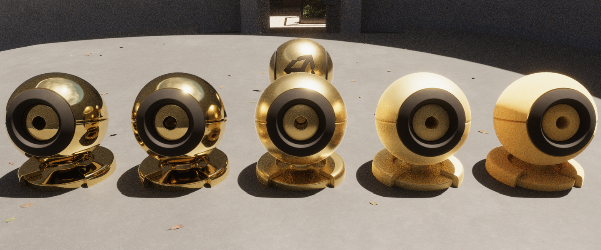
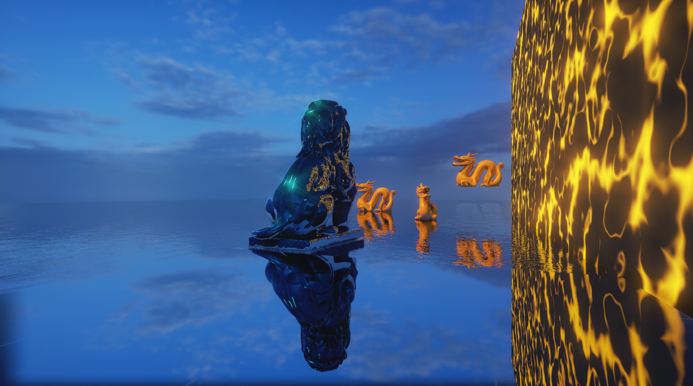
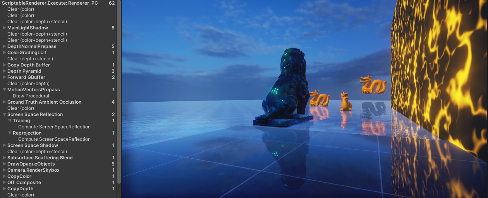
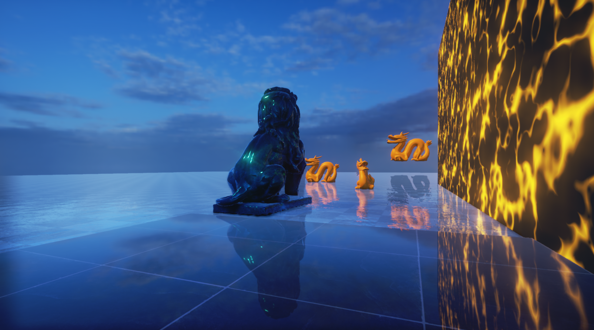

# UPR Forward渲染路径下的Screen Space Reflection实践

<!-- more -->

Screen Space Reflection (SSR 屏幕空间反射)是个很有效提高真实感的屏幕空间效果，并且非常常见。

本篇文章是一个在Forward渲染路径下的实践分享，并不着重于基础概念和算法的解释，如果没了解过SSR，推荐看一下下面的文章和博客。

概念和算法了解：[图形学基础|屏幕空间反射(SSR)](https://blog.csdn.net/qjh5606/article/details/120102582)

Linear优化的算法详解：[Sugu Lee - Screen Space Reflections : Implementation and optimization – Part 1 : Linear Tracing Method](https://sugulee.wordpress.com/2021/01/16/performance-optimizations-for-screen-space-reflections-technique-part-1-linear-tracing-method/)

Hiz优化的算法详解：[Sugu Lee - Screen Space Reflections : Implementation and optimization – Part 2 : HI-Z Tracing Method](https://sugulee.wordpress.com/2021/01/19/screen-space-reflections-implementation-and-optimization-part-2-hi-z-tracing-method/)

因为 URP 上没有内置SSR，得自己实现或者第三方插件，这里先选取了开源的[JoshuaLim007/Unity-ScreenSpaceReflections-URP](https://github.com/JoshuaLim007/Unity-ScreenSpaceReflections-URP)和[EricHu33/URP_SSR](https://github.com/EricHu33/URP_SSR)进行参考。

前者提供了三种SSR 的实现算法，并包括了上述两种优化方案，后者额外拓展了部分算法，并支持Forward管线以及RenderGraph API。

## Forward GBuffer适配

SSR 至少需要采样Depth、Normal、Roughness。在新的URP Forward管线中，Normal可以直接从`DepthNormalPass`生成的`_CameraNormalTexture`中采样，而Roughness则无法获得。

Eric的实现中是增加了一个ThinGBufferPass（我倾向于叫ForwardGBuffer）来专门收集`BRDFData`的`PerspectiveSmoothness`。

笔者是在2022开发的，这里补一下Eric中缺失的传统ScriptableRenderPass实现：

```csharp
public override void Execute(ScriptableRenderContext context, ref RenderingData renderingData)
{
    ref var cameraData = ref renderingData.cameraData;
    if (cameraData.renderer.cameraColorTargetHandle == null)
        return;
    var cmd = CommandBufferPool.Get();
    using (new ProfilingScope(cmd, profilingSampler))
    {
        context.ExecuteCommandBuffer(cmd);
        cmd.Clear();
        cmd.SetRenderTarget(_forwardGBufferTarget, cameraData.renderer.cameraDepthTargetHandle);
        context.ExecuteCommandBuffer(cmd);
        var drawSettings = CreateDrawingSettings(_shaderTagIdList,
            ref renderingData, renderingData.cameraData.defaultOpaqueSortFlags);
        drawSettings.overrideShader = _gBufferShader;
        context.DrawRenderers(renderingData.cullResults, ref drawSettings,
            ref _filteringSettings);
    }
    context.ExecuteCommandBuffer(cmd);
    CommandBufferPool.Release(cmd);
}
```

这里比较hack的地方是使用`overrideShader`来fetch当前材质中和`overrideShader`属性名称相同的值。

但工程上实践后，笔者认为这不是一个好的方式，它对于标准化的`Lit.shader`而言是有效的，但对于自定义的材质就不见得那么有用了。
因此在每个需要使用SSR的shader中手动增加一个`ForwardGBufferPass`才是更合理的方式。例如下面直接在`Lit.shader`中添加一个`ForwardGBufferPass`。

```hlsl
Pass
{
    Name "ForwardGBuffer"
    Tags
    {
        "LightMode" = "ForwardGBuffer"
    }
    
    ZWrite Off
    Cull Off
    ZTest Equal
    
    // To be able to tag stencil with disableSSR information for forward
    Stencil
    {
        WriteMask [_StencilWriteMaskGBuffer]
        Ref [_StencilRefGBuffer]
        Comp Always
        Pass Replace
    }
    
    HLSLPROGRAM
    #pragma target 4.5
    #pragma shader_feature_local_fragment _SPECULAR_SETUP
    
    //--------------------------------------
    // GPU Instancing
    #pragma multi_compile_instancing
    #pragma instancing_options renderinglayer
    #include_with_pragmas "Packages/com.unity.render-pipelines.universal/ShaderLibrary/DOTS.hlsl"
                
    #include "LitForwardGBufferPass.hlsl"

    #pragma vertex LitPassVertex
    #pragma fragment LitForwardGBufferPassFragment

    half4 LitForwardGBufferPassFragment(Varyings input) : SV_Target
    {
        UNITY_SETUP_INSTANCE_ID(input);
        UNITY_SETUP_STEREO_EYE_INDEX_POST_VERTEX(input);

        SurfaceData surfaceData = (SurfaceData)0;
        InitializeStandardLitSurfaceData(input.uv, surfaceData);
        BRDFData brdfData = (BRDFData)0;

        // NOTE: can modify "surfaceData"...
        InitializeBRDFData(surfaceData, brdfData);
        return surfaceData.smoothness;
    }
    ENDHLSL
}
```

## Stencil Mask

类似HDRP的实现，为了控制哪些区域需要SSR，我们可以在`ForwardGBufferPass`或`DepthNormalPass`中写入Stencil，然后在SSR中跳过非Mask区域。

```hlsl
bool doesntReceiveSSR = false;
uint stencilValue = GetStencilValue(LOAD_TEXTURE2D_X(_StencilTexture, positionSS.xy));
doesntReceiveSSR = (stencilValue & STENCIL_USAGE_IS_SSR) == 0;
if (doesntReceiveSSR)
{
    return half4(0, 0, 0, 0);
}
```

`_StencilTexture`需要从Pass中传入， 需要注意在Forward渲染路径下如果不开启`DepthPriming`的情况下，`DepthNormalPass`将深度写入`_CameraDepthTexture`而非`_CameraDepthAttachment`。

```c#
var depthTexture = GetCameraDepthTexture(); // _CameraDepthAttachment 或 _CameraDepthTexture 根据你的Stencil写入在哪
cmd.SetGlobalTexture("_StencilTexture", depthTexture, RenderTextureSubElement.Stencil);
```

当然上面的Mask是开发者按需求控制的，而在Tracing阶段，实际上我们会再根据Roughness来判断是否需要反射，高粗糙度的表面就不需要进行反射。 

在Unreal延迟渲染路径下的实现中， 存在一个 `SSRStencilPrepass` 来提前将Roughness为0的区域标记为不反射，以在SSR Pixel Shader中减少一部分开销，同理我们也可以在ForwardGBufferPass中额外判断粗糙度阈值写入Stencil。

## Hiz优化

Eirc和JoshuaLim在做Hiz Tracing优化的时候，都采用了基于`Texture2DArray`的Hiz生成方案。

这个方案的主要问题在显存开销过高，例如模拟11级Mipmap需要2048 * 2048 * 11的RTArray。这明显是不合理的，因为Hiz的分辨率是远小于纹理分辨率的。

一种优化方案是手动创建每个Level的RT，然后给不同的分辨率，但这个会有切换RenderTarget的开销，并且采样极其麻烦。

而理论上我们应该使用Texture2D自带的Mipmap，然后手动写入Mipmap，于是我看了一下HDRP的实现。

HDRP的Hiz即Depth Pyramid使用了一个Packed Atlas打包图集的方式，将所有Mipmap放在一张RT中。

采样时通过预计算各个Level下 UV 偏移量+屏幕空间位置进行计算就可以直接采样到对应Level的深度，非常优雅，使用示例如下：

```c++
StructuredBuffer<int2>  _DepthPyramidMipLevelOffsets;
TEXTURE2D_X(_DepthPyramid);

float SampleDepthPyramid(float2 uv, int mipLevel)
{
    int2 mipCoord  = (int2)uv.xy >> mipLevel;
    int2 mipOffset = _DepthPyramidMipLevelOffsets[mipLevel];
    return  LOAD_TEXTURE2D_X(_DepthPyramid, mipOffset + mipCoord).r;
}
```

因此我们可以完全抄一下HDRP的Depth Pyramid 实现。

而在进一步检索后，笔者发现Unity6额外对Depth Pyramid的Compute Shader又进行了一波优化，见[知乎清盐-浅析Unity6 GPU Resident Drawer(下)(HiZ GPU Occlusion Culling)](https://zhuanlan.zhihu.com/p/842429737)。简而言之是通过Group Shared Memeory减少了Dispatch次数，1920× 1080 DepthAttachment只需要3个Dispatch。

此外，HDRP对于第一个Mipmap即完整的DepthBuffer的拷贝是使用Compute Shader进行加速的，也可抄。

## 重要性采样

在Eric的实现中，反射方向是直接使用视线和法线`reflect`获得，没有Glossy效果，只是根据金属度进行过渡，在粗糙度较高时效果略差。

而 HDRP 的反射方向使用了基于[Eric Heitz.2018. Sampling the GGX Distribution of Visible Normals](https://jcgt.org/published/0007/04/01/paper.pdf)提出的VNDF重要性采样方法，更物理精确，Glossy效果更准确。



这部分知识推荐看蛋白胨大佬的文章[Importance Sampling PDFs (VNDF, Spherical Caps)](https://zhuanlan.zhihu.com/p/682281086)和三月雨大佬的实践[Visible NDF重要性采样实践](https://zhuanlan.zhihu.com/p/690342321)。

因此这块我们也可以直接抄到URP下，保留原来的近似方法，移动端性能较差的话仍使用它。

## 优化后效果

使用了HDRP的实现后在Unity2022 Forward渲染路径下的效果，因为是直接后处理混合上去的，没有进行光照计算，效果实际上不是很真实，这块我们在下一步进行优化。


## 渲染流程

上文仅提到了采样和算法上的差异，下一步我们来看渲染流程。对于SSR的渲染流程，笔者总结了以下四种模式：

1. 在Pixel Shader中Tracing、采样当前帧并应用。
2. BasePass之后Tracing，后处理采样当前帧并应用。
3. BasePass之后Tracing并Reproject上一帧颜色，在LightingPass中应用。
4. BasePass之前Tracing并Reproject上一帧颜色，在BasePass中应用。

第一种在新URP Sample的Water Shader中进行了使用，因为是Transparent物体，可以在DrawPass中获取CameraOpaqueTexture进行采样。适用于透明物体，同时兼容两种渲染路径。

Eric的实现可归为第二种，在后处理阶段采样当前帧颜色并应用。这一阶段可以根据前面的Hit Result计算SSR颜色，再与当前屏幕颜色直接进行混合。

而其缺点是无法在后处理阶段进行完整的环境BRDF计算，只能和屏幕颜色线性混合，与其他的反射方式如Reflection Cube，Raytracing Reflection，Planar Reflection无法很好兼容, 好处是前向延迟渲染路径都能用。

第三种是Unity HDRP和Unreal在延迟渲染中的实现，因为此时当前帧颜色还未计算出，需要Reproject上一帧的颜色。

其中应用反射的相关逻辑可参考`ReflectionEnvironmentPixelShader.usf`中的处理，下面是简化版：

```c++
// 采样SSR（屏幕空间反射）或Planar Reflection（平面反射）贴图
float4 SSR = Texture2DSample(ScreenSpaceReflectionsTexture, ScreenSpaceReflectionsSampler, BufferUV);

// 直接把SSR的RGB写入Color，表示当前像素的反射初值来自SSR
Color.rgb = SSR.rgb;

// SSR.a 通常是“屏幕空间反射的遮罩”或“可见性”，1表示完全有SSR，0表示没有SSR。
// 这里用 1-SSR.a 作为后续IBL混合的权重（即SSR越强，IBL越弱）
Color.a = 1 - SSR.a;

// 计算Specular Occlusion
float AO = GBuffer.GBufferAO * AmbientOcclusion;
float RoughnessSq = GBuffer.Roughness * GBuffer.Roughness;
float SpecularOcclusion = GetSpecularOcclusion(NoV, RoughnessSq, AO);

// SSR的权重再乘以Specular Occlusion，进一步抑制被遮蔽区域的反射
Color.a *= SpecularOcclusion;

// 用SSR的剩余权重（Color.a）去采样IBL（反射球/天光），并加到Color.rgb上
Color.rgb += PreExposure * GatherRadiance(
    Color.a, WorldPosition, R, GBuffer.Roughness, BentNormal, IndirectIrradiance,
    GBuffer.ShadingModelID, NumCulledReflectionCaptures, DataStartIndex
);

// 最后乘上环境BRDF预积分项，URP自带的是曲线拟合的EnvBRDFApproximate版本，HDRP的是采样PreIntegratedFGD。
Color.rgb *= EnvBRDF(GBuffer.SpecularColor, GBuffer.Roughness, NoV);
```

HDRP中的SSR也是一样，可参考`LightLoop.hlsl EvaluateBSDF_ScreenSpaceReflection`。但这个模式很明显只适用于拆分了Lighting步骤的延迟管线，Forward管线没法统一计算环境光照。

而第四种方式就是为了解决Forward渲染路径时的这一问题，这块非常依赖Unity URP渲染管线的能力，下面进行解释：

1. 因为SSR要在ForwardPass中应用，Tracing需要在这之前，那么Normal和ForwardGBuffer需要在Opaque前绘制。而Unity恰好给了我们`DepthNormalPass`。
2. 因为要Reproject上一帧颜色，我们可以借用TAAPass中的历史帧。没开TAA的话需要在BeforeRenderingPostProcess时Copy一下Color，自己维护。
3. 因为要做Reprojection，我们需要MotionVector获取上一帧的屏幕空间位置。URP14默认在BeforeRenderingPostProcess绘制，在URP17中可以选择在AfterOpaque中绘制，但是我们需要更早的时机即AfterPrepass。

这块改造较为复杂，详细代码就不提供了，一通改造后，Debugger下的渲染流程如下：



应用部分的修改只需要在`GlobalIllumination`函数中采样SSR贴图后叠加到Indirect Specular即可。

```c++
half3 indirectDiffuse = bakedGI;
half3 indirectSpecular = GlossyEnvironmentReflection(reflectVector, positionWS, brdfData.perceptualRoughness,
        1.0h, normalizedScreenSpaceUV);
    
#if _SCREEN_SPACE_REFLECTION // multi_compile_fragment
    half4 reflection = SampleScreenSpaceReflection(normalizedScreenSpaceUV);
    indirectSpecular += reflection.rgb; // accumulate since color is already premultiplied by opacity for SSR
#endif

/* Then calculate env brdf */
```

计算了正确的环境BRDF后效果如下，可以看到近处的镜子轮廓明显了，狮子右侧反射面颜色淡很多：



## 内置TAA适配

HDRP的SSR最后还有一个Temporal Denoise流程，但这块要抄HDRP的实现在没有RenderGraph的情况下会比较复杂，所以笔者这里就不阐释了。URP14里要手工实现的话应该和抄一遍内置的TAA差不多，只是把累加的目标换一下。

如果不使用SSR的TAA但开启相机全屏TAA的情况，需要修改下算法中的参数。如将 `UNITY_MATRIX_VP` 替换为当前帧计算出的`_NonJitteredViewProjMatrix`（开了MotionVectorPrepass就不需要手动算了）， 否则相机拉远反射面会有明显抖动，计算方式如下。

```c#
public static Matrix4x4 CalculateNonJitterViewProjMatrix(ref CameraData cameraData)
{
    float4x4 viewMat = cameraData.GetViewMatrix();
    float4x4 projMat = cameraData.GetGPUProjectionMatrixNoJitter();
    return math.mul(projMat, viewMat);
}
```

## 引用

[Sugu Lee - Screen Space Reflections : Implementation and optimization – Part 1 : Linear Tracing Method](https://sugulee.wordpress.com/2021/01/16/performance-optimizations-for-screen-space-reflections-technique-part-1-linear-tracing-method/)

[Sugu Lee - Screen Space Reflections : Implementation and optimization – Part 2 : HI-Z Tracing Method](https://sugulee.wordpress.com/2021/01/19/screen-space-reflections-implementation-and-optimization-part-2-hi-z-tracing-method/)

[图形学基础|屏幕空间反射(SSR)](https://blog.csdn.net/qjh5606/article/details/120102582)

[知乎清盐-浅析Unity6 GPU Resident Drawer(下)(HiZ GPU Occlusion Culling)](https://zhuanlan.zhihu.com/p/842429737)

[JoshuaLim007/Unity-ScreenSpaceReflections-URP](https://github.com/JoshuaLim007/Unity-ScreenSpaceReflections-URP)

[EricHu33/URP_SSR](https://github.com/EricHu33/URP_SSR)