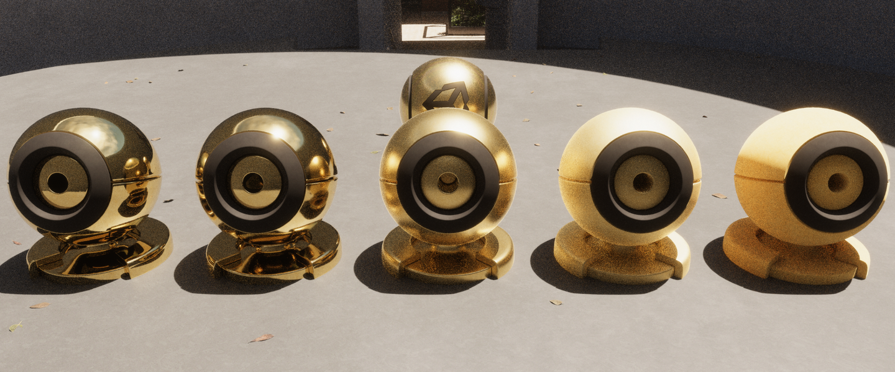

# UPR下的Screen Space Reflection工程实践

<!-- more -->

Screen Space Reflection (SSR 屏幕空间反射)是个很有效提高真实感的屏幕空间效果，并且非常常见。

本篇文章是一个工程实践的分享，并不着重于基础概念和算法的解释，如果没了解过SSR，推荐看一下下面的文章和博客。

概念和算法了解：[图形学基础|屏幕空间反射(SSR)](https://blog.csdn.net/qjh5606/article/details/120102582)

Linear优化的算法详解：[Sugu Lee - Screen Space Reflections : Implementation and optimization – Part 1 : Linear Tracing Method](https://sugulee.wordpress.com/2021/01/16/performance-optimizations-for-screen-space-reflections-technique-part-1-linear-tracing-method/)

Hiz优化的算法详解：[Sugu Lee - Screen Space Reflections : Implementation and optimization – Part 2 : HI-Z Tracing Method](https://sugulee.wordpress.com/2021/01/19/screen-space-reflections-implementation-and-optimization-part-2-hi-z-tracing-method/)

因为URP上没有SSR，得自己实现或者第三方插件，这里选取了开源的[JoshuaLim007/Unity-ScreenSpaceReflections-URP](https://github.com/JoshuaLim007/Unity-ScreenSpaceReflections-URP)和[EricHu33/URP_SSR](https://github.com/EricHu33/URP_SSR)。前者提供了三种SSR的实现算法，并包括了上述两种优化方案，后者额外拓展了部分算法，并支持Forward管线以及RenderGraph API。

## ForwardGBuffer适配

SSR至少需要采样Depth、Normal、Smoothness/Roughness，在新的URP Forward管线中，Normal可以直接从`DepthNormalPass`生成的`CameraNormalTexture`中采样。而Smoothness则无法获得，Eric的实现中是增加了一个ThinGBufferPass（我倾向于叫ForwardGBuffer）来专门收集BRDFData的Reflectivity。

笔者是在2022开发的，这里补一下Eric中缺失的传统ScriptableRenderPass实现：

```csharp
public override void Execute(ScriptableRenderContext context, ref RenderingData renderingData)
{
    ref var cameraData = ref renderingData.cameraData;
    if (cameraData.renderer.cameraColorTargetHandle == null)
        return;
    var cmd = CommandBufferPool.Get();
    using (new ProfilingScope(cmd, profilingSampler))
    {
        context.ExecuteCommandBuffer(cmd);
        cmd.Clear();
        cmd.SetRenderTarget(_forwardGBufferTarget, cameraData.renderer.cameraDepthTargetHandle);
        context.ExecuteCommandBuffer(cmd);
        var drawSettings = CreateDrawingSettings(_shaderTagIdList,
            ref renderingData, renderingData.cameraData.defaultOpaqueSortFlags);
        drawSettings.overrideShader = _gBufferShader;
        context.DrawRenderers(renderingData.cullResults, ref drawSettings,
            ref _filteringSettings);
    }
    context.ExecuteCommandBuffer(cmd);
    CommandBufferPool.Release(cmd);
}
```

这里比较hack的地方是使用`overrideShader`来fetch当前材质中和`overrideShader`属性名称相同的值。

但工程上实践后，笔者认为这不是一个好的方式，它对于标准化的Lit.shader而言是有效的，但对于更多自定义的材质就不见得那么有效了。
因此在每个需要使用SSR的shader中手动增加一个ForwardGBufferPass才是更合理的方式。例如下面直接在Lit.shader中添加一个ForwardGBufferPass。

```hlsl
Pass
{
    Name "ForwardGBuffer"
    Tags
    {
        "LightMode" = "ForwardGBuffer"
    }
    
    ZWrite Off
    Cull Off
    ZTest Equal
    
    // To be able to tag stencil with disableSSR information for forward
    Stencil
    {
        WriteMask [_StencilWriteMaskGBuffer]
        Ref [_StencilRefGBuffer]
        Comp Always
        Pass Replace
    }
    
    HLSLPROGRAM
    #pragma target 4.5
    #pragma shader_feature_local_fragment _SPECULAR_SETUP
    
    //--------------------------------------
    // GPU Instancing
    #pragma multi_compile_instancing
    #pragma instancing_options renderinglayer
    #include_with_pragmas "Packages/com.unity.render-pipelines.universal/ShaderLibrary/DOTS.hlsl"
                
    #include "LitForwardGBufferPass.hlsl"

    #pragma vertex LitPassVertex
    #pragma fragment LitForwardGBufferPassFragment

    half4 LitForwardGBufferPassFragment(Varyings input) : SV_Target
    {
        UNITY_SETUP_INSTANCE_ID(input);
        UNITY_SETUP_STEREO_EYE_INDEX_POST_VERTEX(input);

        SurfaceData surfaceData = (SurfaceData)0;
        InitializeStandardLitSurfaceData(input.uv, surfaceData);
        BRDFData brdfData = (BRDFData)0;

        // NOTE: can modify "surfaceData"...
        InitializeBRDFData(surfaceData, brdfData);
        return surfaceData.smoothness;
    }
    ENDHLSL
}
```

类似HDRP的实现，为了控制哪些区域需要SSR，我们可以在ForwardGBuffer中写入Stencil，然后在SSR中跳过非Mask区域。

```hlsl
bool doesntReceiveSSR = false;
uint stencilValue = GetStencilValue(LOAD_TEXTURE2D_X(_StencilTexture, positionSS.xy));
doesntReceiveSSR = (stencilValue & STENCIL_USAGE_IS_SSR) == 0;
if (doesntReceiveSSR)
{
    return half4(0, 0, 0, 0);
}
```

StencilTexture需要从Pass中传入：

```c#
var depthTexture = GetCameraDepthTexture(); // _CameraDepthAttachment 或 _CameraDepthTexture 根据你的Stencil写入在哪
cmd.SetGlobalTexture("_StencilTexture", depthTexture, RenderTextureSubElement.Stencil);
```


## Hiz优化

Eirc使用了和JoshuaLim一样的基于`Texture2DArray`的Hiz生成方案。

这个方案的主要问题在显存开销过高，例如模拟11级Mipmap需要2048 * 2048 * 11的RTArray。这明显是不合理的，因为Hiz的分辨率是远小于纹理分辨率的。

一种优化方案是手动创建每个Level的RT，然后给不同的分辨率，但这个会有切换RenderTarget的开销，并且采样极其麻烦。

而理论上我们应该使用Texture2D自带的Mipmap，然后手动写入Mipmap，于是我看了一下HDRP的实现。

HDRP的Hiz即Depth Pyramid使用了一个Packed Atlas打包图集的方式，将所有Mipmap放在一张RT中。采样时通过预计算各个Level下UV偏移量+屏幕空间位置进行计算就可以直接采样到对应Level的深度，非常优雅，使用示例如下：

```c++
StructuredBuffer<int2>  _DepthPyramidMipLevelOffsets;
TEXTURE2D_X(_DepthPyramid);

float SampleDepthPyramid(float2 uv, int mipLevel)
{
    int2 mipCoord  = (int2)uv.xy >> mipLevel;
    int2 mipOffset = _DepthPyramidMipLevelOffsets[mipLevel];
    return  LOAD_TEXTURE2D_X(_DepthPyramid, mipOffset + mipCoord).r;
}
```

因此我们可以完全抄一下HDRP的Depth Pyramid实现。

而在进一步检索后，笔者发现Unity6额外对Depth Pyramid的Compute Shader又进行了一波优化，见[知乎清盐-浅析Unity6 GPU Resident Drawer(下)(HiZ GPU Occlusion Culling)](https://zhuanlan.zhihu.com/p/842429737)。简而言之是通过Group Shared Memeory减少了Dispatch次数，1920× 1080 DepthAttachment只需要3个Dispatch。

Ok，这也抄走。然后笔者看到HDRP对于第一个Mipmap即完整的DepthBuffer的拷贝是使用Compute Shader进行加速的，也抄了。

## TAA适配

HDRP的SSR还有一个TAA流程，但这块要抄HDRP的实现在没有RenderGraph的情况下会比较复杂，所以笔者这里就不阐释了。URP 14里要实现的话和抄一遍内置的TAA差不多，只是把累加的目标换一下。

另一种是不使用SSR的TAA但开启相机TAA的情况，需要修改下SSR算法中的参数。如将`UNITY_MATRIX_VP`替换为`_NonJitteredViewProjMatrix`， 否则相机拉远反射面会有明显抖动。

## 重要性采样

在Eric和Joshua的SSR实现中，反射方向是直接使用视线和法线`reflect`获得，没有Glossy效果，只是根据金属度进行过渡，在粗糙度较高时效果略差。

而HDRP的反射方向使用了基于[Eric Heitz.2018. Sampling the GGX Distribution of Visible Normals](https://jcgt.org/published/0007/04/01/paper.pdf)提出的VNDF重要性采样方法，更物理精确，Glossy效果更准确。



这部分知识推荐看蛋白胨大佬的文章[Importance Sampling PDFs (VNDF, Spherical Caps)](https://zhuanlan.zhihu.com/p/682281086)和三月雨大佬的实践[Visible NDF重要性采样实践](https://zhuanlan.zhihu.com/p/690342321)。

因此这块我们也可以直接抄到URP下，保留原来的近似方法，移动端性能较差的话仍使用它。


## 效果

最终在Unity2022 Forward渲染路径下的效果：


## 引用

[Sugu Lee - Screen Space Reflections : Implementation and optimization – Part 1 : Linear Tracing Method](https://sugulee.wordpress.com/2021/01/16/performance-optimizations-for-screen-space-reflections-technique-part-1-linear-tracing-method/)

[Sugu Lee - Screen Space Reflections : Implementation and optimization – Part 2 : HI-Z Tracing Method](https://sugulee.wordpress.com/2021/01/19/screen-space-reflections-implementation-and-optimization-part-2-hi-z-tracing-method/)

[图形学基础|屏幕空间反射(SSR)](https://blog.csdn.net/qjh5606/article/details/120102582)

[知乎清盐-浅析Unity6 GPU Resident Drawer(下)(HiZ GPU Occlusion Culling)](https://zhuanlan.zhihu.com/p/842429737)

[JoshuaLim007/Unity-ScreenSpaceReflections-URP](https://github.com/JoshuaLim007/Unity-ScreenSpaceReflections-URP)

[EricHu33/URP_SSR](https://github.com/EricHu33/URP_SSR)