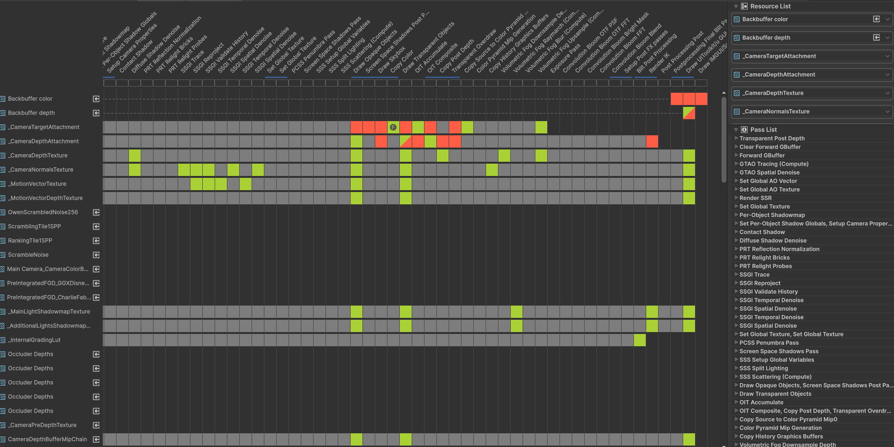
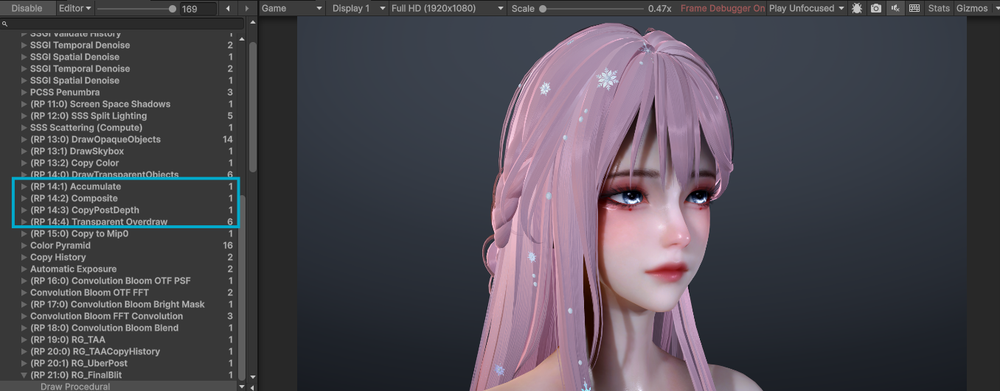
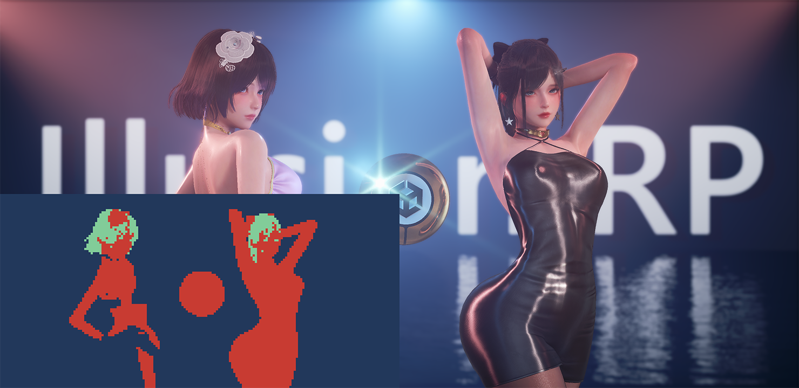
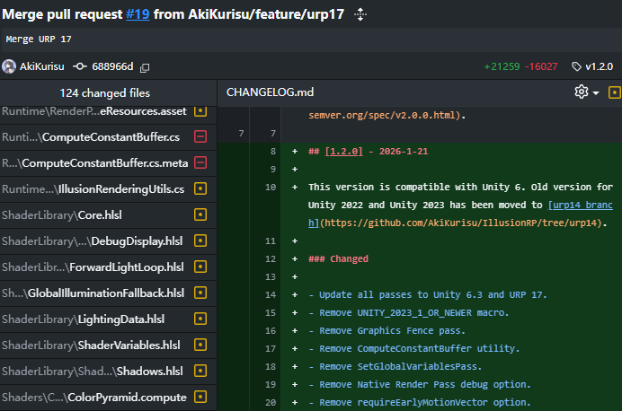

# Unity RenderGraph升级实践

<!-- more -->

在去年底，我开源了一个URP下的高清渲染插件，详见文章[IllusionRP：Unity URP高质量渲染开发实践](https://zhuanlan.zhihu.com/p/1978425877839761874)。

当时IllusionRP是基于2022版本开发的，但随着Unity6的逐步稳定，新引擎的迁移与适配成为了首要任务。

本篇文章就升级IlluionRP的经验，包括升级RenderGraph过程中遇到的坑点进行分享。

# 为什么要迁移




有以下几个原因：
1. Unity 6上有原生的GPU Driven Pipeline。
2. 传统SRP的Subpass合并对于自定义ScriptableRenderPass不友好，且由于使用bitmask，有最大数量限制 `ScriptableRenderer.kRenderPassMaxCount = 20`。
3. 2022不再维护，烘焙光照单一没有APV和Light Probe Proxy。

# 直接迁移的问题

从2022迁移到Unity6势必遇到下面几个问题：
1. Graphics API的变更，例如RendererList调整为了使用RendererListHandle。
2. URP API完全从传统路径（Setup + Configure + Execute）切换到RenderGraph路径（RecordRenderGraph）。
3. URP 渲染管线的变更，例如MotionVector在URP17开始会在Prepass绘制（和HDRP保持一致）。

如果直接迁移的话同时有效果和编译上的双重问题要解决，在不多开编辑器的情况下，难以验证兼容后的渲染结果。

而如果从2023版本逐步升级，虽然会遇到要升级两次的工作量，但我们可以在同一个版本中测试RenderGraph下渲染结果的一致性，因此最终笔者选择从Unity 2023版本（URP15）开始升级。

# RenderGraph升级总结

和HDRP的RDG不同，URP的RDG使用了全新的设计，为了更好的优化移动端性能，对RenderPass进行了拆分，例如ComputeRenderPass和RasterRenderPass，这样方便Compiler处理RenderPass合并逻辑（CS当然就不会有合并），下面是笔者对常见迁移问题的总结。

## AddRenderPass无法使用 

如果直接拷贝HDRP的RenderPass写法，会有下面的报错：

`Exception: Pass 'XXX' is using the legacy rendergraph API. You cannot use legacy passes with the native render pass compiler. Please do not use AddPass on the rendergrpah but use one of the more specific pas types such as AddRasterPass.`

例如HDRP中的Depth Pyramid：

```csharp
using (var builder = renderGraph.AddRenderPass<DepthPyramidPassData>("Depth Pyramid", out var passData, ProfilingSampler.Get(HDProfileId.DepthPyramid)))
{
    passData.DepthPyramidTexture = builder.WriteTexture(depthPyramidHandle);
    passData.MipGenerator = _rendererData.MipGenerator;
    passData.MipChainInfo = _mipChainInfo;

    builder.SetRenderFunc((DepthPyramidPassData data, RenderGraphContext context) =>
    {
        data.MipGenerator.RenderMinDepthPyramid(context.cmd, data.DepthPyramidTexture, data.MipChainInfo);
    });
}
```

我们得指定是LowLevel（用于灵活配置）、Raster（片元着色，面向Fragment Shader）还是Compute（计算，面向ComputeShader），修改后如下：

```csharp
using (var builder = renderGraph.AddComputePass<DepthPyramidPassData>("Depth Pyramid", out var passData, DepthPyramidSampler))
{
    passData.DepthPyramidTexture = builder.UseTexture(depthPyramidHandle, IBaseRenderGraphBuilder.AccessFlags.Write);
    passData.MipGenerator = _rendererData.MipGenerator;
    passData.MipChainInfo = _mipChainInfo;

    builder.AllowPassCulling(false);
    builder.AllowGlobalStateModification(true); // 有Keyword切换，需要标识

    builder.SetRenderFunc((DepthPyramidPassData data, ComputeGraphContext context) =>
    {
        data.MipGenerator.RenderMinDepthPyramid(context.cmd, data.DepthPyramidTexture, data.MipChainInfo);
    });
}
```

## Texture2D的导入

RenderGraph的 `ImportTexture()` 只接受 `RTHandle` 参数，但很多资源（如debug字体、遮罩纹理等）是外部配置，通常是 `Texture2D` 类型。

例如：
```csharp
passData.debugFontTex = renderGraph.ImportTexture(_rendererData.RuntimeResources.debugFontTex);
```

解决方法是使用 `RTHandles.Alloc(Texture)` 包装后再导入
```csharp
RTHandle debugFontRTHandle = RTHandles.Alloc(_rendererData.RuntimeResources.debugFontTex);
passData.debugFontTex = renderGraph.ImportTexture(debugFontRTHandle);
```

虽然RTHandle的创建不会多创建RenderTexture，但也需要关注其本身的Allocation开销。

对于需要包装的自定义纹理，应该在Pass中缓存RTHandle，并在Dispose时释放：

例如IllusionRP对于常用的默认纹理（如 `Texture2D.whiteTexture`、`Texture2D.blackTexture`等），会在 `IllusionRendererData` 中统一管理：

```csharp
private RTHandle _whiteTextureRTHandle;

public RTHandle GetWhiteTextureRT()
{
    if (_whiteTextureRTHandle == null)
    {
        _whiteTextureRTHandle = RTHandles.Alloc(Texture2D.whiteTexture);
    }
    return _whiteTextureRTHandle;
}

public void Dispose()
{
    RTHandles.Release(_whiteTextureRTHandle);
    _whiteTextureRTHandle = null;
}
```

## SetGlobalTexture的使用

使用RDG后，`SetGlobalTexture`这个普遍操作变得麻烦了起来，下面是个示例

```csharp
var currentExposureRT = _rendererData.GetExposureTexture();
passData.currentExposureTexture = builder.UseTexture(renderGraph.ImportTexture(currentExposureRT));

builder.SetRenderFunc((PassData data, ComputeGraphContext context) =>
{
    context.cmd.SetGlobalTexture(ShaderIDs._ExposureTexture, data.currentExposureTexture);
});
```

!!! tips
    需要添加 `builder.AllowGlobalStateModification(true)` 以允许设置全局状态。

好在RenderGraph提供了一个Util函数来简化这一步骤。

```csharp
RenderGraphUtils.SetGlobalTexture(renderGraph, ShaderIDs._ExposureTexture, renderGraph.ImportTexture(currentExposureRT));
```

而Unity似乎意识到这样还是不够优雅，RenderGraphUtils通过增加一个pass的方式会增加RenderGraphCompiler的工作量。 
因此URP17在RenderGraphBuilder中添加了一个函数来方便在现有的Pass结束后设置GlobalTexture。

```csharp
builder.SetGlobalTextureAfterPass(depthTexture, s_CameraDepthTextureID);
```

## RenderGraph.CreateTexture的管理

`RenderGraph.CreateTexture`创建的纹理在最后一次被使用后（计数管理），如果其TextureDesc没有标记需要discard，可以被RenderGraph中的其他Pass复用（这也是为什么需要有TextureHandle再次封装RTHandle的原因之一，这样能有效减少需要Allocate的RT数量）。

但需要注意如果该纹理需要被`SetGlobalTexture`隐式给Lighting Pass使用，应该使用唯一的RTHandle进行管理，否则就会被回收，进而被其他Pass错误写入。

下面代码就是在某些情况下遇到了屏幕空间反射的结果`SsrLightingTexture`被SSGI中`Intermediate Texture`错误写入，故相较于HDRP进行了调整。

```csharp
// Create transient textures for hit points and lighting
TextureHandle hitPointTexture = renderGraph.CreateTexture(new TextureDesc(_rtWidth, _rtHeight, false, false)
{
    colorFormat = GraphicsFormat.R16G16_UNorm,
    clearBuffer = !useAsyncCompute,
    clearColor = Color.clear,
    enableRandomWrite = _tracingInCS,
    name = "SSR_HitPoint_Texture"
});

// @IllusionRP: 
// Notice if we use RenderGraph.CreateTexture, ssr lighting texture may be re-used before lighting.
// So we should always use SsrAccum(RTHandle) instead of SsrLighting in RenderGraph.
// TextureHandle ssrLightingTexture = renderGraph.CreateTexture(new TextureDesc(_rtWidth, _rtHeight, false, false)
// {
//     colorFormat = GraphicsFormat.R16G16B16A16_SFloat,
//     clearBuffer = !useAsyncCompute && !_needAccumulate,
//     clearColor = Color.clear,
//     enableRandomWrite = _reprojectInCS || _needAccumulate,
//     name = "SSR_Lighting_Texture"
// });

// Clear operations for async compute or PBR accumulation
var ssrAccumRT = _rendererData.GetCurrentFrameRT((int)IllusionFrameHistoryType.ScreenSpaceReflectionAccumulation);
TextureHandle ssrAccum = renderGraph.ImportTexture(ssrAccumRT);
ClearTexturePass(renderGraph, ssrAccum, Color.clear, useAsyncCompute);

// @IllusionRP: Always use SSrAccum
TextureHandle ssrLightingTexture = ssrAccum;
```

## Swap Backbuffer

在URP14以及以前的版本中，我们如果要在后处理前进行全屏Blit，会使用ScriptableRenderPass提供的`Blit`方法，其原理是UniversalRenderer维护了一个双缓冲，通过切换最终输出的Buffer来减少中间纹理的创建和第二次Blit。

在URP17的RenderGraph下，我们可以直接通过设置`UniversalResourceData.cameraColor`来修改后续Pass使用的ColorTarget。

```csharp
var resourceData = frameData.Get<UniversalResourceData>();
resourceData.cameraColor = targetTextureHandle;
```

需要注意的是，在2023版本中我没找到类似的方法。如果要在2023使用RenderGraph只能沿用中间纹理 + 第二次Blit的老方法。

## Subpass

哭Subpass久矣，在2022版本，虽然由于前文所说的Pass数量限制原因无法开启Native Render Pass，对于自定义的Pass，我们可以使用`ScriptableRenderContext.BeginScopedSubPass` API来构造Subpass，但写起来非常邪门, GitHub上搜索代码，除了我以外，没人用过这个API。

```c#
private void DoNativeRenderPass(ScriptableRenderContext context, ref RenderingData renderingData)
{
    var camDesc = renderingData.cameraData.cameraTargetDescriptor;
    var colorHandle = renderingData.cameraData.renderer.cameraColorTargetHandle;
    var depthHandle = renderingData.cameraData.renderer.cameraDepthTargetHandle;
    int width = camDesc.width, height = camDesc.height, samples = Mathf.Max(1, camDesc.msaaSamples);

    var depthDesc = new AttachmentDescriptor(SystemInfo.GetGraphicsFormat(DefaultFormat.DepthStencil));
    depthDesc.ConfigureTarget(depthHandle.nameID, true, true);
    
    var accumDesc = new AttachmentDescriptor(RenderTextureFormat.ARGBFloat);
    accumDesc.ConfigureClear(Color.clear, 0);
    accumDesc.loadStoreTarget = BuiltinRenderTextureType.None;
    
    var revealDesc = new AttachmentDescriptor(RenderTextureFormat.RFloat);
    revealDesc.ConfigureClear(Color.white, 0);
    revealDesc.loadStoreTarget = BuiltinRenderTextureType.None;
    
    var colorDesc = new AttachmentDescriptor(colorHandle.rt.descriptor.graphicsFormat);
    colorDesc.ConfigureTarget(colorHandle.nameID, true, true);

    const int kDepth = 0;
    const int kAccum = 1;
    const int kReveal = 2;
    const int kColor = 3;
    var attachments = new NativeArray<AttachmentDescriptor>(4, Allocator.Temp);
    attachments[kDepth] = depthDesc;     // 0 -> Depth Attachment
    attachments[kAccum] = accumDesc;     // 1 -> Accumulate
    attachments[kReveal] = revealDesc;    // 2 -> Revealage
    attachments[kColor] = colorDesc;     // 3 -> Color Attachment

    using (context.BeginScopedRenderPass(width, height, samples, attachments, depthAttachmentIndex: kDepth))
    {
        attachments.Dispose();

        var compositeBuffer = new NativeArray<int>(2, Allocator.Temp);
        compositeBuffer[0] = kAccum;
        compositeBuffer[1] = kReveal;
        using (context.BeginScopedSubPass(compositeBuffer, isDepthStencilReadOnly: false))
        {
            compositeBuffer.Dispose();
            CommandBuffer cmd = CommandBufferPool.Get();
            using (new ProfilingScope(cmd, _accumulateSampler))
            {
                context.ExecuteCommandBuffer(cmd);
                cmd.Clear();

                var drawSettings = CreateDrawingSettings(OitTagId, ref renderingData, renderingData.cameraData.defaultOpaqueSortFlags);
                
#if UNITY_2023_1_OR_NEWER
                var rendererList = default(RendererList);
                RenderingUtils.CreateRendererListWithRenderStateBlock(context, renderingData, drawSettings, _filteringSettings, _renderStateBlock, ref rendererList);
                cmd.DrawRendererList(rendererList);
#else
                context.DrawRenderers(renderingData.cullResults, ref drawSettings, ref _filteringSettings, ref _renderStateBlock);
#endif
            }

            context.ExecuteCommandBuffer(cmd);
            cmd.Clear();
            CommandBufferPool.Release(cmd);
            // Need to execute it immediately to avoid sync issues between context and cmd buffer
            context.ExecuteCommandBuffer(renderingData.commandBuffer);
            renderingData.commandBuffer.Clear();
        }

        var compositeTarget = new NativeArray<int>(1, Allocator.Temp);
        compositeTarget[0] = kColor;
        var compositeInput = new NativeArray<int>(2, Allocator.Temp);
        compositeInput[0] = kAccum;
        compositeInput[1] = kReveal;
        using (context.BeginScopedSubPass(compositeTarget, compositeInput, isDepthStencilReadOnly: true))
        {
            compositeTarget.Dispose();
            compositeInput.Dispose();
            CommandBuffer cmd = CommandBufferPool.Get();
            using (new ProfilingScope(cmd, _compositeSampler))
            {
                Vector2 viewportScale = colorHandle.useScaling 
                    ? new Vector2(colorHandle.rtHandleProperties.rtHandleScale.x, colorHandle.rtHandleProperties.rtHandleScale.y) 
                    : Vector2.one;
                _compositeMat.Value.EnableKeyword(IllusionShaderKeywords._ILLUSION_RENDER_PASS_ENABLED);
                Blitter.BlitTexture(cmd, viewportScale, _compositeMat.Value, 0);
            }

            context.ExecuteCommandBuffer(cmd);
            cmd.Clear();
            CommandBufferPool.Release(cmd);
            // Need to execute it immediately to avoid sync issues between context and cmd buffer
            context.ExecuteCommandBuffer(renderingData.commandBuffer);
            renderingData.commandBuffer.Clear();
        }
    }
}
```

在RenderGraph下实现则非常的简单：

```C#
// Pass 1: Accumulation - render transparent objects to accumulate and revealage buffers
using (var builder = renderGraph.AddRasterRenderPass<OITPassData>("OIT Accumulate", out var passData, _accumulateSampler))
{
    passData.CompositeMaterial = _compositeMat.Value;
    builder.SetRenderAttachment(accumulateHandle, 0);
    builder.SetRenderAttachment(revealageHandle, 1);
    builder.SetRenderAttachmentDepth(depthTarget);
}

// Pass 2: Composite - blend accumulated results into color target
using (var builder = renderGraph.AddRasterRenderPass<OITPassData>("OIT Composite", out var passData, _compositeSampler))
{
    passData.CompositeMaterial = _compositeMat.Value;
    passData.CameraData = cameraData;
    passData.CompositeMaterial = _compositeMat.Value;
    builder.SetInputAttachment(accumulateHandle, 0);
    builder.SetInputAttachment(revealageHandle, 1);
    builder.SetRenderAttachment(colorTarget, 0);
    passData.ColorHandle = colorTarget;
    builder.SetRenderAttachmentDepth(depthTarget, AccessFlags.Read);
}
```



## VRS可变着色率

底层Unity都帮你写好了，管线只需要调用VRS API即可。对于每个RasterPass下我们可以设置一张Shading Rate Image来控制着色率。

作为示例，IllusionRP在Transparent Overdraw Pass前用Stencil生成了一张Shading Rate Image来减少Overdraw Pass的开销（实际上没派上用处，因为Stencil Test直接过滤了绝大部分）。

在官方Demo[Unity-Technologies/shading-rate-demo](https://github.com/Unity-Technologies/shading-rate-demo)中，Vrs被使用在了全屏的体积光计算上，根据MotionVector来减少移动中物体的着色率（本来也看不太清，就可以降分辨率了）。

```csharp
if (frameData.Contains<StencilVRSData>()) 
{
    var vrsData = frameData.Get<StencilVRSData>();
    if (vrsData.ShadingRateImage.IsValid())
    {
        builder.SetShadingRateImageAttachment(vrsData.ShadingRateImage);
        builder.SetShadingRateCombiner(ShadingRateCombinerStage.Fragment, ShadingRateCombiner.Override);
    }
}
```



后续我会结合性能数据看看VRS还可以适用在哪些Pass上。

除此之外，我们还可以直接控制单个Raster Pass的VRS即`ShadingRateFragmentSize`，这样我们可以通过使用2X2的VRS来替代原本一些半分辨率 + UpSample的组合。

```csharp
builder.SetShadingRateFragmentSize(_shadingRateFragmentSize);
builder.SetShadingRateCombiner(ShadingRateCombinerStage.Fragment, ShadingRateCombiner.Override);
```

# 结语

笔者之前评估升级Unity6的工时不小，至少也得3个月起步（因为相当于重写一遍管线代码）。但好在笔者把迁移的要点总结后，AI照葫芦画瓢嘎嘎提速，最终用时只花了两星期。




（这么多改动放以前是不敢想的）


之后准备测试下URP预览中的Screen Space Radiance Cache GI，其运用了新推出的`Unified Ray Tracing Shader`来允许使用ComputeShader进行软光追.

最后欢迎Star、Fork和Contribute~

[AkiKurisu - IllusionRP](https://github.com/AkiKurisu/IllusionRP)