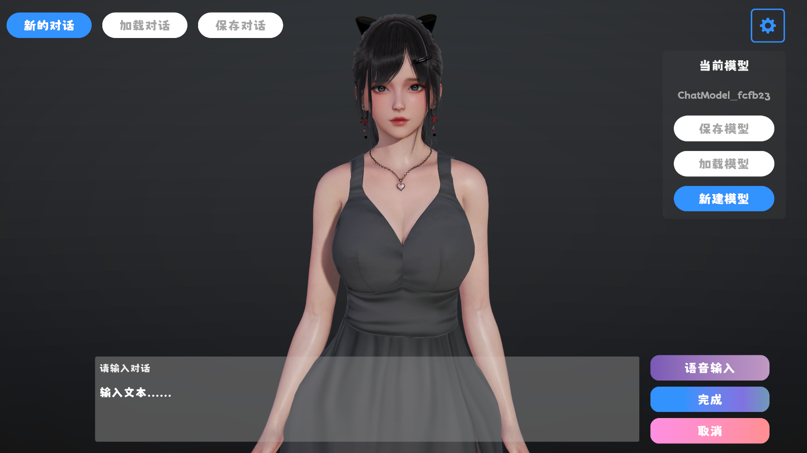

# 在Unity中使用NLP自然语言处理技术

<!-- more -->

## 前情提要

之前我在Unity中制作了一个ChatBox，为了能让AI拥有记忆，我基于`Unity.Sentis`在运行时使用嵌入模型`Embedding Model`来生成文本特征向量并持久化到数据库中。

如果要进行搜索，就直接计算向量的余弦相似度，详情可见上期[《在Unity中制作一个ChatBox》](./create-chatbox-in-unity.md)。


那么除了上述用作数据检索，我们还可以在游戏中使用哪些NLP技术呢？

## Classification 文本分类

为了让ChatBox变得更有意思，我在上期的基础上加上了我之前复刻的AIHS2渲染和捏脸系统



文本转语音我依然使用非常好用的`VITS-Simple-API`项目作为服务器，嘴型匹配使用`uLipSync`。

但如果只是这样聊天未免太过呆板，要让她在说话的同时做一些动作才会比较自然。

生成式动画技术目前也在发展中，不过尚未达到商业化水平，我这里想要使用的是原本游戏中的大量动画，通过文本输入来选取合适的动画。

那么这在机器学习中就是经典的分类问题。

下面的文本就是我从原游戏中解包对话文本并生成的数据集。这些原本是用于在游戏中演出文本的同时给人物增加丰富的表情。
```json
{
    "哦你好。": "微笑3",
    "啊......是你。": "微笑",
    "在这样的地方真是奇怪的巧合。": "疑問",
    "那么，它是做什么用的呢？": "疑問",
    "怎么，怎么了？": "微笑",
    "你也在这里。": "笑顔",
    "我很高兴见到你。": "笑顔",
}
```

表情系统的实现较为简单，这里先略过，我们最终需要模型输出的就是一个id，根据id切换不同的表情。


### 预处理

那么我们就可以先对所有的表情进行One-Hot独热编码。

```json
{
    "示例对话内容。": [0, 0, 1, 0, 0]
}
```

再使用文本向量嵌入模型为文本生成特征向量，那么数据集应该变为了`dim of embedding: dim of label`。

### 模型

因为是一个简单的分类器，我们直接选取基础的MLP多层感知机来进行分类。为了防止过拟合，我们要加上`dropout`层。

```python
class CustomClassifier(nn.Module):
    def __init__(self, input_dim, hidden_dim, output_dim):
        super(CustomClassifier, self).__init__()
        
        self.fc1 = nn.Linear(input_dim, hidden_dim)
        self.relu = nn.ReLU()
        self.dropout = nn.Dropout(p=0.1)
        self.fc2 = nn.Linear(hidden_dim, output_dim)
    
    def forward(self, x):
        x = self.fc1(x)
        x = self.relu(x)
        x = self.dropout(x)
        x = self.fc2(x)
        return x
```

因为我们的数据集分布不是那么均匀，计算损失函数时候要加入根据样本数量得到的权重

```python
label_counts = { }
for label_id in label_data.values():
    label_counts[label_id] = 0
for text, label_id in text_id_data.items():
    label = label_id.index(1)
    label_counts[label] += 1
label_counts = dict(sorted(label_counts.items()))
total_samples = sum(label_counts.values())
label_weights = { }
for label, samples in label_counts.items():
        if samples == 0 :
            label_weights[label] = 0
        else:
            weight = total_samples / (len(label_counts) * samples)
            label_weights[label] = weight
```

最后我们训练200epoch就大功告成了，为了能在Unity中直接使用，我们将其导出为ONNX格式。

同理，我们对动作也可以进行类似的分类器训练，这里就进行省略。


<center>就聊天来说效果非常不错</center>

## Zero Shot 零样本分类

可以看到对于聊天来说，几个简单的文本分类器就可以带来不错的视觉效果，那么如果任务不止有聊天了呢？

例如，我们希望通过语言，能让AI在这个房间里进行移动、拿去物品等，我们就需要让AI能识别出我们的自然语言指令。

当然我们可以将这些指令提前用分类器的方式训练，但如何后续还要增加就得重新训练。我们可以像ChatBox一样用文本向量嵌入的方式来匹配指令预设文本和输入文本的相似度，实际上这就是零样本分类的方法。

## Named Entity Recognition 命名实体识别
利用零样本分类，我们可以提取出文本中的指令，那如果这个指令还有参数呢？例如移动到哪里的位置。

这就是NLP中经典的命名实体识别任务，我们需要使用NER模型来找出文本中的名词并由游戏中的解释器来转为游戏对象。

## 大语言模型：一次解决所有

如果你看过我之前开发的`Real Agents`项目，我们如今可以使用大语言模型来在给定的行为集合中决策和执行任务。

当然这就增加了对网络API的依赖，但好处是我们不需要设置复杂的语义解析规则和多个模型集成学习，而是使用一个模型解决全部问题，这也是为什么很多人称大语言模型是通往AGI（通用人工智能）的钥匙。

那么下期我将尝试使用大语言模型来丰富AI的行为。