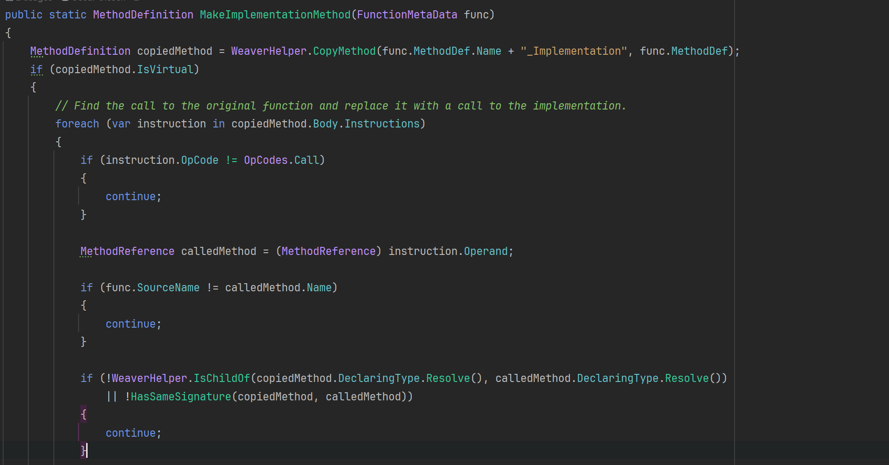

# UnrealSharp接入探索

<!-- more -->

## 缘由

众所周知，黑猴用了C#作为脚本方案，说明这玩意开发起来效率是真高啊。加上现在有很多项目已经启动了UE5，C#方案有可能替代原有的Lua、Typescript等脚本方案。

游科是基于[USharp](https://github.com/pixeltris/USharp)进行的迭代，但并没有对它们的UE5版本进行开源。为了避免重复造轮子，我决定尝试一下直接面向UE5的[UnrealSharp](https://github.com/UnrealSharp/UnrealSharp)。

## 依赖

[UnrealSharp](https://github.com/UnrealSharp/UnrealSharp)

[.Net 9.0](https://dotnet.microsoft.com/en-us/download/dotnet/9.0)

[dnspy](https://github.com/dnSpy/dnSpy)

## 工作流分析

以下是我尝试UnrealSharp后对其工作流的初步认识。

1. Engine Plugin导出C#胶水层
2. Source导出C#胶水层
3. Managed项目CodeGen生成Wrapper和注入桥接函数。
4. Editor编写脚本HotReload
5. （实现中）打包NativeAOT/il2cpp将托管代码转为C++

根据工作流的不同阶段，UnrealSharp主要分为了以下几个模块

1. `UnrealSharp.Core(Unmanaged)`为C++ Runtime部分，用于绑定Unreal对象
2. `UnrealSharp.ScriptGenerator`是UBT插件，用于在UHT处理完头文件后，直接从Unreal反射系统中获取metadata导出C#胶水层
3. `UnrealSharp(Managed)`为C# Runtime部分
4. `UnrealSharp.SourceGenerator`是C#的分析器和源生成器
5. `UnrealSharpWeaver`是Managed项目的IL Post Process（Unity的命名，以下简称ILPP）部分，用于Emit调用托管代码的IL指令

## 接入实验

虽然UnrealSharp看起来很好用，但当笔者拿着现有项目尝试时，遇到了一系列C#编译的问题，主要产生在`ScriptGenerator`中。

### 调试UBT

因为`ScriptGenerator`是UBT插件，为了能方便定位插件的问题，所以需要调试UBT，调试步骤如下：

1. Solution中右键UnrealBuildTool设置启动Resolution，Rider直接Debug
2. 设置启动参数如下，可以从`Build.bat`中复制：

`-Target="{GameTarget}Editor Win64 Development -Project="{Source Path}/{GameTarget}.uproject"`

### 签名规范

如上文所述，`ScriptGenerator`是从Unreal的反射系统中获取元数据来导出C#胶水层。但C++和C#由于在代码风格上有所差异，`UnrealSharp`做了一系列转换，但这会导致生成方法产生冲突。

例如下面的UFunction导出C#后签名是一样的：

```cpp
UFunction(BlueprintCallable)
void UMyActor::BP_MyFunction(int32 InParam)

UFunction()
void UMyActor::MyFunction(int32 InParam)
```

下面的Delegate和UObject在导出C#后签名也是一样的：
```cpp
DECLARE_MULTICAST_DELEGATE(FMyData);

UCLASS(Blueprintable)
class MyGame_API UMyData : public UObject
{
}
```

这些冲突如果要在C++中一个个修改API，影响范围过大，我为此也和插件作者进行了交流，见 [PR Review](https://github.com/UnrealSharp/UnrealSharp/pull/362)，但作者认为这种Shipping方案很常见，并不会移除。

因此为了适配现有项目，我只能修改`ScriptGenerator`的导出逻辑，以及`SourceGenerator`的桥接逻辑，以解决签名冲突的问题。


### 使用示例

成功编译后，UnrealSharp会为我们创建一个新C#项目Managed{ProjectName}，里面的代码会被源生成器和ILPP识别。以下是一个示例：

```csharp
using UnrealSharp;
using UnrealSharp.Attributes;
using UnrealSharp.Engine;

namespace ManagedGame;

[UMultiDelegate]
public delegate void OnTestActorPlay();

[UClass]
public partial class ATestActor : AActor
{
    [UProperty(PropertyFlags.EditAnywhere | PropertyFlags.BlueprintReadWrite)]
    public int TestIntValue { get; set; }

    [UProperty(PropertyFlags.BlueprintAssignable)]
    public TMulticastDelegate<OnTestActorPlay> OnTestActorPlay { get; set; }
    
    protected override void BeginPlay()
    {
        OnTestActorPlay.Invoke();
        base.BeginPlay();
    }
}
```

ILPP后可以用dnspy查看实际的代码：


比较有趣的是这里BeginPlay的实现被移动到了BeginPlay_Implementation中。这部分逻辑在`UnrealSharpWeaver.FunctionMetaData.RewriteFunction`中。

添加字段和方法后，Editor会触发C#编译，编译成功后能够直接HotReload。


开发起来非常方便，体感接近于Unity开发的速度啦ヾ(≧▽≦*)o。


## 继承实验

因为C++项目已经很完备了，C#侧希望能直接继承C++的类型或实现接口。
但发现C#类无法implement C++侧定义的参数带有自定义结构体的Interface。

以下是示例，其中`DamageInfo`是在GameSource中定义的结构体：

```csharp
[UClass]
public partial class AMyActor : AActor, IDamageInterface
{
    void IDamageInterface.OnDamage(DamageInfo info)
    {
        // ILPP error
    }
}

[UClass]
public partial class AMyActor : AActor
{
    void OnDamage(DamageInfo info)
    {
        // ILPP succeed
    }
}
```

### 调试UnrealSharpWeaver

这里的问题来自于ILPP阶段，所以我们需要调试`UnrealSharpWeaver`，下面是调试的参数。

```
dotnet\
{SourcePath}/Plugins/UnrealSharp/Binaries/Managed/UnrealSharpWeaver.dll\
-p\
{SourcePath}\Script\Managed{Project}\bin\Debug\net9.0\Managed{Project}.dll\
-o\
{SourcePath}\Binaries\Managed
```

### 原因分析

上面笔者提到UnrealSharp导出的胶水层都依赖于UBT提供的元数据，因此这里的接口方法实际也都标记为了UFunction。

ILPP阶段Weaver处理UFunction方法时需要把C#侧的接口实现移动到`{Method}_Implementation`签名的方法中。



对于接口会额外Emit一个`Invoke_{Method}`签名的Thunk函数用于C++侧调用，这部分和UE为BlueprintCallable方法生成Thunk函数逻辑类似，用于将方法的输入输出类型擦除。


最后再Emit实际的接口方法实现作为C#侧调用非托管代码的Invoker。

Weaver生成Thunk和Invoker时需要拿到参数数据结构对应的`Marshaller`，自定义结构体的`Marshaller`是由`ScriptGenerator`自动生成的，但UnrealSharpBuildTool中把GameSource的胶水层在ILPP时剔除了。
因此笔者尝试在`-p`后增加上胶水层的dll路径`{SourcePath}\Script\Managed{Project}\bin\Debug\net9.0\ProjectGlue.dll`。

但因为`ProjectGlue`是单向给托管侧提供C++方法调用的，需要从实际的`Weaving`中剔除，即不需要额外对`ProjectGlue.dll`进行ILPP。

实验后，果然成功Weave了☆*: .｡. o(≧▽≦)o .｡.:*☆

这看起来是个bug，可见[Issues 371](https://github.com/UnrealSharp/UnrealSharp/issues/371)。

## 其他问题

因为`UnrealSharp`用的.Net9, UBT每次触发`UnrealSharpBuildTool` build时都会强制使用.Net9然后触发一个报错，阻塞Engine启动。目前再点一次就好了，但对于CICD会存在阻塞问题，需要解决。

## 总结

笔者尝试了在C#项目中实现简单功能、继承C++的接口，体验了一下C#写Unreal Gameplay逻辑的快感。

略有遗憾的是本篇文章对于打包托管项目还未测试，好在工具链的代码大部分都是C#写的，修改调试起来的成本比较低，之后有时间继续研究。