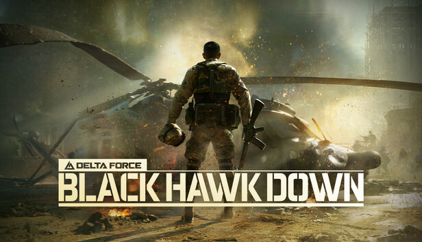

---
search:
  exclude: true
hide:
  - navigation
  - toc
---

GAME&nbsp;DEV · GRAPHICS · AI

# Make Great Games! { .home-hero__title }

Notes from my game dev journey

[Read Blogs](blog/index.md){ .md-button .home-hero__cta }

# Intro

My journey through game development milestones.

## 2022

!!! success "Beginning"
    Started learning game development, embarking on an exciting journey into the world of game creation.

---

## 2023

!!! tip "GameJam Achievement"
    Collaborated with friend **GuGuTong** to create the game **"Reversed Space Time"**
    
    :trophy: Won the **Special Award** at Unity China's first GameJam

!!! note "Unity China Internship"
    Interned at **Unity China** and presented game development experience at Unity Open Day Beijing

!!! success "Personal Project"
    Personally developed the game **"Evolution Contract"**
    
    **Awards & Nominations:**
    
    - :first_place_medal: Won **"Innovative Gameplay Design Award"** at Hypergryph's 2023 Innovation Core
    - :medal: Nominated for **"Best Gameplay Design Award"** at the 3rd CUSGA National College Student Game Development Competition
    - :medal: Nominated for **"Best Strategy Game Award"** at the 3rd CUSGA National College Student Game Development Competition

---

## 2024 - 2025

!!! tip "Professional Career"
    After graduation, joined **Tencent** as a game client developer

    Participated in the development of **Delta Force: Black Hawk Down**.

    { loading=lazy }

---

## 2026

!!! success "Back to Unity"
    Refocused on Unity game development, now placing greater emphasis on how AI Agents can be applied throughout the game development workflow rather than on Gameplay itself.