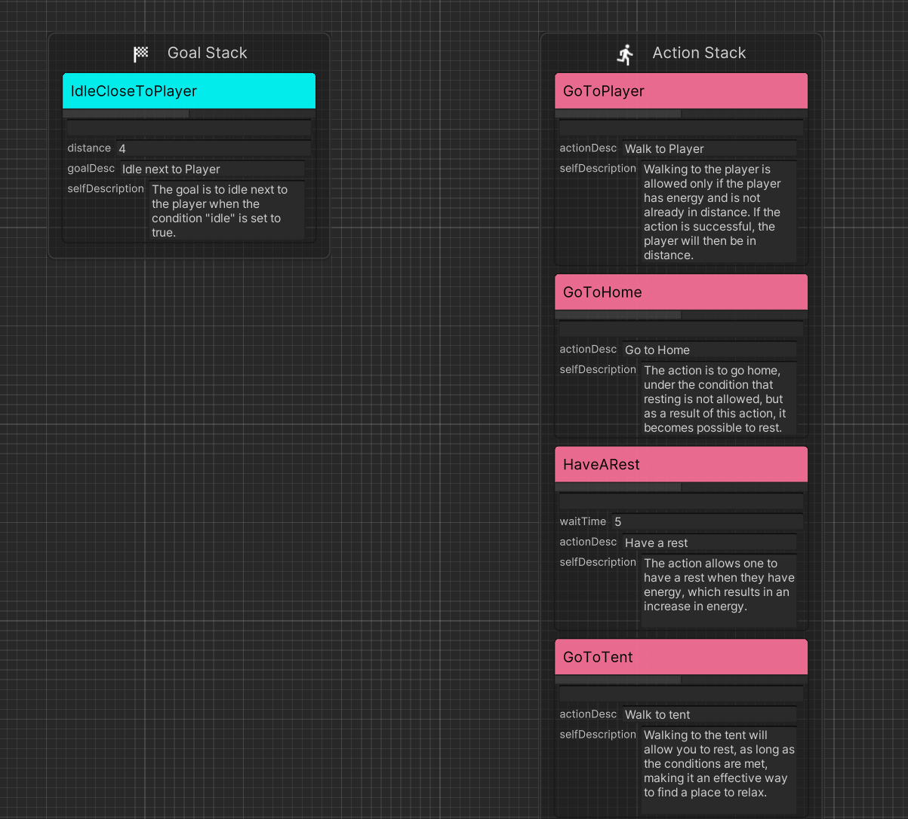
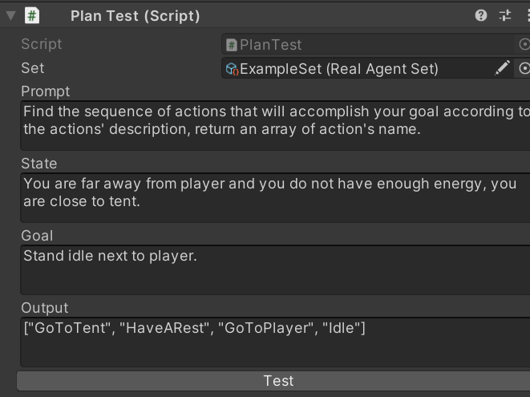
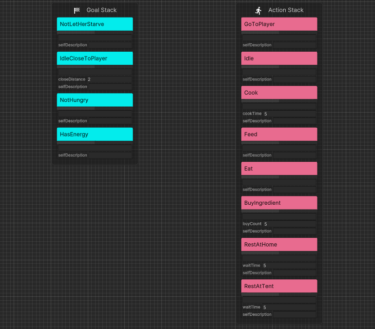
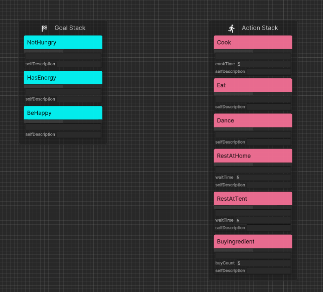
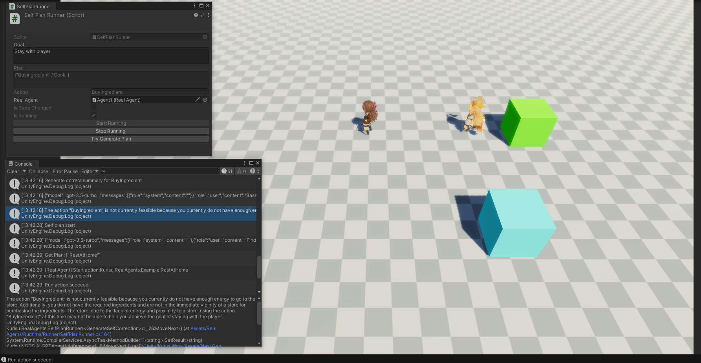

# 实验一

## 实验目的
测试设想一中生成式代理完全操控决策是否可行

## 实验方法
笔者先使用Goap来运行程序化代理，再运行生成式代理进行结果上的比较。

具体而言，生成式代理预先根据代码中的`Precondition`和`Effect`等状态形成`Summary`，在运行时通过输入的目标`Goa`l和记忆格式化输出`Plan`并尝试运行。

### 程序化代理
在玩家附近静止待机，条件为离玩家近且有能量。如果没有能量就找一个近的休息地点休息，休息完移动过去。

### 生成式代理

结合上述的配对（Name：Summary）和用自然语言输出的世界状态(`WorldState`)，询问AI如何实现Goal。

显然AI是能找到路径的，并且可以保证是能运行的，因为我们不再需要复杂的解释机制而是直接执行这个序列。

## 存在的问题
现在的`ActionSet`中的`Action`数量太少，因此下一个实验是将`Action`增多，详见[实验二](#实验二)。

# 实验二
## 实验目的
测试设想一中生成式代理完全操控任务网络在可控行为增多时，即复杂场景下是否仍然可行

## 改进方法

### 行为合并
实验二在实验一基础上增加了饥饿度，Agent1需要让自己和玩家都不受饿。如果不受饿就还是走到Agent2附近待机，如果一方挨饿了就先去超市买食材=>去厨房烹饪出食物=>走到玩家=>喂养。

Agent2则增加了“变高兴”的目标，如果有能量并且不饿就会开始跳舞。

为了方便阅读，笔者合并了部分静态的移动行为（例如“走到家”和“休息”被简化为“在家休息”，从而减少复杂度。

### 运行时修正Summary

在实验一中，我们先通过代码构建了Goap的可用`Action`和`Goal`，然后让大语言模型阅读代码中的参数得到`Summary`，因此在运行时我们同样可使用Goap的`Planner`来<b>"监督"</b>生成式代理。

>有别于机器学习、生成对抗网络中的监督器

具体而言，在生成式代理运行时，我们依然收集世界状态的变化，对于隶属于`GoalSet`中的`Goal`，我们先用`Planner`搜索得到程序化的`Plan`。再以相同的状态数据让Agent通过LLM生成一个`Plan`，对比二者，再有LLM根据差异点进行反思`Reason`修正`Summary`。

对于不在`GoalSet`中的`Goal`，我们不使用`Planner`，仅判断生成的`Plan`是否满足先决条件，例如`Plan`中的`Action`为`移动到玩家`，在Goap中，其具有`需要有能量`的条件，若当前状态不具备该条件，说明`Plan`是不合理的，LLM则可以修正`Summary`。

示例：生成式代理生成当前执行的`Action`为`烹饪`，而此时不具备`烹饪`的条件`拥有食材`，因此生成式代理修正自身的理解后给出了正确的`Action`为`购买食材`

修正前:

>The action "Cook" requires having energy and ingredients, and as a result, you will have food.

修正后:

>The action "Cook" is not currently feasible because the required preconditions for cooking are not currently met. Specifically, you do not have the necessary ingredients and are not in proximity to the appropriate resources. As a result, despite having energy, it is currently not possible to fulfill the action's requirements.

## 实验结果

在修正几次后，生成式代理可以执行和程序化代理近似的行为。

## 初步总结

笔者认为代理决策的方式，具有以下好处：
### 1. 快速干预

用户可以通过自然语言快速调整Agent的决策。

### 2. 实时反馈

GA和衍生作中虽然使用<b>`Multi-Agents`</b>的方式处理多个Task，但Call Api也需要等待时间，因此要实时反馈是很困难的，需要预先生成好数据然后在前端展示。
但可以看到原作中有许多Task是用于执行任务例如生成三元组、AI评估分数等，这些在Real Agents框架下是完全不需要的，从而减少了等待时间。

### 3. 行为可信

NPC只能使用有限的`ActionSet`，语言和行为进行了划分（2D游戏中`喝水`等动作使用表情包表达实际上是一种折中选项，对于语言太抽象，对于行为也不够真实，笔者认为这不够清晰），在Real Agents中行为是有限可控的，而语言、思想是自由的。生成式代理只需要提供做什么、为什么做，而怎么做由程序控制。

## 存在的问题
修正后的`Summary`会聚焦于当前状态甚至是即时的反馈，例如上文出现的“it is currently”和“Specifically”，这种短期的“鞭策”对后续决策并没有起到指导作用。原因包括记忆的结构和提示词问题（提示词也需要尽可能提供完整的信息并减少指代词）。

行为执行的连续性存在缺陷，将当前`Plan`和`Action`作为输入依然会出现正在执行的ActionA取消，转而执行ActionB。原因之一是因为大语言模型不知道任务是否完成。

# 优化措施

## 长短期记忆
调整记忆结构让AI能够从错误中总结经验。

可以认为监督者是NPC的老师，老师批评学生会带来一些指正或教训`Comment`，这些教训作为短期记忆是有利于下一次决策避免重复错误，但对长期而言，例如完成期末考试，我们应该总结归纳知识点，因此适用GA中的<b>`Reflect`</b>思想，在短期记忆`Comments`到达阈值时对其进行总结归纳并提交至长期记忆也即`Summary`中。

## 执行层优化

和程序化代理不同，生成式代理的决策有显著的时间成本，AkiGOAP中使用每帧搜索不再适合生成式人工智能（何况多Call API意味着多花钱），我们应当惜字如金，因此对于生成式代理生成的`Plan`，我们会尽可能完整的使用，而非程序化代理中即使生成了依然会再次搜索来比对是否有更合适的。

这使得NPC一旦搜索到合适的`Plan`在条件满足的情况下会尽可能的按`Plan`执行。因此不会导致一些奇怪的行为，例如还没走到摊铺就掉头折返。
