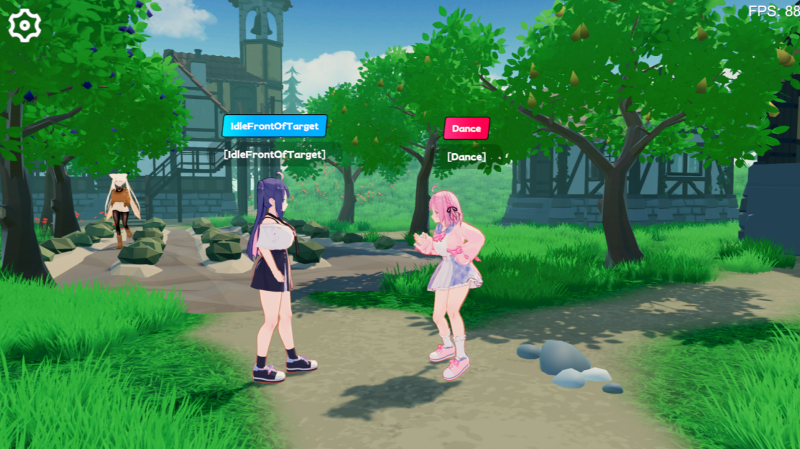
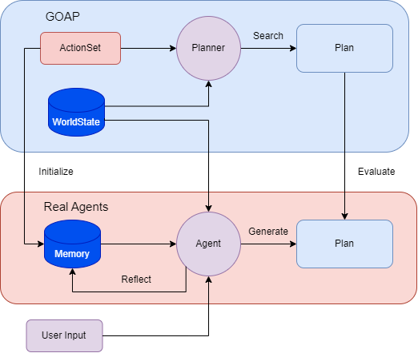
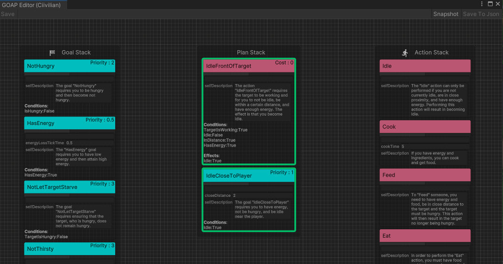
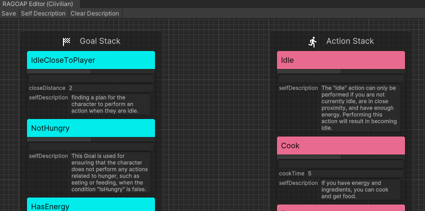
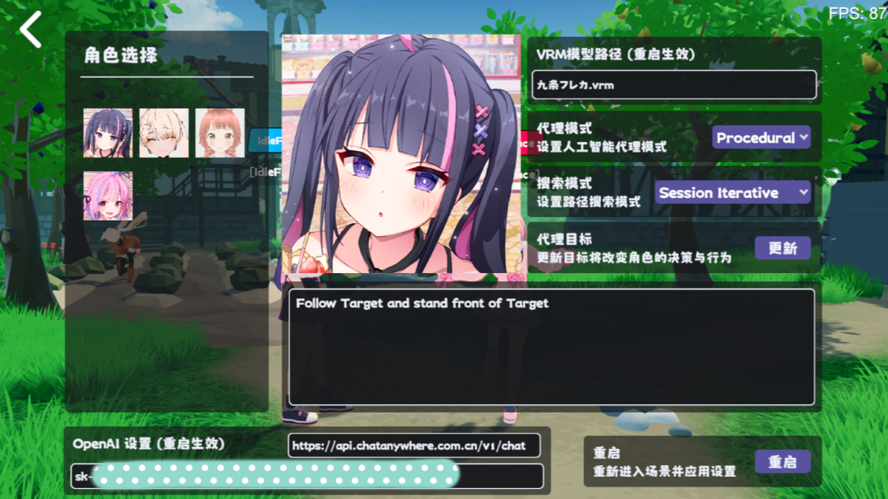
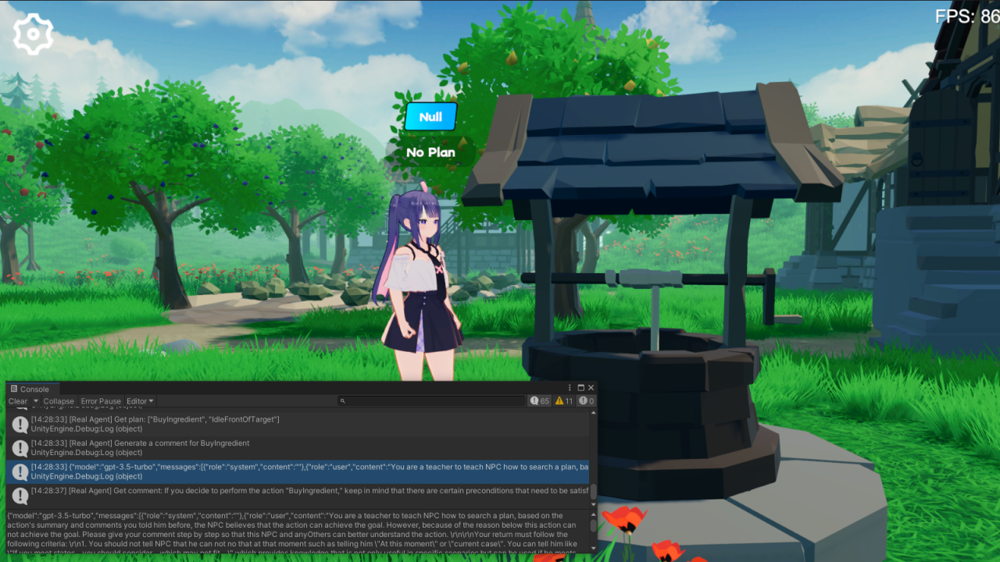
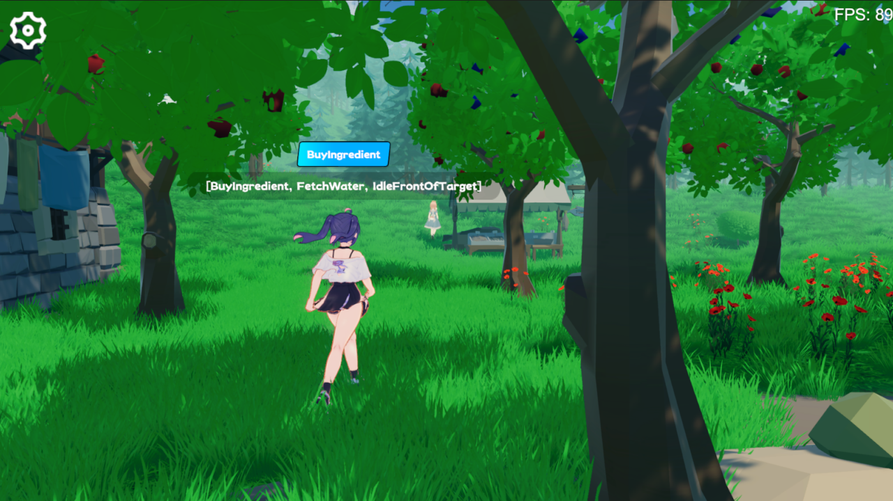

# Real Agents

!!! abstract

    目前还在写论文阶段，暂未开源

Real Agents是一个结合传统人工智能方法和大语言模型（Large Language Models，LLM），适用于生成式人工智能代理（Generative AI Agents）的规划框架,包含一个Unity插件和演示项目。

本项目的开发事由为完成我的本科毕业论文（设计）以及个人对游戏AI的兴趣。


## 项目链接

https://github.com/AkiKurisu/Real-Agents



## 特点

1. 结合目标导向的行为规划方法(Goal Oriented Action Planning,GOAP)
2. 使用自然语言操控NPC执行和规划游戏中定义的行为集合
3. 代理可以学习并优化决策

## 说明

由于运行时使用OpenAI API，游戏不具稳定性，仅用作实验用途


## 依赖

1. AkiAI https://github.com/AkiKurisu/AkiAI
2. AkiBT https://github.com/AkiKurisu/AkiBT
3. AkiGOAP https://github.com/AkiKurisu/AkiGOAP
4. Next Gen Dialogue https://github.com/AkiKurisu/Next-Gen-Dialogue

## 下载Demo源码或EXE

见Release页面

## Demo部署
如果选用词向量嵌入则需要额外本地部署LangChain Server

命令行输入`pip install requirement.txt`安装依赖库

## 原理


先根据GOAP的数据用LLM标注Action和Goal。

运行时让Agent和Planner根据世界状态（WorldStates）生成和搜索Plan。

比对Plan，LLM反思并迭代Memory。

之后可关闭Planner，由Agent生成Plan。

### 流程图



### 步骤1：预处理

首先，开发者定义了一个可执行行为集合(`ActionSet`)和目标集合(`GoalSet`)。



每个行为都基于GOAP规则下，具有先决条件`Precondition`和效果`Effect`。
```C#
public class Eat : DescriptiveTask
{
        protected sealed override void SetupDerived()
        {
            Preconditions[States.HasFood] = true;
            Preconditions[States.IsHungry] = true;
        }
        protected sealed override void SetupEffects()
        {
            Effects[States.IsHungry] = false;
        }
}
```

其次，向大语言模型输入`Action`，将其总结为自然语言作为代理对行为的初始印象(`InitialImpression`)和长期记忆(`Summary`),并将短期记忆(`Comments`)置空。
```json
"Name": "Cook",
"InitialImpression": "To Cook, you need to have energy and ingredients, and as a result, you will have food.",
"Summary": "Latest summary",
"Comments": [
  "",
  "",
  "",
  "",
  ""
]
```
向大语言模型输入`Goal`，让LLM生成自然语言作为使用该Goal的解释(`Explanation`)。并将其组合获得该集合G的解释。

Real Agents中你可以直接在`RealAgentSet`的编辑器中点击`Self Description`生成上述数据。



## 步骤2：学习

调整代理模式（`AgentMode`），设置为`Training`。

此时运行的`Plan`由Planner搜索，Agent同时生成一份`Plan`。如果存在差异的行为，由LLM对其原因进行反思，并生成`Comment`作为短期记忆注入数据库。

Agent在短期记忆达到阈值时根据初始印象、评论和当前长期记忆对其进行总结归纳，覆盖长期记忆，以此进行迭代。
## 步骤3：实时规划

根据外界输入的目标，代理在虚拟空间中实时推理。



LLM根据自身对每个行为的记忆找到合适的`Plan`，由于没有Planner对比，此时仅判断`Plan`是否具有可行性，如不具备，则由LLM生成（`Comment`）注入数据库。



<center>Agent生成并评估Plan</center>



<center>Agent执行Plan</center>

## 推理后端

实验以OpenAI的ChatGPT3.5为推理模型，可选用本地部署的ChatGLM3-6B，不过经过测试可能难以完成路径搜索任务。

## 拓展

本项目为行为AI，你可以将其接入对话插件中，这样玩家可以根据对话来改变AI行为。

如果你对和NPC对话感兴趣可以参考对话插件：[VirtualHuman-Unity](https://github.com/AkiKurisu/VirtualHuman-Unity)

## 许可证

MIT

## Demo许可证引用

VRM 模型请参阅各个作者的许可说明。

Polygon Fantasy Kingdom is a paid asset.

>https://assetstore.unity.com/packages/3d/environments/fantasy/polygon-fantasy-kingdom-low-poly-3d-art-by-synty-164532

Example scene is optimized by Scene Optimizer created by [Procedural Worlds]

>https://assetstore.unity.com/publishers/15277


Lowpoly Environment can be downloaded in assetstore for free.

>https://assetstore.unity.com/packages/3d/environments/lowpoly-environment-nature-free-medieval-fantasy-series-187052

Heat - Complete Modern UI is paid asset

>https://assetstore.unity.com/packages/2d/gui/heat-complete-modern-ui-264857

GUI-CasualFantasy is paid asset

>https://assetstore.unity.com/packages/2d/gui/gui-casual-fantasy-265651

Unity Chan animation is owned by Unity Technology Japan and under UC2 license.

Medieval Animations Mega Pack is paid asset.

https://assetstore.unity.com/packages/3d/animations/medieval-animations-mega-pack-12141

Unity Starter Asset is under the Unity Companion License and can be downloaded in assetstore for free.

UniVRM is under MIT license.

>https://github.com/vrm-c/UniVRM

AkiFramework is under MIT license.

>https://github.com/AkiKurisu/AkiFramework


Demo中使用的其他动画、音乐、ui、字体资源均为网络资源，请勿用于商业用途。

## 引用本仓库
```
@misc{realagents,
  author = {YiFei Feng},
  title = {Real Agents: An planning framework for generative artificial intelligence agents},
  year = {2024},
  publisher = {GitHub},
  journal = {https://github.com/AkiKurisu/Real-Agents},
  school = {East China University of Political Science and Law},
  location = {Shanghai, China}
}
```

## 参考文献

1. Steve Rabin, <i>Game AI Pro 3: Collected Wisdom of Game AI Professionals</i>,International Standard Book.

2. [Orkin 06] Orkin, J. 2006.<i> 3 states and a plan: The AI of F.E.A.R.</i>, Game Developers Conference, San Francisco, CA.
3. Joon Sung Park, Joseph C. O’Brien, Carrie J. Cai, Meredith Ringel Morris,Percy Liang, and Michael S. Bernstein. 2023. Generative Agents: Interactive Simulacra of Human Behavior.
4. Wang, Zihao et al. “Describe, Explain, Plan and Select: Interactive Planning with Large Language Models Enables Open-World Multi-Task Agents.” ArXiv abs/2302.01560 (2023): n. pag.
5. Lin J, Zhao H, Zhang A, et al. Agentsims: An open-source sandbox for large language model evaluation[J]. arXiv preprint arXiv:2308.04026, 2023.
6. Xi, Z., Chen, W., Guo, X., He, W., Ding, Y., Hong, B., Zhang, M., Wang, J., Jin, S., Zhou, E., Zheng, R., Fan, X., Wang, X., Xiong, L., Liu, Q., Zhou, Y., Wang, W., Jiang, C., Zou, Y., Liu, X., Yin, Z., Dou, S., Weng, R., Cheng, W., Zhang, Q., Qin, W., Zheng, Y., Qiu, X., Huan, X., & Gui, T. (2023). The Rise and Potential of Large Language Model Based Agents: A Survey. ArXiv, abs/2309.07864.