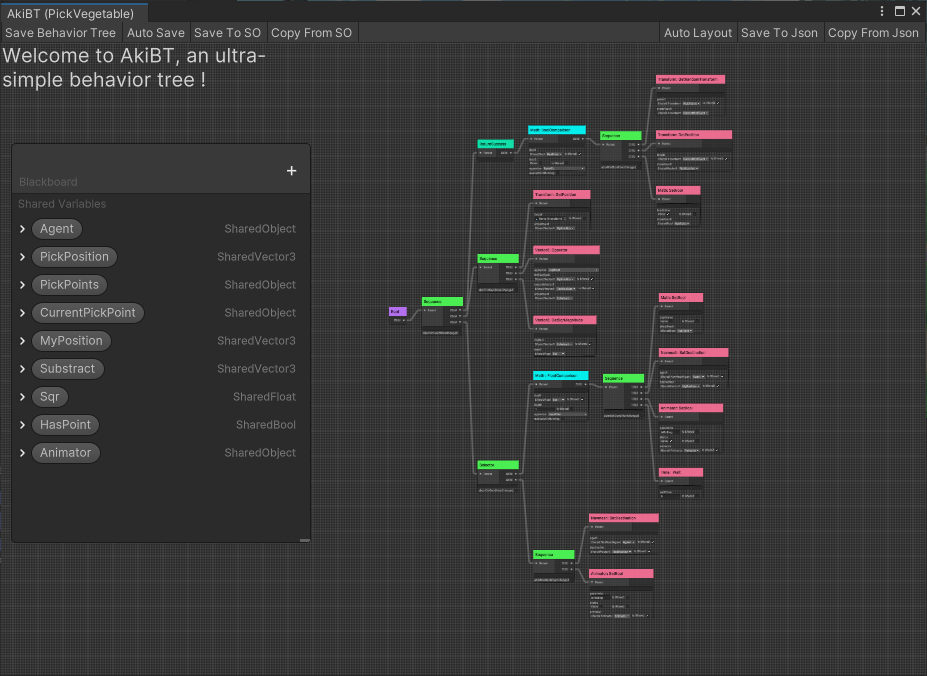
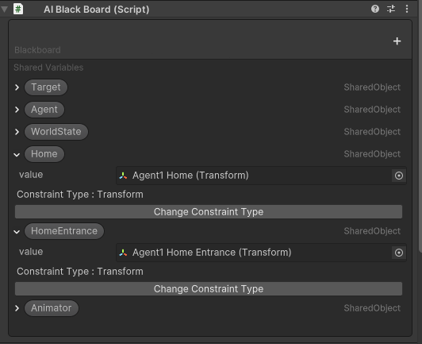
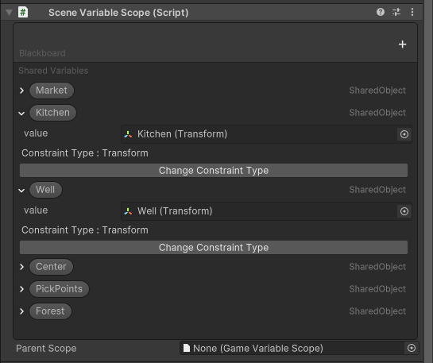

# 传统AI方法的使用技巧

!!! abstract

    记录了Real Agents示例项目对于传统AI方法（GOAP、BehaviorTree）的使用和设计技巧

## Goap的设计

在示例项目中，我们先设计了一套基于GOAP规则的AI Agents，使得游戏在没有生成式人工智能时同样可以运行。

另一方面，我们需要考虑生成式人工智能如何更方便地理解，因此要对一些`Action`和`Goal`进行组合或是拆解。

## 拆解Goal

Real Agents中的生成式代理是不允许直接了解`Goal`对象的，我们不应该在`DescriptiveGoal`中对世界状态`WorldState`进行修改，因此Real Agents密封了以下3个方法。

```C#
public abstract class DescriptiveGoal : AIGoal<IRealAgentContext>, ISelfDescriptive
{
  public sealed override void OnActivate() { }
  public sealed override void OnDeactivate() { }
  public sealed override void OnTick() { }
}
```

在`AkiGOAP`中，这些方法是用于处理`Goal`的生命周期，例如在示例项目中，假设NPC有一个`Goal`为`观赏跳舞`，那么它应该先获取`舞者`的位置。这部分逻辑如果写在`Goal`的`OnActivate()`方法中就会很方便。

!!! question

    那不使用上面基于生命周期的方法我们如何处理这个需求呢？

我们可以将这个步骤同样作为一个`Action`，例如下面脚本:

```C#
 public class SetDancerAsTarget : DescriptiveTask
  {
      protected override void SetupDerived()
      {
          Preconditions[States.TargetIsDancer] = false;
      }
      protected override void OnActivateDerived()
      {
          if (CharaManager.Instance.TryGetChara(Career.Dancer, out var define))
              Host.BlackBoard.GetSharedObject(Variables.Target).SetValue(define.transform);
          worldState.SetState(States.TargetIsDancer, true);
          CompleteTask();
      }
      protected override void SetupEffects()
      {
          Effects[States.TargetIsDancer] = true;
      }
  }
```

这个`Action`相当于一个触发器，启用后只需要运行一次。


## 简化Action

### DescriptiveTask的使用

像上面的`SetDancerAsTarget`中，我们继承自`DescriptiveTask`，它是在`DescriptiveAction`的基础上增加了一个生命周期，这样使得对于这部分`Action`而言，生成式代理不需要思考是否需要被中断，在完成后将自动跳转至`Plan`中的下一个`Action`。


### SequenceTask的使用

对于固定且耦合的<b>动作</b>，除了将它们作为`Action`由Planner搜索，也可以选择将它们放在一个`Action`中，例如下面的脚本:

```C#
 public abstract class RestAtPlace : DescriptiveTask
{
  protected sealed override void OnActivateDerived()
  {
      sequence = new SequenceTask(RestoreEnergy);
      sequence.Append(new MoveTask(Host.TContext.NavMeshAgent, RestEntrance))
              .AppendCallBack(() =>
              {
                  inRest = true;
                  Host.TContext.NavMeshAgent.SetDestination(Host.Transform.position);
                  Host.TContext.NavMeshAgent.enabled = false;
                  Host.Transform.position = RestPoint.position;
                  Host.TContext.Animator.Play("Rest");
              })
              .Append(new WaitTask(waitTime))
              .Run();
  }
}
```

示例项目中使用`AkiAI`提供的`SequenceTask`来完成序列动作，你也可以使用例如`Dotween`等补间插件或`UniTask`等异步插件来完成相同功能。

!!! tips
    上文使用中文名词`动作`用以区别GOAP中的`Action`


### BehaviorTree的使用

如果你的序列动作比较复杂，你可以使用行为树来完成这部分工作，例如下面的脚本：

```C#
public class PickVegetable : DescriptiveAction
{
    protected sealed override void OnActivateDerived()
    {
        Host.GetTask(Tasks.PickVegetable).Start();
        worldState.SetState(States.IsWorking, true);
    }
    protected sealed override void OnDeactivateDerived()
    {
        Host.GetTask(Tasks.PickVegetable).Stop();
        worldState.SetState(States.IsWorking, false);
        Host.TContext.Animator.SetBool("IsPicking", false);
    }
}
```

这使得`Action`脚本变得更简洁,而下面才是行为树的具体实现：



!!! Extend
    比较有趣的是，结合`Builder Pattern`或者`Domain Specific Language`的方式，如今你可以让大语言模型来生成行为树了！

## BlackBoard的使用

对于一个AI Agent而言，它需要响应自身和世界的状态变化。在Real Agents中我们借助于`AkiBT`中的`BlackBoard`来存储这些数据。

对于Agent自身的数据，我们使用`AIBlackBoard`存储，例如`家`，`当前目标`，等，你可以在Inspector中进行调试和修改。



对于场景中全局的数据，例如`店铺的位置`，`农田采摘点的位置`，我们使用`SceneVaribaleScope`存储。

